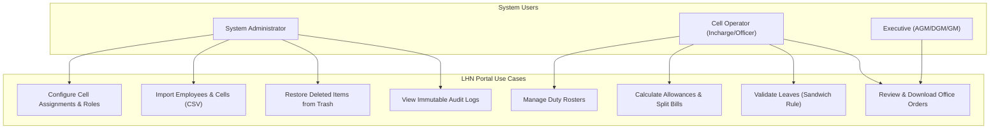
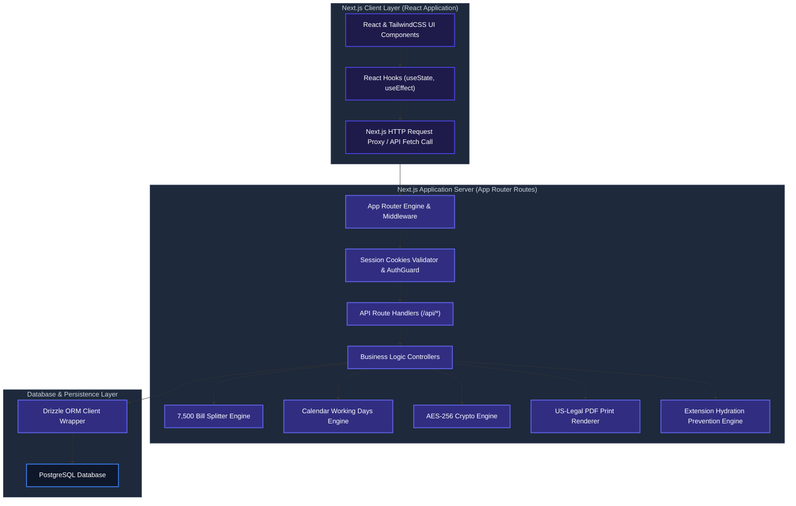
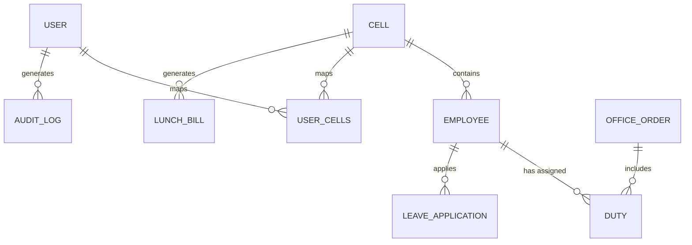
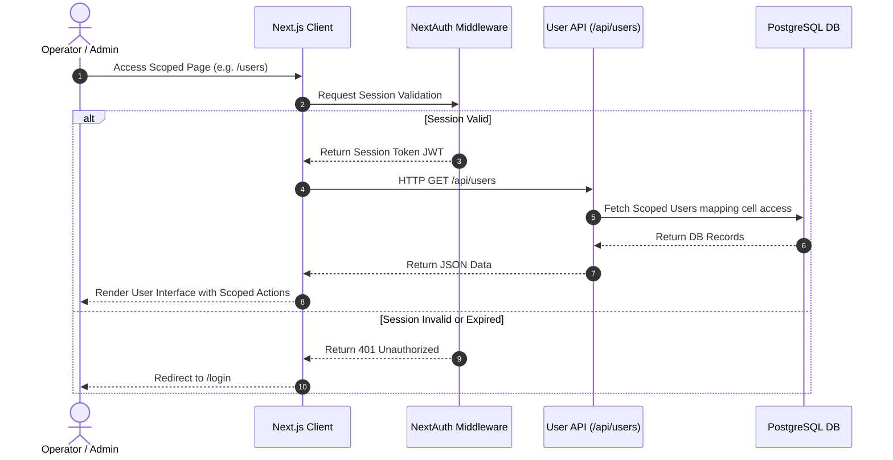
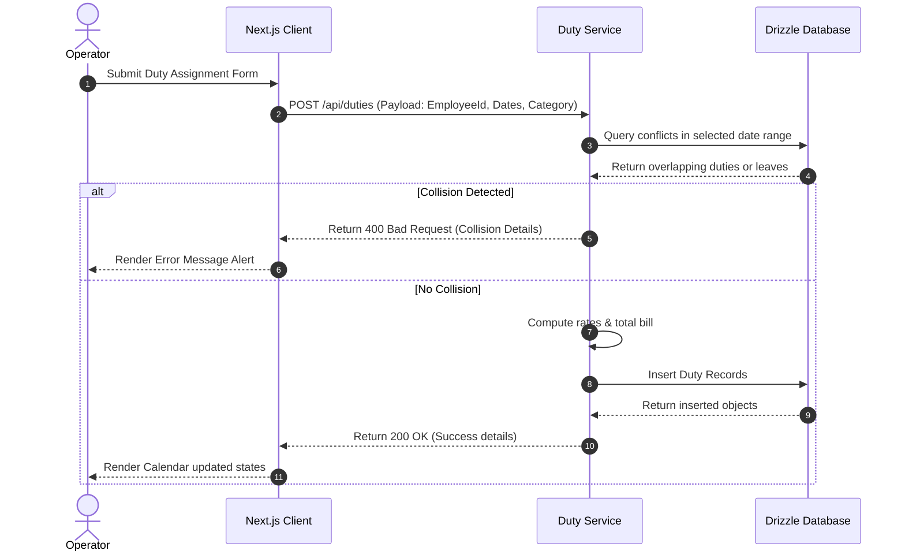
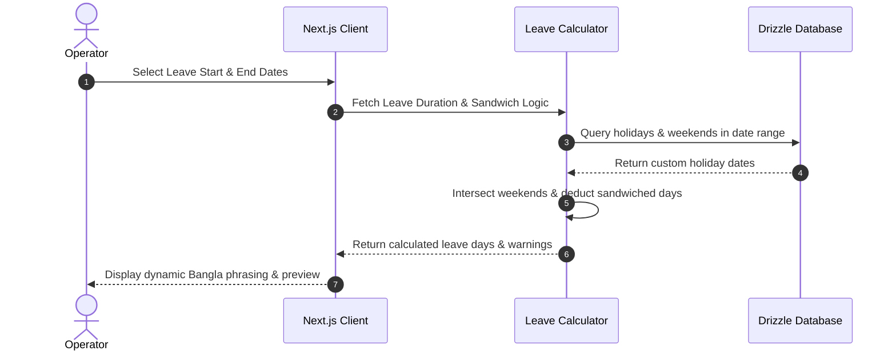
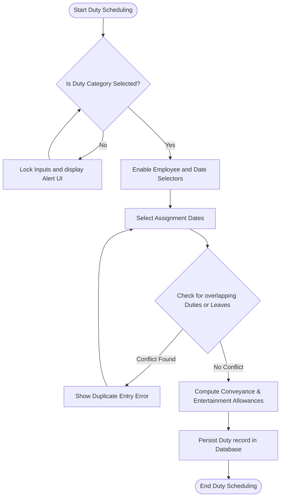
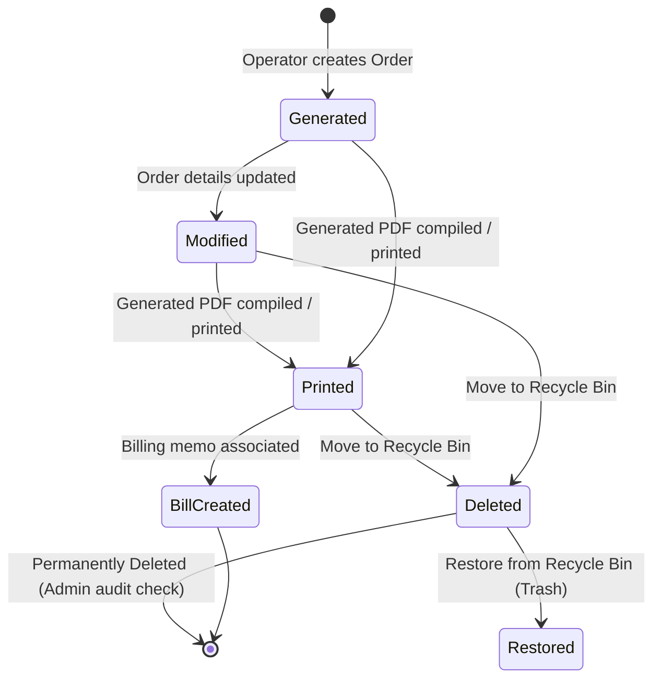

# Janata Bank Late-Sitting, Holiday, and Night Duty Portal (LHN Portal)

An enterprise-grade administrative and financial utility management portal built to automate late-sitting, holiday, and night duty assignments, calculate conveyance and entertainment allowance bill reports, manage executive seniority directories, handle official leave requests, and configure fine-grained role-based cell assignments for Janata Bank PLC.

---

## 1. Executive Summary

The **Janata Bank LHN Portal** is a production-ready, security-hardened administrative system designed to automate shift-roster scheduling, leave verification, and allowance computation workflows for bank employees working non-standard operational shifts. Built specifically for the **Online Banking Department (CBS Integrated Development Cell)** of Janata Bank PLC, the portal digitizes the legacy manual roster preparation, allowance verification, and print-layout generation into an immutable, audit-compliant digital system. By integrating automated validations, collision checks, and bank-compliant document rendering, the system prevents billing leakage, eliminates human errors, and enforces strict compliance with internal banking audit policies.

---

## 2. Problem Statement

Prior to the deployment of the LHN Portal, the Online Banking Department at Janata Bank PLC relied on manual spreadsheet-based entry systems to track late-sitting, weekend holiday duties, and night shift assignments. This manual workflow suffered from several major operational and security deficiencies:
* **Duplicate Billing and Overlaps:** No real-time verification existed to prevent assigning an employee to multiple duties on the same date, or logging duties during their active approved leave periods.
* **Audit Violations:** Banking regulations limit single office order budgets to a threshold of ৳7,500. Exceeding this required manual partitioning, which was prone to errors, delays, and auditor queries.
* **Lack of Data Integrity and Accountability:** Data modifications lacked tracking, meaning changes to employee rosters, salary rates, or cell scopes had no immutable audit logs.
* **Cell Boundary Breaches:** Operators of one cell could view or modify employee rosters of different cells, leading to cross-department database pollution and unauthorized edits.

---

## 3. Objectives

The LHN Portal was built to achieve the following operational targets:
1. **Zero Duplicate Duty Assignments:** Automate database-level validation to block conflicting entries.
2. **Automated Budget Compliance:** Enforce the ৳7,500 split threshold dynamically via a programmatic split-billing engine.
3. **100% Audit Compliance:** Implement an immutable audit log tracking all CRUD operations for 5 financial years in compliance with Bangladesh Bank IT Audit guidelines.
4. **Fine-grained Access Controls:** Apply cell-based permission boundaries (RBAC) restricting operators to their mapped cells.
5. **Standardized High-Density Printouts:** Generate pixel-perfect A4 office orders and Legal-size billing memos containing zero English numerals or incorrect Bengali typography.

---

## 4. Stakeholders

The system manages three primary classes of actors with isolated permission scopes:
* **System Administrators:** Responsible for managing user directories, configuring global cell scopes, editing system parameters, reviewing immutable audit logs, and restoring soft-deleted records.
* **Operators (Cell In-Charges & Cell Officers):** Assigned to specific cells (e.g., CBS Development Cell) to schedule rosters, input leave requests, compute conveyance/entertainment bills, and manage employee directories within their authorized cell boundaries.
* **Executives (AGM, DGM, GM):** Review, authorize, and sign off on printed office orders, consolidated reports, and billing memos.

---

## 5. Functional Requirements

### 5.1 Duty Roster Management
* System must block duplicate duty logging for the same employee on the same date.
* System must prevent scheduling a duty for an employee on dates overlapping with their approved leaves.
* Category lock: The user must select the duty category (Late Sitting, Holiday Duty, Night Shift) before selecting employees or dates.

### 5.2 Billing & Splitting Engine
* Automatically compute allowances: Late Sitting = ৳300, Holiday = ৳500, Night Shift = ৳1,000.
* Automatically partition any billing ledger exceeding ৳7,500 into multiple compliant office orders sorted chronologically, assigning staggered unique reference dates.
* Export report datasets to CSV/Excel format with UTF-8 BOM headers to display Bengali characters properly.

### 5.3 Leave Processing
* Calculate leave balances applying the "Sandwich Rule" (sandwiched weekends are deducted from casual leave balances).
* Prevent leave submission if date ranges overlap with existing leaves or logged duties.

### 5.4 Soft Deleted Recycle Bin
* Retain soft-deleted records (Employees, Duties, Cells, Users) in an audit-compliant bin, allowing administrators to restore them without violating relational constraints.

---

## 6. Non-Functional Requirements

* **Performance & Scalability:** Server response times for API requests must be under 200ms under standard loads. Next.js build compilation must be optimized using modular sub-components to limit bundle sizes.
* **Security & Regulatory Compliance:** Session tokens must be cryptographically signed using JWT. Data in transit must use TLS 1.3, and data at rest must use AES-256-CBC.
* **Availability & Reliability:** Target 99.9% uptime. System failures must dispatch webhook warning alerts to administrative Slack/Discord channels immediately.
* **Recovery Targets:** Recovery Time Objective (RTO) must be less than 2 hours. Recovery Point Objective (RPO) must be less than 24 hours.

---

## 7. Business Rules

| Rule Identifier | Module | Description / Logic |
| :--- | :--- | :--- |
| **BR-ALLOW-RATE** | Billing | Late-sitting allowance is ৳300/day. Holiday duty is ৳500/day. Night shift is ৳1000/day. |
| **BR-BUDGET-LIMIT** | Billing | Any single office order or bill memo must not exceed ৳7,500. Splitting must occur chronologically. |
| **BR-SANDWICH-RULE** | Leaves | Weekends (Friday/Saturday) sandwiched between consecutive casual leaves must be deducted from the leave balance. |
| **BR-LEAVE-LOCK** | Duties | Duties cannot be logged on dates where the employee has an active, approved leave application. |
| **BR-WEEKEND-DUTY** | Duties | Late Sitting duties cannot be assigned on weekends (Friday/Saturday) unless weekend is overridden as a working day. |
| **BR-CELL-GATE** | Security | Operators with `USER` role can only CRUD employees and process duties belonging to their assigned cells. |

---

## 8. Use Case Diagram



---

## 9. System Architecture Diagram



---

## 10. ER Diagram



---

## 11. Database Design & Text-Based ERD

The database utilizes optimized foreign-key relationships to maintain high referential integrity. Alphanumeric indexing is applied to `fileNo`, `bankId`, and `orderRef` columns to optimize querying.

### 11.1 Entity Mappings & Schema Definitions
1. **User (`User`):** Stores credentials for operator logins. Mapped roles are restricted to `ADMIN` and `USER`.
2. **Cell (`Cell`):** Represents branch operational departments (e.g., R22 Core Banking).
3. **Employee (`Employee`):** Employee directory. Tracks designations, file numbers, and assigned cell IDs. Cascades deletions to child duties.
4. **Duty (`Duty`):** Logs shift data (`LATE_SITTING`, `HOLIDAY`, `NIGHT_SHIFT`) and calculates allowances.
5. **OfficeOrder (`OfficeOrder`):** Records compiled rosters, status details (`Generated`, `Printed`, `Modified`), and payload data.
6. **Holiday (`Holiday`):** Logs national holidays and weekend overrides (`isWorkingDay`).
7. **Executive (`Executive`):** Directory of senior bank executives sorted by seniority filing numbers.
8. **Trash (`Trash`):** Audit-compliant soft-deletion log storing serialized JSON records for restoration.
9. **LeaveApplication (`LeaveApplication`):** Registers approved leave dates applying sandwich calculations.
10. **LunchBill (`LunchBill`):** Restricts cell monthly bills to a single record using a composite unique constraint (`cellId`, `month`, `year`).
11. **AuditLog (`AuditLog`):** Stores system-wide changes, containing actions (`CREATE`, `UPDATE`, `DELETE`), user IDs, and timestamps.

### 11.2 Text-Based Schema & Junction Table Relationships
* **User-to-Cell Relation (M:N):** Handled via the implicit many-to-many junction table `_UserCells`.
  * `_UserCells.A` (Foreign Key referencing `Cell.id`, cascade delete)
  * `_UserCells.B` (Foreign Key referencing `User.id`, cascade delete)
* **Cell-to-Employee Relation (1:N):** `Employee.cellId` (Foreign Key referencing `Cell.id`).
* **Employee-to-Duty Relation (1:N):** `Duty.employeeId` (Foreign Key referencing `Employee.id`, cascade delete).
* **Duty-to-OfficeOrder Relation (N:1):** `Duty.orderRef` (Nullable foreign key referencing `OfficeOrder.orderRef`, updates dynamically).

---

## 12. API Specification

### 12.1 Endpoint Matrix Table

| Method | Endpoint | Request Payload (JSON Sample / Query) | Expected Response & Status |
| :--- | :--- | :--- | :--- |
| **POST** | `/api/auth/[...nextauth]` | `{ "username": "026795", "password": "..." }` | `200 OK` + Signed Session Cookie |
| **GET** | `/api/cells` | *None* | `200 OK` + List of Cells (`[{ "id": 1, "name": "..." }]`) |
| **POST** | `/api/employees` | `{ "name": "Riazul", "designation": "SPO", "cellId": 1 }` | `201 Created` + Created Employee Object |
| **GET** | `/api/duties` | `?cellId=1&month=5&year=2026` | `200 OK` + Array of duties for target cell |
| **POST** | `/api/leaves` | `{ "applicantName": "...", "startDate": "2026-06-01", "endDate": "2026-06-05", "leaveType": "CASUAL" }` | `201 Created` + Calculated Leave Details |
| **POST** | `/api/documents/generate-bill-memo` | `{ "billRef": "JB/OBD/2026/12", "employeeName": "Riazul" }` | `200 OK` + Generated PDF Stream / File Path |

### 12.2 Enterprise-Grade API JSON Payload Specifications

#### Authentication API: `POST /api/auth/[...nextauth]`
```json
{
  "username": "026795",
  "password": "db_secure_password_123"
}
```
*Expected Response (Status 200 OK):*
```json
{
  "user": {
    "id": 6,
    "name": "জনাব সৈয়দ আরিফুল ইসলাম ইমন",
    "username": "026795",
    "role": "ADMIN",
    "cells": [
      { "id": 7, "name": "CBS Integrated Development Cell" },
      { "id": 9, "name": "R09 Development & Customization Cell" }
    ]
  }
}
```

#### Leave Application API: `POST /api/leaves`
```json
{
  "applicantName": "জনাব মোঃ রিয়াজুল হাসান",
  "designation": "Senior Principal Officer (SPO)",
  "bankId": "028144",
  "fileNo": "JB-9831",
  "cellName": "CBS Integrated Development Cell",
  "leaveType": "CASUAL",
  "startDate": "2026-06-10",
  "endDate": "2026-06-15",
  "selectedDistrict": "ঢাকা",
  "delegateId": "27"
}
```
*Expected Response (Status 201 Created):*
```json
{
  "success": true,
  "leaveId": 45,
  "calculatedDays": 6,
  "sandwichedWeekends": 2,
  "deductedFromBalance": 4
}
```

#### Bill Memo Compiler API: `POST /api/documents/generate-bill-memo`
```json
{
  "orderRef": "JB/OBD/LHN/2026/415",
  "orderDate": "2026-06-16",
  "category": "BILL_LATE_SITTING",
  "employeeName": "জনাব মোঃ রিয়াজুল হাসান",
  "cellName": "CBS Integrated Development Cell",
  "content": {
    "backingOrderRef": "JB/OBD/LHN/2026/415"
  },
  "dutyIds": [102, 103, 104, 105],
  "duties": [
    {
      "employeeId": "028144",
      "employeeName": "জনাব মোঃ রিয়াজুল হাসান",
      "designation": "SPO",
      "days": 4,
      "apyaonRate": 100,
      "totalApyaon": 400,
      "totalTransport": 800,
      "grandTotal": 1200,
      "datesFormatted": "১০-০৬-২০২৬, ১১-০৬-২০২৬, ১২-০৬-২০২৬, ১৩-০৬-২০২৬"
    }
  ]
}
```
*Expected Response (Status 200 OK):*
```json
{
  "success": true,
  "documentId": 76,
  "filePath": "/uploads/documents/BILL_LATE_SITTING_415.pdf",
  "totalAmount": 1200
}
```

---

## 13. Security Design & Regulatory Compliance

### 13.1 Authentication & Cell Permission Boundaries
* **Session Hardening:** All private routes are protected using NextAuth.js JWT authentication. Authentication tokens are decrypted server-side to resolve roles and active cell mappings.
* **Row-Level Cell Boundaries (RBAC):** Users with the `USER` role are blocked from altering records outside their assigned cell boundaries. Database repositories inject user cell maps in SQL queries (e.g. `inArray(employees.cellId, userCellIds)`) to restrict access.

### 13.2 Banking Regulatory Compliance & Data Retention
* **Data Encryption Standards:**
  * **In-Transit:** TLS 1.3 encryption is enforced on all external endpoints.
  * **At-Rest:** Database storage and backup exports (`postgres_dump.json`) are encrypted using AES-256-CBC.
* **Bangladesh Bank Compliance Retention Policy:** To satisfy Bangladesh Bank IT Audit guidelines, the `AuditLog` table records are flagged as immutable. The records are preserved for a minimum retention window of **5 financial years** before purging.

---

## 14. Sequence Diagrams

### 14.1 User Authentication and Access Control


### 14.2 Duty Assignment and Collision Checks


### 14.3 Leave Application and Sandwich-Rule Validation


---

## 15. Activity Diagrams

### 15.1 Duty Scheduling Workflow


### 15.2 ৳7,500 Budget Limit Bill Splitting Flow


---

## 16. State Diagram

### 16.1 OfficeOrder and Bill Lifecycle


---

## 17. Testing Strategy

The portal relies on automated unit tests, static type checks, and pre-commit hooks to ensure high system stability.

### 17.1 Pre-Commit / Pre-Push Pipelines
Developers must configure git hooks to run the following test commands automatically before code is pushed to remote branches:
* **TypeScript Integrity Check:** Enforce clean compilation without emitting code:
  ```bash
  npx tsc --noEmit
  ```
* **Unit Test Runner (Vitest):** Run automated test suites:
  ```bash
  npx vitest run
  ```

### 17.2 Strict Quality Gate Requirements
The CI/CD pipeline enforces a quality gate of **minimum 80% code coverage** on core business logic services. These include:
* `src/services/leave.service.ts` (Sandwich-rule calculations, holiday overrides, and date interval verification).
* `src/services/officeOrder.service.ts` (Dynamic ৳7,500 budget limit splitter logic).
* `src/services/duty.service.ts` (Allowances rate calculation logic).

---

## 18. Risk Assessment

| Risk Description | Impact | Probability | Mitigation Strategy |
| :--- | :---: | :---: | :--- |
| **SQL Injection** | Critical | Low | Prevented by Drizzle ORM's automated query parameterization. |
| **Duplicate Allowance Claims** | High | Medium | Enforced date-uniqueness checks on employee assignments at server API level. |
| **Cross-Cell Data Tampering** | High | Low | NextAuth session verification with cell-mapping filters in the database layer. |
| **Bengali Text Rendering Failure** | Medium | Medium | Unified print stylesheets using 'SolaimanLipi' and 'Nikosh' fonts with letter-spacing normal. |
| **Server Uptime Interruption** | High | Low | PM2 process monitoring and Nginx reverse proxy recovery rules. |

---

## 19. Backup & Disaster Recovery (DR)

### 19.1 Automated Nightly Backup Cron Job
To ensure business continuity, backup processes are automated. Administrators must configure a nightly cron job on the RHEL server:
1. Open crontab configuration:
   ```bash
   crontab -e
   ```
2. Schedule a job that executes at 02:00 AM nightly:
   ```text
   0 2 * * * cd /var/www/lhn-portal && npm run db:dump && tar -czf backups/dump_$(date +\%F).tar.gz postgres_dump.json && rsync -az backups/ sftp_user@backup.janatabank.com:/var/backups/lhn/
   ```

### 19.2 Recovery Target Parameters
* **Recovery Time Objective (RTO):** `< 2 Hours` (Time required to spin up a clone server using Docker or PM2 and restore schema).
* **Recovery Point Objective (RPO):** `< 24 Hours` (Maximum allowable data loss, guaranteed by nightly backups).

---

## 20. Deployment Architecture

### 20.1 Nginx Reverse Proxy & Firewall Architecture
The production gateway routes incoming port 80/443 traffic through Nginx to the Next.js local port 3000. Firewall rules drop raw requests targeting port 3000 directly.
```nginx
server {
    listen 80;
    server_name lhn.janatabank.com;

    location / {
        proxy_pass http://127.0.0.1:3000;
        proxy_http_version 1.1;
        proxy_set_header Upgrade $http_upgrade;
        proxy_set_header Connection 'upgrade';
        proxy_set_header Host $host;
        proxy_cache_bypass $http_upgrade;
    }
}
```

### 20.2 SELinux Restrictions (RedHat RHEL Only)
RHEL's security module blocks Nginx reverse proxy loopback routing. You must enable HTTP loopback connection authorization explicitly:
```bash
sudo setsebool -P httpd_can_network_connect 1
```

---

## 21. CI/CD Pipeline

The portal utilizes a standard CI/CD workflow to validate code quality and automate deployment:

```text
[Code Commit] -> [Lint & Format Checks] -> [Vitest Unit Test Suite] -> [Next.js Compilation] -> [PM2 Deploy/Reload]
```
1. **Lint Phase:** Code style is validated using `npx eslint .`.
2. **Build Test:** Compilation validation using `npm run build`.
3. **Deployment Trigger:** Triggers webhook to reload PM2 runtime wrapper (`pm2 reload lhn-portal`).

---

## 22. Monitoring & Logging

* **Audit Logs:** Immutable audit log tables record all database operations, storing operator IDs, action descriptions, timestamps, IP addresses, and User Agents.
* **Exception Webhooks:** If a server exception (500) occurs, Next.js handles it and dispatches warning payloads to configured administrative Slack/Discord webhooks immediately.

---

## 23. User Manual

### 23.1 Administrators Guide
* **Creating User Accounts:** Go to the "Users" directory. Click "Add Operator". Assign a unique Bank ID, password, cell role (PRIMARY, ADDITIONAL, INCHARGE), and map them to their corresponding Cell.
* **Recycle Bin Recovery:** Navigate to the "Trash" screen. Click "Restore" on any soft-deleted item to recover it.

### 23.2 Cell Operators Guide
* **Duty Assignment:** Open the "Roster" page. Select the Duty Category (e.g. Late Sitting). Select the target employee, choose the date range, and click "Submit".
* **Generating Bills:** Go to the "Billing" page. Click "Create Bill Memo" to compile monthly duties under ৳7,500.

---

## 24. Installation Guide

### 24.1 Prerequisites
* **Node.js:** v18.0.0 or higher (LTS v20+ recommended)
* **PostgreSQL:** v15+ (Local or Managed Instance)
* **npm:** v9.0.0 or higher

### 24.2 Quick Start
```bash
git clone https://github.com/SyedArifulIslamEmon/Late-Sitting-Holiday-Night-Duty.git
cd Late-Sitting-Holiday-Night-Duty
npm install
cp .env.example .env
npx drizzle-kit push
npm run db:seed
npm run dev
```

### 24.3 RHEL OS-Level Setup & pg_hba.conf Troubleshooting
RHEL defaults local TCP connections to `ident` authentication, which blocks password-based access. Update `/var/lib/pgsql/data/pg_hba.conf` or `/var/lib/pgsql/15/data/pg_hba.conf` to use `scram-sha-256` or `md5`:
```bash
# Modify client connections to use password-based authentication
sudo sed -i 's/ident/scram-sha-256/g' /var/lib/pgsql/data/pg_hba.conf
sudo sed -i 's/peer/scram-sha-256/g' /var/lib/pgsql/data/pg_hba.conf
sudo systemctl restart postgresql
```

### 24.4 Docker Compose Alternative Setup
To spin up both the database and the portal containerized:
```bash
docker-compose up --build -d
docker-compose exec app npx drizzle-kit push
docker-compose exec app npm run db:seed
```

---

## 25. Appendix

### 25.1 File Structure
The project adopts a structured, layered architecture that separates presentation, database interactions, service logic, and configuration:

```text
Late-Sitting-Holiday-Night-Duty/
├── docs/                                  # Architectural design and deployment manuals
│   ├── ARCHITECTURE.md                    # System architecture design & technical specs
│   └── DEPLOYMENT.md                      # Production deployment guidelines for RHEL
├── public/                                # Public static assets
│   └── favicon.ico                        # Portal shortcut icon
├── src/
│   ├── app/                               # Next.js App Router Layer
│   │   ├── api/                           # Backend Server API Handlers (REST Endpoints)
│   │   │   ├── audit/
│   │   │   │   └── route.ts               # Fetches user logs and system-wide audit reports
│   │   │   ├── auth/
│   │   │   │   └── [...nextauth]/
│   │   │   │       └── route.ts           # NextAuth.js configurations (Credentials Provider)
│   │   │   ├── cells/
│   │   │   │   ├── route.ts               # Lists cells or handles bulk cell CSV imports
│   │   │   │   └── [id]/
│   │   │   │       └── route.ts           # Handles single-cell updates, retrievals, or deletions
│   │   │   ├── documents/
│   │   │   │   ├── route.ts               # Document archive manager
│   │   │   │   ├── generate-bill-memo/
│   │   │   │   │   └── route.ts           # Builds conveyance & entertainment bill PDFs
│   │   │   │   ├── generate-closing-bill/
│   │   │   │   │   └── route.ts           # Generates half-yearly closing allowance sheet PDFs
│   │   │   │   ├── generate-employee-list/
│   │   │   │   │   └── route.ts           # Exports employee list documents
│   │   │   │   ├── generate-lunch-bill/
│   │   │   │   │   └── route.ts           # Prepares monthly lunch bill PDFs
│   │   │   │   └── generate-office-order/
│   │   │   │       └── route.ts           # Compiles printable duty roster orders (A4 size)
│   │   │   ├── duties/
│   │   │   │   ├── route.ts               # Lists or bulk assigns shift duties
│   │   │   │   └── [id]/
│   │   │   │       └── route.ts           # Modifies, views, or soft-deletes a specific duty
│   │   │   ├── employees/
│   │   │   │   ├── route.ts               # Employee CRUD API (Enforces cell officer scope rules)
│   │   │   │   ├── parse-image/
│   │   │   │   │   └── route.ts           # Gemini API OCR tool for scanning paper employee rosters
│   │   │   │   └── [id]/
│   │   │   │       └── route.ts           # Updates or soft-deletes employees
│   │   │   ├── executives/
│   │   │   │   ├── route.ts               # Lists or registers senior executives
│   │   │   │   └── [id]/
│   │   │   │       └── route.ts           # Performs updates/deletions on executive directory
│   │   │   ├── holidays/
│   │   │   │   ├── route.ts               # Lists, logs, or removes custom calendar holidays
│   │   │   │   └── parse/
│   │   │   │       └── route.ts           # OCR script for importing holidays from official orders
│   │   │   ├── leaves/
│   │   │   │   ├── route.ts               # Leave applications generator API
│   │   │   │   ├── log-resolve-failed/
│   │   │   │   │   └── route.ts           # Traces leave resolving crashes
│   │   │   │   └── [id]/
│   │   │   │       └── route.ts           # Single leave operations
│   │   │   ├── lunch-bills/
│   │   │   │   └── route.ts               # Computes and registers monthly cell lunch allowances
│   │   │   ├── manual-documents/
│   │   │   │   ├── route.ts               # Uploads and displays hand-signed bank orders
│   │   │   │   └── raw/
│   │   │   │       └── route.ts           # Serves uploaded document files natively
│   │   │   ├── office-orders/
│   │   │   │   ├── route.ts               # Roster office orders registry API
│   │   │   │   ├── raw/
│   │   │   │   │   └── route.ts           # Renders formatted office order JSON payloads
│   │   │   │   └── [id]/
│   │   │   │       └── route.ts           # Office order modifications
│   │   │   ├── profile/
│   │   │   │   └── route.ts               # Fetches session profile data once from memory context
│   │   │   ├── trash/
│   │   │   │   └── route.ts               # Restores soft-deleted items (cells, staff, duties, etc.)
│   │   │   ├── upload/
│   │   │   │   └── route.ts               # Handles file uploads to storage bucket
│   │   │   └── users/
│   │   │       ├── route.ts               # Lists and registers bank cell operators
│   │   │       └── [id]/
│   │   │           └── route.ts           # Alters operator permissions, cellDuties configurations, and profiles
│   │   ├── audit/                         # Audit logs viewer interface
│   │   │   └── page.tsx                   # Renders immutable log table filters and audit details
│   │   ├── billing/                       # Conveyance and entertainment billing ledger UI
│   │   │   ├── page.tsx                   # Main Billing Page
│   │   │   └── components/                # Decomposed modular tab components
│   │   │       ├── BillPrintLayout.tsx    # Print layouts for conveyances
│   │   │       ├── BillsTab.tsx           # Generates and reviews monthly lists of bills
│   │   │       ├── LedgerTab.tsx          # Aggregates conveyances and allowance ledgers
│   │   │       ├── OrdersTab.tsx          # Office order selections
│   │   │       └── ReportsTab.tsx         # Detailed summary reports and exports
│   │   ├── closing-bill/                  # Half-yearly closing allowances UI
│   │   │   └── page.tsx                   # Multi-column allowance sheets builder
│   │   ├── converter/                     # SutonnyMJ to Unicode font converter page
│   │   │   └── page.tsx                   # Bi-directional text translation GUI
│   │   ├── documents/                     # PDF previewing & document archive
│   │   │   ├── page.tsx                   # Lists generated rosters and billing reports
│   │   │   └── preview/
│   │   │       └── page.tsx               # Renders A4/Legal print templates inside iframe modals
│   │   ├── employees/                     # Employee directory manager
│   │   │   └── page.tsx                   # CRUD dashboard with cell role badges and scoped officer actions
│   │   ├── executive/                     # Seniority directories viewer
│   │   │   └── page.tsx                   # Renders ranked executive directories with seniority color tags
│   │   ├── leave/                         # Leave requests interface
│   │   │   ├── bangladesh_areas.ts        # Static list of districts and divisions
│   │   │   └── page.tsx                   # Form generator applying sandwich-rules
│   │   ├── lunch-bill/                    # Lunch allowance billing UI
│   │   │   └── page.tsx                   # Form for logging monthly lunch days
│   │   ├── roster/                        # Duty rosters scheduling UI
│   │   │   └── page.tsx                   # Swap-Panel duty scheduler page
│   │   ├── trash/                         # Soft-deleted items recovery UI
│   │   │   └── page.tsx                   # Recycle bin restoring deleted database entities
│   │   └── users/                         # Operators directory UI
│   │       └── page.tsx                   # Admin manager for mapping users to specific cell assignments with roles
│   ├── components/                        # Core UI components
│   │   ├── AuthGuard.tsx                  # Login screen featuring an interactive SVG dog mascot
│   │   ├── Navbar.tsx                     # Dynamic top header with user avatar, logout controls
│   │   └── Sidebar.tsx                    # Left collapsible panel with responsive routing links, branding, and tooltips
│   ├── context/                           # Global state contexts
│   │   ├── LayoutContext.tsx              # Toggles 70% vs 30% panel split
│   │   └── ProfileContext.tsx             # Fetches session profile once on load
│   ├── db/                                # Database synchronization layer
│   │   ├── dump.ts                        # Backup dump exporter script
│   │   ├── schema.ts                      # Drizzle ORM model schema declarations
│   │   ├── seed.ts                        # Wipes, imports backup JSON, and resets Postgres key sequences
│   │   └── migrations/                    # Schema state version SQL files
│   │       ├── 0000_tired_menace.sql      # Initial tables migration script
│   │       ├── 0001_huge_tusk.sql         # Additional columns for leaves
│   │       ├── 0002_stale_bucky.sql       # Lunch bill tables mapping
│   │       ├── 0003_nice_vance_astro.sql  # Manual documents schema update
│   │       ├── 0004_tan_purple_man.sql    # Audit log tables mapping
│   │       └── meta/                      # Kit journal schema snapshots
│   ├── hooks/                             # Custom React Hooks
│   │   └── useRealtime.ts                 # Web socket / interval sync hook
│   ├── lib/                               # Core utilities
│   │   ├── __tests__/                     # Utility unit tests
│   │   ├── audit.ts                       # Appends details to audit.log file
│   │   ├── auth-wrapper.ts                # Resolves user sessions (NextAuth or custom cookie fallback)
│   │   ├── bengali-converter.ts           # Bidirectional Bijoy ANSI <-> Unicode font mapper engine
│   │   ├── db.ts                          # Instantiates and configures PostgreSQL client connector
│   │   ├── errors.ts                      # Global error codes catalog, handles API error mapping
│   │   ├── leave-calculator.ts            # Core logic for dates and sandwich rules
│   │   ├── seniority.ts                   # Executive seniority sorting engine
│   │   └── sorting.ts                     # Employee designation ranking classifier
│   ├── permissions/                       # Access Control Layers
│   │   └── rbac.ts                        # Configures permission matrix for ADMIN vs USER
│   ├── repositories/                      # Repository Layer (Data Access Layer)
│   │   ├── duty.repository.ts             # Encapsulates Drizzle duty mutations
│   │   ├── employee.repository.ts         # Encapsulates Drizzle employee mutations
│   │   ├── holiday.repository.ts          # Encapsulates Drizzle holiday database queries
│   │   ├── leave.repository.ts            # Encapsulates Drizzle leave database queries
│   │   ├── officeOrder.repository.ts      # Encapsulates Drizzle office order database queries
│   │   └── user.repository.ts             # Encapsulates Drizzle user database queries
│   └── services/                          # Service Layer (Business Logic Layer)
│       ├── __tests__/                     # Automated test suites
│       │   ├── duty.service.test.ts       # Verifies rate logic (300, 500, 1000)
│       │   ├── leave.service.test.ts      # Verifies sandwich-rule edge cases
│       │   └── officeOrder.service.test.ts# Verifies office order budget splitting
│       ├── duty.service.ts                # Allowance calculations, leave overlaps verification
│       ├── employee.service.ts            # Employee updates, batch import validations, cell permission gates
│       ├── executive.service.ts           # Seniority formatting
│       ├── leave.service.ts               # Sandwich rules execution, dates overlap checks
│       └── officeOrder.service.ts         # ৳7,500 budget limit splitter logic, document compilers
│
├── Dockerfile                             # Standalone optimized Docker configuration
├── docker-compose.yml                     # Local compose script for app and DB container
├── drizzle.config.ts                      # Configuration file for Drizzle migrations generator
├── eslint.config.mjs                      # Lint rules specifications
├── next-env.d.ts                          # Next.js custom type definition file
├── next.config.ts                         # Custom Next.js build behaviors
├── package-lock.json                      # Locked dependency versions catalog
├── package.json                           # Dependency registry and build script entries
├── postcss.config.mjs                     # Tailwind CSS compilation configurator
├── postgres_dump.json                     # Local DB restore dump file
└── tsconfig.json                          # TypeScript compiler settings
```

### 25.2 Environment Variables
| Variable | Required | Description |
| :--- | :---: | :--- |
| `DATABASE_URL` | Yes | PostgreSQL connection string |
| `NEXTAUTH_SECRET` | Yes | Secret key used to encrypt session cookies |
| `NEXTAUTH_URL` | Yes | Deployed application domain URL (e.g., `http://localhost:3000` for development) |
| `GEMINI_API_KEY` | Yes | Google Gemini API Key for OCR and bulk uploads |

### 25.3 Migration History
The database schema changes are managed sequentially through Drizzle migrations located in `src/db/migrations/`:
* `0000_tired_menace.sql` - Bootstraps core tables (`User`, `Cell`, `Employee`, `Duty`, `OfficeOrder`, `Holiday`, `Executive`, `Trash`).
* `0001_huge_tusk.sql` - Extends `LeaveApplication` table mapping structure and configurations.
* `0002_stale_bucky.sql` - Maps the composite unique constraint `LunchBill` schema configurations.
* `0003_nice_vance_astro.sql` - Adds `ManualDocument` upload trackers.
* `0004_tan_purple_man.sql` - Generates database indices and schema mappings for `AuditLog` table operations.

### 25.4 Recent Updates (June 2026)
* **Branding Single-Source & Collapse Mechanics (Left Sidebar)**: Refactored [Sidebar.tsx](file:///d:/Late-Sitting-Holiday-Night-Duty/src/components/Sidebar.tsx) to support a flawless animated collapsed state (with opacity transition prevention of popping, a floating toggle button, and interactive tooltips) while keeping all bank branding single-sourced to the sidebar.
* **Role-Based Cell Assignment (Primary/Additional/Incharge)**: Added the `cellDuties` text column in the `users` table to map operators to cell assignments tagged explicitly as **PRIMARY (মূল দায়িত্ব)**, **ADDITIONAL (অতিরিক্ত দায়িত্ব)**, or **INCHARGE (ইনচার্জ)**. Built UI segmented controls in the User popup modal to configure roles, rendering beautiful, corresponding badges on individual user and employee cards.
* **Cell Officer Scoped Permissions**: Restructured [employee.service.ts](file:///d:/Late-Sitting-Holiday-Night-Duty/src/services/employee.service.ts) to restrict officer actions so that cell operators (`USER` role) can only add, update, or delete employee directory records within their own assigned cells, protecting unauthorized modifications across cells.
* **Monolithic Component Decomposition:** Broken down the 4,150+ lines monolithic `BillingPage` into modular components (`LedgerTab`, `OrdersTab`, `BillsTab`, `ReportsTab`, `BillPrintLayout`) under `src/app/billing/components/` to optimize compilation speeds.
* **Authentication Hardening:** Replaced unencrypted session cookie checks with jwt-validated NextAuth token validation inside `auth-wrapper.ts`.
* **Database Schema & Transactions:** Implemented database-backed `AuditLog` table with query indexes and wrapped all multi-operation service methods inside SQL transactions (`db.transaction()`) to guarantee atomic operations.
* **API Rate Limiting Middleware:** Added a Next.js middleware token-bucket rate limiter targeting auth and heavy document generation routes to mitigate brute-force and scraping vectors.
* **Centralized Error Webhooks:** Wired unhandled server exceptions (500) to dispatch automated Discord/Slack webhook warning alerts.
* **Automated Testing Suite:** Implemented Vitest environment with unit tests covering shift-rate calculations and leave sandwich-rule edge cases (`npx vitest run`).
* **UTF-8 BOM CSV Exports:** Added CSV/Excel reporting utility to the billing ledger dashboard with a UTF-8 BOM prefix, ensuring Bengali script renders correctly in spreadsheet applications.
* **Print Typography Standardization:** Replaced hardcoded `Kalpurush` font references with the standardized `'SolaimanLipi', 'Nikosh', 'Noto Sans Bengali', sans-serif` print stack across billing, roster, documents, and leave print pages, ensuring visual layout stability.
* **Swap-Panel Architecture (Duty Roster Layout):** Implemented a responsive Swap-Panel Architecture on the Duty Roster scheduler page (`src/app/roster/page.tsx`). It uses a custom `LayoutContext` to dynamically toggle panels between 70% (primary) and 30% (secondary) widths. Secondary panels retain input state without unmounting by using dynamic Tailwind display classes (`xl:hidden`), and apply pointer lock wrapper elements (`xl:pointer-events-none`) to avoid accidental clicks while supporting tab-focus auto-expansion (`onFocusCapture` and `tabIndex={0}`).

---

## 26. Contributors

* **Syed Ariful Islam Emon**
