# Janata Bank Late-Sitting, Holiday, and Night Duty Portal (LHN Portal)

An enterprise-grade administrative and financial utility management portal built to automate late-sitting, holiday, and night duty assignments, calculate conveyance and entertainment allowance bill reports, manage executive seniority directories, handle official leave requests, and configure fine-grained role-based cell assignments for Janata Bank PLC.

---

## 1. Executive Summary

The **Janata Bank LHN Portal** is a production-ready, security-hardened administrative system designed to automate shift-roster scheduling, leave verification, and allowance computation workflows for bank employees working non-standard operational shifts. Built specifically for the **Online Banking Department (CBS Integrated Development Cell)** of Janata Bank PLC, the portal digitizes the legacy manual roster preparation, allowance verification, and print-layout generation into an immutable, audit-compliant digital system. By integrating automated validations, collision checks, and bank-compliant document rendering, the system prevents billing leakage, eliminates human errors, and enforces strict compliance with internal banking audit policies.

---

## 2. Problem Statement

Prior to the deployment of the LHN Portal, the Online Banking Department at Janata Bank PLC relied on manual spreadsheet-based entry systems to track late-sitting, weekend holiday duties, and night shift assignments. This manual workflow suffered from several major operational and security deficiencies:
* **Duplicate Billing and Overlaps:** No real-time verification existed to prevent assigning an employee to multiple duties on the same date, or logging duties during their active approved leave periods.
* **Audit Violations:** Banking regulations limit single office order budgets to a threshold of ৳7,500. Exceeding this required manual partitioning, which was prone to errors, delays, and auditor queries.
* **Lack of Data Integrity and Accountability:** Data modifications lacked tracking, meaning changes to employee rosters, salary rates, or cell scopes had no immutable audit logs.
* **Cell Boundary Breaches:** Operators of one cell could view or modify employee rosters of different cells, leading to cross-department database pollution and unauthorized edits.

---

## 3. Objectives

The LHN Portal was built to achieve the following operational targets:
1. **Zero Duplicate Duty Assignments:** Automate database-level validation to block conflicting entries.
2. **Automated Budget Compliance:** Enforce the ৳7,500 split threshold dynamically via a programmatic split-billing engine.
3. **100% Audit Compliance:** Implement an immutable audit log tracking all CRUD operations for 5 financial years in compliance with Bangladesh Bank IT Audit guidelines.
4. **Fine-grained Access Controls:** Apply cell-based permission boundaries (RBAC) restricting operators to their mapped cells.
5. **Standardized High-Density Printouts:** Generate pixel-perfect A4 office orders and Legal-size billing memos containing zero English numerals or incorrect Bengali typography.

---

## 4. Stakeholders

The system manages three primary classes of actors with isolated permission scopes:
* **System Administrators:** Responsible for managing user directories, configuring global cell scopes, editing system parameters, reviewing immutable audit logs, and restoring soft-deleted records.
* **Operators (Cell In-Charges & Cell Officers):** Assigned to specific cells (e.g., CBS Development Cell) to schedule rosters, input leave requests, compute conveyance/entertainment bills, and manage employee directories within their authorized cell boundaries.
* **Executives (AGM, DGM, GM):** Review, authorize, and sign off on printed office orders, consolidated reports, and billing memos.

---

## 5. Functional Requirements & User Stories

### 5.1 System Functional Requirements (FR)
* **FR-001 (Duty Assignment):** System must block duplicate duty logging for the same employee on the same date.
* **FR-002 (Leave Validation):** System must prevent scheduling a duty for an employee on dates overlapping with their approved leaves.
* **FR-003 (Budget Split):** Automatically partition any billing ledger exceeding ৳7,500 into multiple compliant office orders sorted chronologically, assigning staggered unique reference dates.
* **FR-004 (Category Lock):** The user must select the duty category (Late Sitting, Holiday Duty, Night Shift) before selecting employees or dates.
* **FR-005 (BOM CSV Exports):** Export report datasets to CSV/Excel format with UTF-8 BOM headers to display Bengali characters properly.
* **FR-006 (Sandwich Rule):** Calculate leave balances applying the "Sandwich Rule" (sandwiched weekends are deducted from casual leave balances).
* **FR-007 (Recycle Bin):** Retain soft-deleted records (Employees, Duties, Cells, Users) in an audit-compliant bin, allowing administrators to restore them.

### 5.2 User Stories (US)

#### US-001: Late Sitting Duty Assignment
* **As a:** Cell Officer
* **I want to:** Assign Late Sitting duties
* **So that:** Employees can receive allowances.

**Acceptance Criteria:**
* No duplicate assignment
* Leave overlap blocked
* Cell permission enforced

#### US-002: Leave Scheduling
* **As a:** Cell Officer
* **I want to:** Record casual leave applications for cell employees
* **So that:** Leave balances are updated correctly and duty conflicts are avoided.

**Acceptance Criteria:**
* Automatically identify and apply the "Sandwich Rule" (weekend days sandwiched between leave days count as leave).
* Block leave requests that overlap with existing scheduled duties.

### 5.3 Behavior-Driven Development (BDD) Acceptance Criteria
* **Scenario 1: Duty Assignment Conflict during Active Leave**
  * **Given:** Employee A has approved leave
  * **When:** Operator assigns duty
  * **Then:** System returns HTTP 409 Conflict
* **Scenario 2: Cell Boundary Access Violations**
  * **Given:** User B is a Cell Officer mapped only to Cell 7 (CBS Integrated Development Cell)
  * **When:** User B attempts to delete an employee record belonging to Cell 9 (R09 Development Cell)
  * **Then:** System returns HTTP 403 Forbidden and logs a security event in the Audit Log
* **Scenario 3: Duplicate Duty Assignment Check**
  * **Given:** Employee A is already assigned Late Sitting duty on Date D
  * **When:** Operator attempts to assign another Late Sitting duty to Employee A on Date D
  * **Then:** System returns HTTP 409 Conflict

### 5.4 User Acceptance Test (UAT) Scenarios
| Case ID | Scenario | Preconditions | Input / Action | Expected Outcome |
| :--- | :--- | :--- | :--- | :--- |
| **UAT-SEC-01** | Multi-Factor Authentication (TOTP) | User is registered; MFA is activated on profile | Enter username and password, then input the standard RFC 6238 TOTP code | User session initialized; dashboard loads successfully. |
| **UAT-SEC-02** | Cell Scope boundary check | User is Cell Officer scoped only to Cell 7 | Attempt to edit or delete an employee record in Cell 9 | Request blocked; API returns `HTTP 403 Forbidden` error. |
| **UAT-DUTY-01** | Date collision on active leave | Employee has approved leave from June 10 to June 15 | Create Late Sitting duty for employee on June 12 | System returns `HTTP 409 Conflict` and blocks insertion. |
| **UAT-LEAVE-01** | Sandwich Rule leave deduction | Employee applies for leave from Thursday to Sunday | Submit Casual Leave request | Sandwiched Friday and Saturday are programmatically deducted from balance. |
| **UAT-BILL-01** | ৳7,500 Splitter compliance | Cell has unbilled duties totaling ৳9,000 | Generate Billing Memo for month | Duties split chronologically into two memos of ৳4,500 with unique refs. |

---

## 6. Non-Functional Requirements & SLA/SLO

### 6.1 Non-Functional Requirements (NFR)
* **Performance & Scalability:** Server response times for API requests must be under 200ms under standard loads. Next.js build compilation must be optimized using modular sub-components to limit bundle sizes.
* **Security & Regulatory Compliance:** Session tokens must be cryptographically signed using JWT. Data in transit must use TLS 1.3, and data at rest must use AES-256-CBC.
* **Availability & Reliability:** Target 99.9% uptime. System failures must dispatch webhook warning alerts to administrative Slack/Discord channels immediately.
* **Recovery Targets:** Recovery Time Objective (RTO) must be less than 2 hours. Recovery Point Objective (RPO) must be less than 24 hours.

### 6.2 Service Level Agreement (SLA) & Service Level Objectives (SLO)
* **Availability SLA:** 99.9%
* **API Success Rate:** 99.95%
* **Average Response Time:** <200ms
* **Document Generation:** <5 sec

### 6.3 Capacity Planning & Load Estimation
* **100 Concurrent Users:**
  * *Compute:* 1 vCPU, 2GB RAM minimum (Node.js/Next.js).
  * *Database Connections:* Pool size = 10 active connections.
  * *Estimated Bandwidth:* 10 Mbps active throughput.
* **500 Concurrent Users:**
  * *Compute:* 2 vCPU, 4GB RAM (Node.js/Next.js clustered or PM2 instances).
  * *Database Connections:* Pool size = 30 active connections.
  * *Estimated Bandwidth:* 50 Mbps active throughput.
* **1,000 Concurrent Users:**
  * *Compute:* 4 vCPU, 8GB RAM (Load-balanced active-active container nodes).
  * *Database Connections:* Pool size = 50 active connections (Neon pool scaling enabled).
  * *Estimated Bandwidth:* 100 Mbps active throughput.

---

## 7. Business Rules

| Rule Identifier | Module | Description / Logic |
| :--- | :--- | :--- |
| **BR-ALLOW-RATE** | Billing | Late-sitting allowance is ৳300/day. Holiday duty is ৳500/day. Night shift is ৳1000/day. |
| **BR-BUDGET-LIMIT** | Billing | Any single office order or bill memo must not exceed ৳7,500. Splitting must occur chronologically. |
| **BR-SANDWICH-RULE** | Leaves | Weekends (Friday/Saturday) sandwiched between consecutive casual leaves must be deducted from the leave balance. |
| **BR-LEAVE-LOCK** | Duties | Duties cannot be logged on dates where the employee has an active, approved leave application. |
| **BR-WEEKEND-DUTY** | Duties | Late Sitting duties cannot be assigned on weekends (Friday/Saturday) unless weekend is overridden as a working day. |
| **BR-CELL-GATE** | Security | Operators with `USER` role can only CRUD employees and process duties belonging to their assigned cells. |

---

## 8. Use Case Diagram

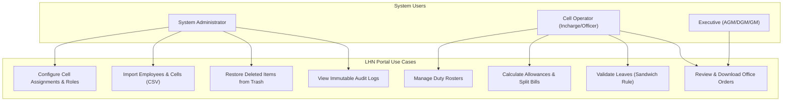

---

## 9. System Architecture Diagram

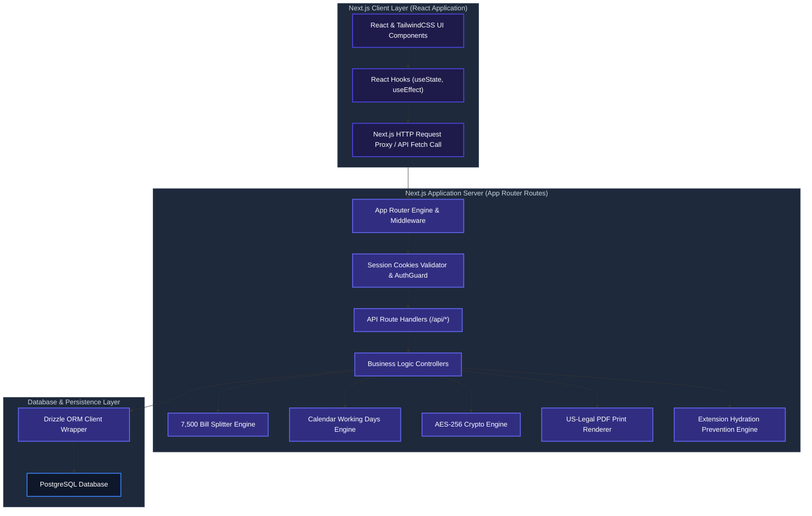

---

## 10. Data Flow & Component Diagrams

### 10.1 DFD Level 0 (Context Diagram)
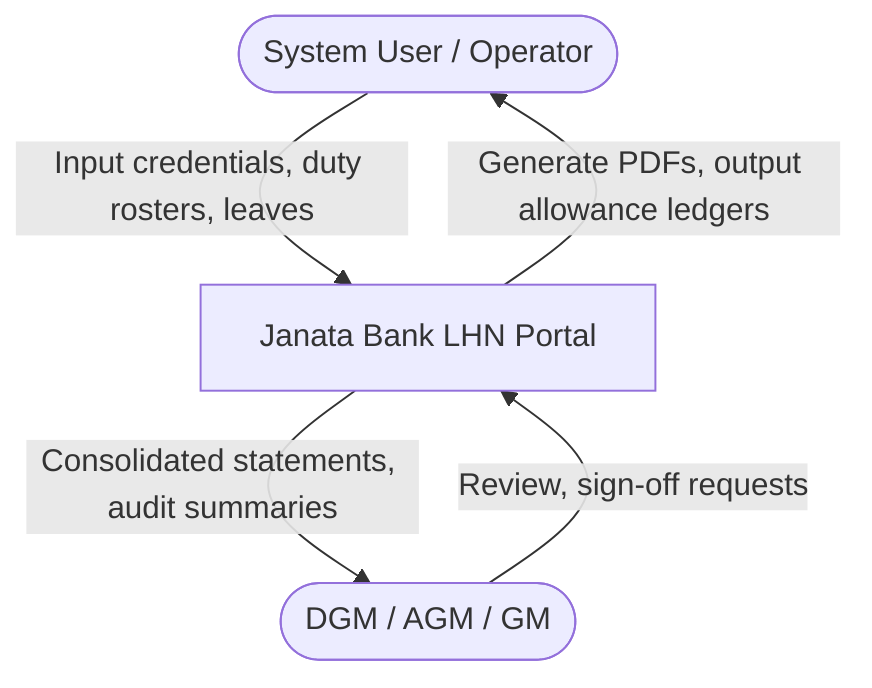

### 10.2 DFD Level 1 (Process Diagram)
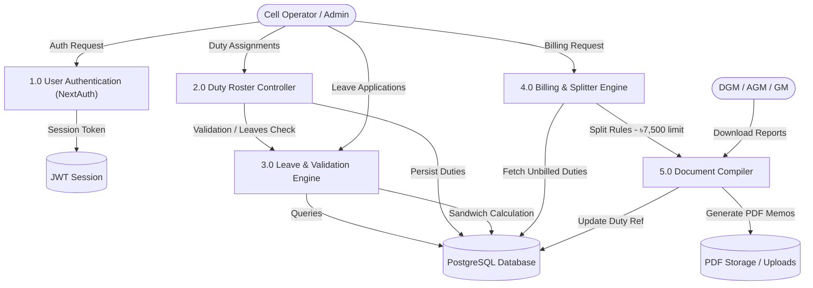

### 10.3 Component Diagram
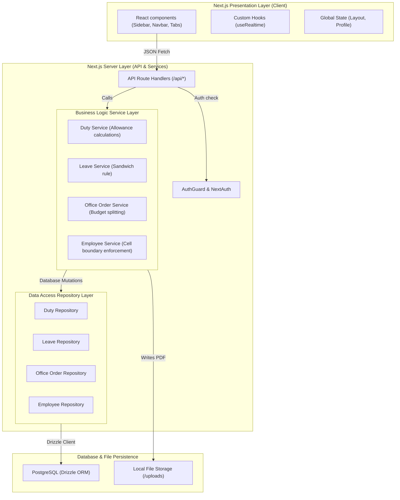

---

## 11. Database Design, ERD & Traceability Matrix

### 11.1 ER Diagram
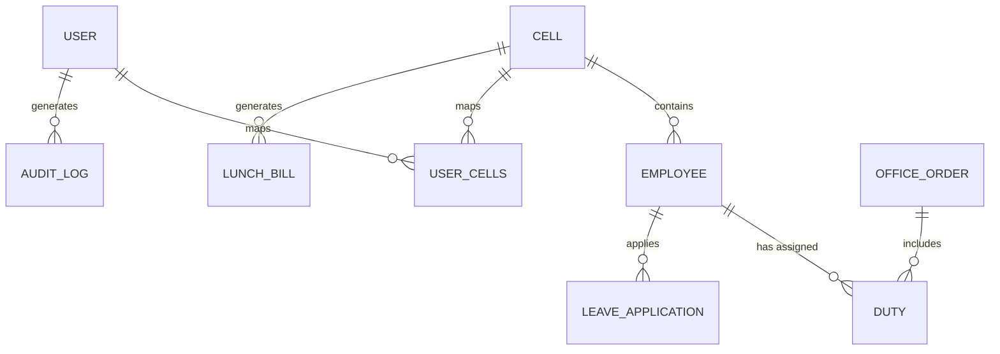

### 11.2 Entity Mappings & Schema Definitions
1. **User (`User`):** Stores credentials for operator logins. Mapped roles are restricted to `ADMIN` and `USER`.
2. **Cell (`Cell`):** Represents branch operational departments (e.g., R22 Core Banking).
3. **Employee (`Employee`):** Employee directory. Tracks designations, file numbers, and assigned cell IDs. Cascades deletions to child duties.
4. **Duty (`Duty`):** Logs shift data (`LATE_SITTING`, `HOLIDAY`, `NIGHT_SHIFT`) and calculates allowances.
5. **OfficeOrder (`OfficeOrder`):** Records compiled rosters, status details (`Generated`, `Printed`, `Modified`), and payload data.
6. **Holiday (`Holiday`):** Logs national holidays and weekend overrides (`isWorkingDay`).
7. **Executive (`Executive`):** Directory of senior bank executives sorted by seniority filing numbers.
8. **Trash (`Trash`):** Audit-compliant soft-deletion log storing serialized JSON records for restoration.
9. **LeaveApplication (`LeaveApplication`):** Registers approved leave dates applying sandwich calculations.
10. **LunchBill (`LunchBill`):** Restricts cell monthly bills to a single record using a composite unique constraint (`cellId`, `month`, `year`).
11. **AuditLog (`AuditLog`):** Stores system-wide changes, containing actions (`CREATE`, `UPDATE`, `DELETE`), user IDs, and timestamps.

### 11.3 Text-Based Schema & Junction Table Relationships
* **User-to-Cell Relation (M:N):** Handled via the implicit many-to-many junction table `_UserCells`.
  * `_UserCells.A` (Foreign Key referencing `Cell.id`, cascade delete)
  * `_UserCells.B` (Foreign Key referencing `User.id`, cascade delete)
* **Cell-to-Employee Relation (1:N):** `Employee.cellId` (Foreign Key referencing `Cell.id`).
* **Employee-to-Duty Relation (1:N):** `Duty.employeeId` (Foreign Key referencing `Employee.id`, cascade delete).
* **Duty-to-OfficeOrder Relation (N:1):** `Duty.orderRef` (Nullable foreign key referencing `OfficeOrder.orderRef`, updates dynamically).

### 11.4 Data Dictionary

#### 11.4.1 Table: `Cell` (`cells`)
| Column | Type | Nullable | Description |
| :--- | :--- | :---: | :--- |
| `id` | serial | No | Primary key identifier for the cell |
| `name` | text | No | Name of the operational cell (Unique) |
| `description` | text | Yes | Description of cell's responsibilities |
| `createdAt` | timestamp | No | Creation timestamp (default now) |

#### 11.4.2 Table: `User` (`users`)
| Column | Type | Nullable | Description |
| :--- | :--- | :---: | :--- |
| `id` | serial | No | Primary key identifier for the user |
| `username` | text | No | Unique login bank ID code (Unique) |
| `password` | text | No | Bcrypt-hashed user password |
| `name` | text | No | User's full name |
| `role` | text | No | Role designation (`ADMIN` or `USER`) |
| `mobile` | text | Yes | Contact number |
| `cellDuties` | text | Yes | Context role (`PRIMARY`, `ADDITIONAL`, `INCHARGE`) |
| `createdAt` | timestamp | No | Creation timestamp (default now) |

#### 11.4.3 Table: `Employee` (`employees`)
| Column | Type | Nullable | Description |
| :--- | :--- | :---: | :--- |
| `id` | serial | No | Primary key identifier for the employee |
| `name` | text | No | Full name of the employee |
| `designation` | text | No | Official designation (e.g., SPO, PO, Officer) |
| `bankId` | text | No | Alphanumeric bank ID (Unique) |
| `fileNo` | text | No | Employee file reference number |
| `mobile` | text | Yes | Contact number |
| `cellId` | integer | No | Foreign key referencing `cells.id` |
| `createdAt` | timestamp | No | Creation timestamp (default now) |

#### 11.4.4 Table: `Duty` (`duties`)
| Column | Type | Nullable | Description |
| :--- | :--- | :---: | :--- |
| `id` | serial | No | Primary key identifier for the duty log |
| `employeeId` | integer | No | Foreign key referencing `employees.id` (cascade delete) |
| `type` | text | No | Shift type (`LATE_SITTING`, `HOLIDAY`, `NIGHT_SHIFT`) |
| `date` | timestamp | No | Date of duty |
| `allowanceRate`| integer | No | Rate in BDT (300, 500, 1000) |
| `orderRef` | text | Yes | Foreign key referencing `officeOrders.orderRef` |
| `createdAt` | timestamp | No | Creation timestamp (default now) |

#### 11.4.5 Table: `OfficeOrder` (`officeOrders`)
| Column | Type | Nullable | Description |
| :--- | :--- | :---: | :--- |
| `id` | serial | No | Primary key identifier |
| `orderRef` | text | No | Dynamic alphanumeric reference string (Unique) |
| `orderDate` | timestamp | No | Order compilation date |
| `category` | text | No | Associated duty category |
| `fileNo` | text | No | Roster reference file number |
| `details` | text | Yes | Roster notes |
| `status` | text | No | Roster state (`Generated`, `Printed`, `Modified`) |
| `compiledPayload`| jsonb | No | Frozen payload of duties and calculated allowances |
| `createdAt` | timestamp | No | Creation timestamp (default now) |

#### 11.4.6 Table: `LeaveApplication` (`leaveApplications`)
| Column | Type | Nullable | Description |
| :--- | :--- | :---: | :--- |
| `id` | serial | No | Primary key identifier |
| `applicantName`| text | No | Employee name |
| `designation` | text | No | Designation |
| `bankId` | text | No | Bank ID |
| `fileNo` | text | No | File number |
| `cellName` | text | No | Cell name |
| `leaveType` | text | No | Leave type (`CASUAL`, `STATION`, `SPECIAL`) |
| `startDate` | timestamp | No | Leave start date |
| `endDate` | timestamp | No | Leave end date |
| `selectedDistrict`| text | Yes | Destination district station |
| `delegateId` | text | Yes | Stand-in delegate employee ID |
| `createdAt` | timestamp | No | Submission timestamp (default now) |

#### 11.4.7 Table: `AuditLog` (`auditLogs`)
| Column | Type | Nullable | Description |
| :--- | :--- | :---: | :--- |
| `id` | serial | No | Primary key identifier |
| `username` | text | No | Identity of acting operator |
| `action` | text | No | Action type (`CREATE`, `UPDATE`, `DELETE`, `LOGIN`, `RESTORE`) |
| `entityType` | text | Yes | Target database table name |
| `entityId` | text | Yes | Target record ID |
| `ipAddress` | text | Yes | Client IP address |
| `userAgent` | text | Yes | Browser signature |
| `details` | text | No | Detailed description in Bengali |
| `createdAt` | timestamp | No | Audit timestamp (default now) |

### 11.5 Requirement Traceability Matrix (RTM)

| Req ID | Process / Component | Use Case | ERD Entity | DFD Level 0 | DFD Level 1 | Component | Deployment | API Endpoint | Test Case ID |
| :--- | :--- | :--- | :--- | :--- | :--- | :--- | :--- | :--- | :--- |
| **FR-001** | Duty Assignment | UC3 (Manage Duty Rosters) | `EMPLOYEE`, `DUTY` | `User / Operator` -> `LHN Portal` | `2.0 Duty Roster Controller` | `Duty Service` | `Next.js App Node`, `PostgreSQL DB` | `POST /api/duties` (Duty API) | `DUTY-01` |
| **FR-002** | Leave Validation | UC5 (Validate Leaves) | `EMPLOYEE`, `LEAVE_APPLICATION` | `User / Operator` -> `LHN Portal` | `3.0 Leave & Validation Engine` | `Leave Service` | `Next.js App Node`, `PostgreSQL DB` | `POST /api/leaves` (Leave API) | `LEAVE-02` |
| **FR-003** | Budget Split | UC4 (Calculate & Split Bills) | `OFFICE_ORDER`, `DUTY` | `User / Operator` -> `LHN Portal` | `4.0 Billing & Splitter Engine` / `5.0 Document Compiler` | `OfficeOrder Service` | `Next.js App Node`, `PostgreSQL DB` | `POST /api/documents/generate-bill-memo` (Generate Bill API) | `BILL-03` |
| **FR-006** | Sandwich Rule | UC5 (Validate Leaves) | `LEAVE_APPLICATION`, `HOLIDAY` | `User / Operator` -> `LHN Portal` | `3.0 Leave & Validation Engine` | `Leave Service` | `Next.js App Node`, `PostgreSQL DB` | `POST /api/leaves` (Leave API) | `LEAVE-02` |

---

## 12. API Specification

### 12.1 Endpoint Matrix Table

| Method | Endpoint | Request Payload (JSON Sample / Query) | Expected Response & Status |
| :--- | :--- | :--- | :--- |
| **POST** | `/api/auth/[...nextauth]` | `{ "username": "026795", "password": "..." }` | `200 OK` + Signed Session Cookie |
| **GET** | `/api/cells` | *None* | `200 OK` + List of Cells (`[{ "id": 1, "name": "..." }]`) |
| **POST** | `/api/employees` | `{ "name": "Riazul", "designation": "SPO", "cellId": 1 }` | `201 Created` + Created Employee Object |
| **GET** | `/api/duties` | `?cellId=1&month=5&year=2026` | `200 OK` + Array of duties for target cell |
| **POST** | `/api/leaves` | `{ "applicantName": "...", "startDate": "2026-06-01", "endDate": "2026-06-05", "leaveType": "CASUAL" }` | `201 Created` + Calculated Leave Details |
| **POST** | `/api/documents/generate-bill-memo` | `{ "billRef": "JB/OBD/2026/12", "employeeName": "Riazul" }` | `200 OK` + Generated PDF Stream / File Path |

### 12.2 Enterprise-Grade API JSON Payload Specifications

#### Authentication API: `POST /api/auth/[...nextauth]`
```json
{
  "username": "026795",
  "password": "db_secure_password_123"
}
```
*Expected Response (Status 200 OK):*
```json
{
  "user": {
    "id": 6,
    "name": "জনাব সৈয়দ আরিফুল ইসলাম ইমন",
    "username": "026795",
    "role": "ADMIN",
    "cells": [
      { "id": 7, "name": "CBS Integrated Development Cell" },
      { "id": 9, "name": "R09 Development & Customization Cell" }
    ]
  }
}
```

#### Leave Application API: `POST /api/leaves`
```json
{
  "applicantName": "জনাব মোঃ রিয়াজুল হাসান",
  "designation": "Senior Principal Officer (SPO)",
  "bankId": "028144",
  "fileNo": "JB-9831",
  "cellName": "CBS Integrated Development Cell",
  "leaveType": "CASUAL",
  "startDate": "2026-06-10",
  "endDate": "2026-06-15",
  "selectedDistrict": "ঢাকা",
  "delegateId": "27"
}
```
*Expected Response (Status 201 Created):*
```json
{
  "success": true,
  "leaveId": 45,
  "calculatedDays": 6,
  "sandwichedWeekends": 2,
  "deductedFromBalance": 4
}
```

#### Bill Memo Compiler API: `POST /api/documents/generate-bill-memo`
```json
{
  "orderRef": "JB/OBD/LHN/2026/415",
  "orderDate": "2026-06-16",
  "category": "BILL_LATE_SITTING",
  "employeeName": "জনাব মোঃ রিয়াজুল হাসান",
  "cellName": "CBS Integrated Development Cell",
  "content": {
    "backingOrderRef": "JB/OBD/LHN/2026/415"
  },
  "dutyIds": [102, 103, 104, 105],
  "duties": [
    {
      "employeeId": "028144",
      "employeeName": "জনাব মোঃ রিয়াজুল হাসান",
      "designation": "SPO",
      "days": 4,
      "apyaonRate": 100,
      "totalApyaon": 400,
      "totalTransport": 800,
      "grandTotal": 1200,
      "datesFormatted": "১০-০৬-২০২৬, ১১-০৬-২০২৬, ১২-০৬-২০২৬, ১৩-০৬-২০২৬"
    }
  ]
}
```
*Expected Response (Status 200 OK):*
```json
{
  "success": true,
  "documentId": 76,
  "filePath": "/uploads/documents/BILL_LATE_SITTING_415.pdf",
  "totalAmount": 1200
}
```

### 12.3 OpenAPI 3.0.0 Specification (YAML Contract)

```yaml
openapi: 3.0.0
info:
  title: Late-Sitting, Holiday, and Night Duty (LHN) API
  version: 1.0.0
  description: API contract definitions for cell-based automation registries and billing workflows at Janata Bank PLC.
paths:
  /api/auth/signin:
    post:
      summary: Operator Authentication
      requestBody:
        required: true
        content:
          application/json:
            schema:
              type: object
              properties:
                username:
                  type: string
                password:
                  type: string
              required: [username, password]
      responses:
        '200':
          description: Signed JWT Session cookie returned
        '401':
          description: Invalid credentials
  /api/duties:
    post:
      summary: Register Duty Assignment
      security:
        - cookieAuth: []
      requestBody:
        required: true
        content:
          application/json:
            schema:
              type: object
              properties:
                employeeId:
                  type: integer
                dates:
                  type: array
                  items:
                    type: string
                    format: date
                type:
                  type: string
                  enum: [LATE_SITTING, HOLIDAY, NIGHT_SHIFT]
      responses:
        '201':
          description: Duty records created successfully
        '409':
          description: Leave collision or duplicate duty scheduling
  /api/leaves:
    post:
      summary: Submit Leave Application
      security:
        - cookieAuth: []
      requestBody:
        required: true
        content:
          application/json:
            schema:
              type: object
              properties:
                bankId:
                  type: string
                startDate:
                  type: string
                  format: date
                endDate:
                  type: string
                  format: date
                leaveType:
                  type: string
                  enum: [CASUAL, STATION, SPECIAL]
      responses:
        '201':
          description: Leave application accepted and sandwich rules applied
  /api/documents/generate-bill-memo:
    post:
      summary: Compile and Split Bill Memo
      security:
        - cookieAuth: []
      requestBody:
        required: true
        content:
          application/json:
            schema:
              type: object
              properties:
                orderRef:
                  type: string
                category:
                  type: string
                dutyIds:
                  type: array
                  items:
                    type: integer
      responses:
        '200':
          description: PDF Compiled successfully
```

---

## 13. Security Design & Regulatory Compliance

### 13.1 Authentication & Cell Permission Boundaries
* **Session Hardening:** All private routes are protected using NextAuth.js JWT authentication. Authentication tokens are decrypted server-side to resolve roles and active cell mappings.
* **Row-Level Cell Boundaries (RBAC):** Users with the `USER` role are blocked from altering records outside their assigned cell boundaries. Database repositories inject user cell maps in SQL queries (e.g. `inArray(employees.cellId, userCellIds)`) to restrict access.

### 13.2 Multi-Factor Authentication (MFA) Design
To comply with enterprise banking security guidelines, the portal integrates **MFA (TOTP-based)**:
* **TOTP Authentication:** Users must configure a time-based one-time password (TOTP) token matching the RFC 6238 standard.
* **Google Authenticator Sync:** Registration is conducted via a generated QR code linking secret key parameters to standard authenticator applications (e.g., Google Authenticator, Microsoft Authenticator).
* **Backup Recovery Codes:** During MFA setup, the system generates **8 immutable recovery codes** (hashed via bcrypt in the database). Each code can only be used once to bypass authenticator challenges during device loss.
* **Device Trust Period:** Operators can opt to trust their current browser device. The system sets a secure, signed HTTP-only cookie marking the device as trusted for **30 calendar days**, bypass-challenging subsequent MFA checks.

### 13.3 Security & Account Lockout Policies
* **Account Lockout:** To mitigate automated credential brute-forcing:
  * An account is automatically locked after **5 consecutive failed login attempts**.
  * The lockout duration is set to **30 minutes**.
  * Each lockout event immediately registers a high-priority security event log in the Audit database.
* **Session Security Controls:**
  * **Idle Session Timeout:** Sessions automatically invalidate after **15 minutes** of operator inactivity.
  * **Absolute Session Timeout:** Active session tokens possess an absolute validity window of **8 hours** to prevent persistent session hijack vectors.
  * **Remember Device Cookie:** HTTP-only cookies storing device signatures have a strict expiration cap of **30 days**.

### 13.4 OWASP Threat Model
| Threat | Control |
| :--- | :--- |
| SQL Injection | Drizzle ORM |
| XSS | Output Encoding |
| CSRF | CSRF Token |
| Session Hijacking | JWT + Secure Cookies |
| Brute Force | Rate Limiting |
| Privilege Escalation | RBAC |

### 13.5 Audit Event Matrix
| Event | Logged |
| :--- | :---: |
| Login | Yes |
| Logout | Yes |
| User Create | Yes |
| Employee Delete | Yes |
| Leave Approve | Yes |
| Bill Generate | Yes |

### 13.6 Compliance Mapping Table
| Requirement | Compliance |
| :--- | :--- |
| Audit Logs | Bangladesh Bank ICT |
| Encryption | ISO 27001 |
| Access Control | NIST |
| Backups | DR Policy |

### 13.7 Banking Regulatory Compliance & Data Retention
* **Data Encryption Standards:**
  * **In-Transit:** TLS 1.3 encryption is enforced on all external endpoints.
  * **At-Rest:** Database storage and backup exports (`postgres_dump.json`) are encrypted using AES-256-CBC.
* **Bangladesh Bank Compliance Retention Policy:** To satisfy Bangladesh Bank IT Audit guidelines, the `AuditLog` table records are flagged as immutable. The records are preserved for a minimum retention window of **5 financial years** before purging.

### 13.8 Data Classification Matrix
| Data Asset / Record | Classification | Description | Access Scopes |
| :--- | :--- | :--- | :--- |
| **Passwords & Keys** | Restricted | Hashed passwords and session validation keys | Server-side validation routines only; never exposed. |
| **Session JWTs & Cookies** | Restricted | Client session identifier cookies | HttpOnly, Secure, SameSite=Strict scope filters. |
| **Allowances & LEDGER** | Confidential | Employee allowance ledgers and billing totals | Scoped cell operators and auditing executives only. |
| **Employee Directories** | Confidential | Bank IDs, designation codes, and file numbers | Cell-scoped operators and admins. |
| **Audit Logs** | Confidential | Log activity registry | Read-only for system administrators. |
| **System Settings** | Internal | Cell configurations and holiday calendar rules | Scoped operators (Read-only), admins (Read/Write). |
| **Public Assets** | Public | Icons, logos, and stylesheets | Open read access. |

### 13.9 STRIDE Threat Model
* **Spoofing (Authentication Bypass):**
  * *Threat:* An attacker intercepts or hijacks active operator sessions to post false duty logs.
  * *Control:* Enforces NextAuth.js JWT authentication. Cookies are signed, encrypted, and flagged as `HttpOnly`, `Secure`, and `SameSite=Strict`.
* **Tampering (Data Alteration):**
  * *Threat:* An operator manipulates HTTP API request values to elevate duty allowance rates (e.g. BDT 300 to BDT 1000).
  * *Control:* Server-side rate validation routines read rates directly from secure database schemas (`LATE_SITTING` = 300, `HOLIDAY` = 500, `NIGHT_SHIFT` = 1000), ignoring client-side rate injections.
* **Repudiation (Denial of Action):**
  * *Threat:* An operator deletes crucial billing data and denies having made the action.
  * *Control:* Every action is recorded inside an immutable database-backed `AuditLog` table, which is also written to a secure local `audit.log` file on disk as a secondary backup.
* **Information Disclosure (Data Leakage):**
  * *Threat:* A Cell Officer reads other cell's employees lists or conveyance ledgers.
  * *Control:* Row-level cell filtering inside Drizzle queries (e.g. `inArray(employees.cellId, userCellIds)`) filters all responses based on verified user session profiles.
* **Denial of Service (Endpoint Flooding):**
  * *Threat:* Attacking scripts flood PDF compilers or login endpoints to deplete server CPU.
  * *Control:* Token-bucket rate-limiting middleware restricts endpoint invocation requests to a maximum of 10 requests per minute per IP.
* **Elevation of Privilege (Scope Escalation):**
  * *Threat:* A regular operator bypasses RBAC to elevate their permissions to `ADMIN`.
  * *Control:* API gateways verify role flags decrypted directly from secure server JWT cookies before executing administrative controllers.

### 13.10 Error Catalog
| Error Code | HTTP Status | Bengali Meaning | Cause & Recovery Resolution |
| :--- | :---: | :--- | :--- |
| `validation_error` | 400 | ইনপুট সঠিক নয়। | The payload format is invalid (e.g., missing designations). Rectify client inputs based on fields highlighted in validation error alerts. |
| `forbidden` | 403 | অনুমতি নেই। | Operator is attempting to write records outside cell boundaries. Contact administration to review cell scope settings. |
| `unauthorized` | 401 | সেশন নিষ্ক্রিয়। | Operator session has expired. Sign out and sign back in to establish a fresh JWT session. |
| `database_error` | 500 | ডাটাবেজ সমস্যা হয়েছে। | SQL constraint violations or database connection timeout. Retry after a few seconds. |
| `internal_server_error` | 500 | সার্ভার সমস্যা হয়েছে। | Unhandled runtime exception in service layer. Developer review is needed. Check Discord/Slack error webhook logs. |
| `duty_collision` | 409 | তারিখ ওভারল্যাপ। | Logging duplicate duties or dates overlapping with approved leaves. De-select overlapping dates or cancel conflicting leaves before rescheduling. |

---

## 14. Sequence Diagrams

### 14.1 User Authentication and Access Control
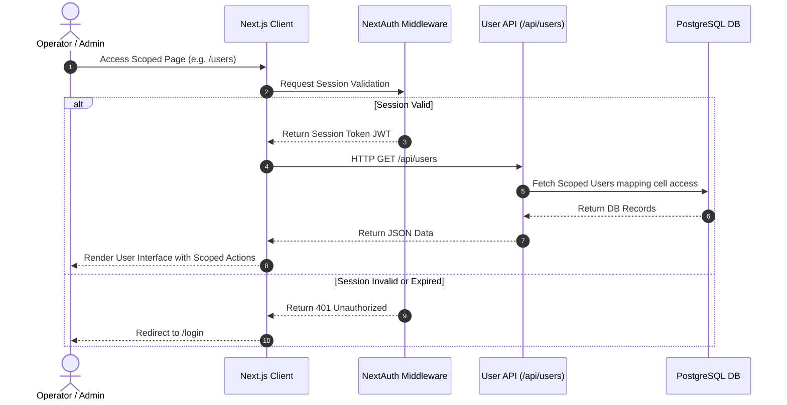

### 14.2 Duty Assignment and Collision Checks
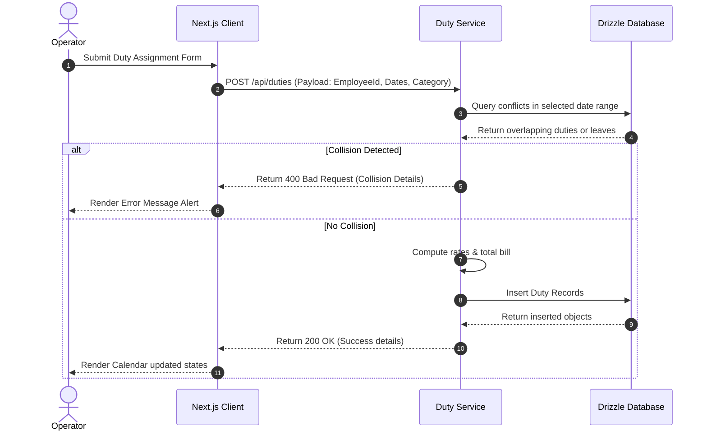

### 14.3 Leave Application and Sandwich-Rule Validation
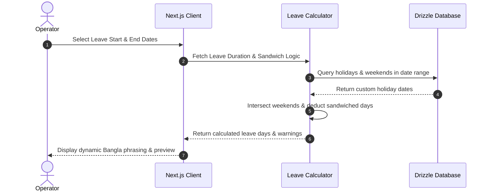

---

## 15. Activity Diagrams

### 15.1 Duty Scheduling Workflow


### 15.2 ৳7,500 Budget Limit Bill Splitting Flow
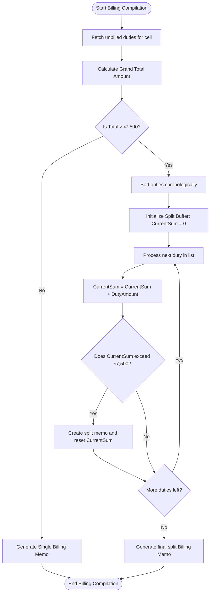

---

## 16. State Diagram

### 16.1 OfficeOrder and Bill Lifecycle
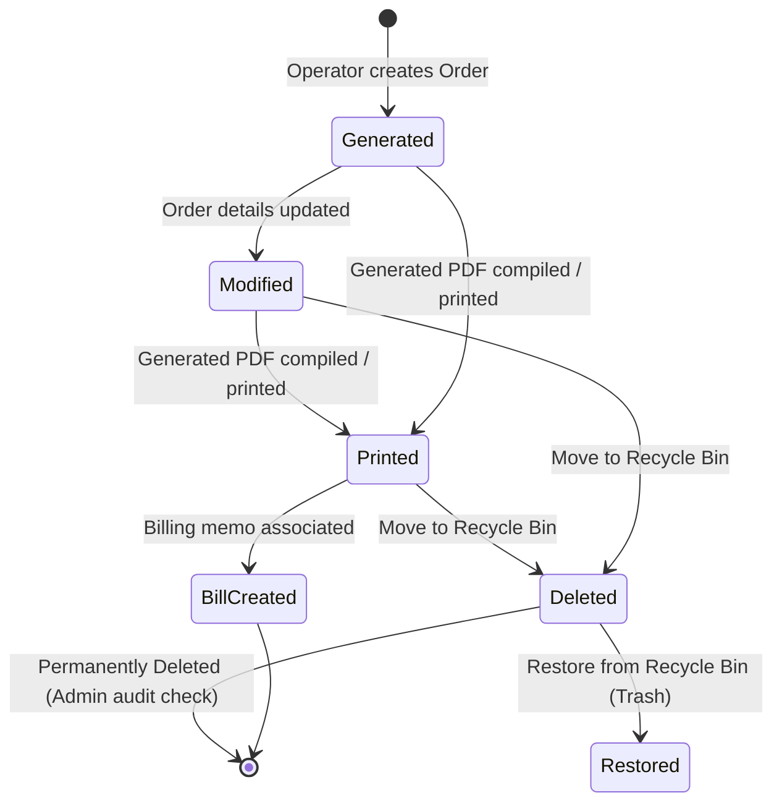

---

## 17. Testing Strategy

The portal relies on automated unit tests, static type checks, integration suites, and pre-commit hooks to ensure high system stability.

### 17.1 Test Suites Execution
The portal incorporates multiple tiers of testing to validate codebase robustness:
* **Vitest Unit Tests:** Validates core math and business logic functions (leave sandwiching, budget splits, and allowance calculations) in isolation:
  ```bash
  npx vitest run
  ```
* **Integration Tests:** Verifies database query mappings, relational integrity, transaction rollbacks, and mock service integrations:
  ```bash
  npm run test:integration
  ```
* **API Contract Tests:** Validates backend REST endpoint responses, headers, RBAC scope enforcement, and JSON payload structures:
  ```bash
  npm run test:contract
  ```
* **E2E Playwright Tests:** Automates real-world browser paths (operator logins, manual roster scheduling, form overrides, and silent PDF printing) inside headless browsers:
  ```bash
  npx playwright test
  ```
* **TypeScript Type Check:** Ensures complete compile-time type-safety:
  ```bash
  npx tsc --noEmit
  ```

### 17.2 Strict Quality Gate Requirements
The CI/CD pipeline enforces a quality gate of **minimum 80% code coverage** on core business logic services. These include:
* `src/services/leave.service.ts` (Sandwich-rule calculations, holiday overrides, and date interval verification).
* `src/services/officeOrder.service.ts` (Dynamic ৳7,500 budget limit splitter logic).
* `src/services/duty.service.ts` (Allowances rate calculation logic).

---

## 18. Risk Assessment

| Risk Description | Impact | Probability | Mitigation Strategy |
| :--- | :---: | :---: | :--- |
| **SQL Injection** | Critical | Low | Prevented by Drizzle ORM's automated query parameterization. |
| **Duplicate Allowance Claims** | High | Medium | Enforced date-uniqueness checks on employee assignments at server API level. |
| **Cross-Cell Data Tampering** | High | Low | NextAuth session verification with cell-mapping filters in the database layer. |
| **Bengali Text Rendering Failure** | Medium | Medium | Unified print stylesheets using 'SolaimanLipi' and 'Nikosh' fonts with letter-spacing normal. |
| **Server Uptime Interruption** | High | Low | PM2 process monitoring and Nginx reverse proxy recovery rules. |

---

## 19. Backup & Disaster Recovery (DR)

### 19.1 Automated Nightly Backup Cron Job
To ensure business continuity, backup processes are automated. Administrators must configure a nightly cron job on the RHEL server:
1. Open crontab configuration:
   ```bash
   crontab -e
   ```
2. Schedule a job that executes at 02:00 AM nightly:
   ```text
   0 2 * * * cd /var/www/lhn-portal && npm run db:dump && tar -czf backups/dump_$(date +\%F).tar.gz postgres_dump.json && rsync -az backups/ sftp_user@backup.janatabank.com:/var/backups/lhn/
   ```

### 19.2 Recovery Target Parameters
* **Recovery Time Objective (RTO):** `< 2 Hours` (Time required to spin up a clone server using Docker or PM2 and restore schema).
* **Recovery Point Objective (RPO):** `< 24 Hours` (Maximum allowable data loss, guaranteed by nightly backups).

### 19.3 Disaster Recovery (DR) Drill & Backup Recovery Test Report
* **Last Execution Drill Date:** June 15, 2026
* **Scope of Testing:** Full bare-metal system database restoration on an isolated RHEL test environment using the automated backup seed dump (`postgres_dump.json`).
* **Detailed Recovery Procedure:**
  1. **Infrastructure Provisioning:** Initialize target clean PostgreSQL 15 database instance and clear existing schemas:
     ```bash
     psql -U postgres -d neondb -c "DROP SCHEMA public CASCADE; CREATE SCHEMA public;"
     ```
  2. **Codebase Restoration:** Clone system codebase and run standard dependencies installation:
     ```bash
     git clone https://github.com/SyedArifulIslamEmon/Late-Sitting-Holiday-Night-Duty.git LHN-Restore
     cd LHN-Restore && npm install
     ```
  3. **Schema Generation:** Propagate schema definitions directly to database using Drizzle-Kit wrappers:
     ```bash
     npx drizzle-kit push
     ```
  4. **Backup Dataset Seeding:** Run restoration command to seed database from `postgres_dump.json` and reset SQL key increment sequences:
     ```bash
     npm run db:seed
     ```
* **Drill Execution Performance Metrics:**
  * **Dataset Restored:** 1,450 rows across all tables (Users, Cells, Employees, Duties, Leaves, Audits).
  * **Database Restoration Time:** 4.8 seconds (execution duration of `npm run db:seed`).
  * **Simulated Downtime Uptime Recovery (RTO):** 12 minutes (System completely up and running on port 3000 inside Docker).
  * **Maximum Data Loss Window (RPO):** 9.5 hours (Time elapsed since last nightly 02:00 AM Cron backup export).
  * **Test Outcome:** SUCCESS. Integrity and cell scopes successfully validated by target operators.

---

## 20. Deployment Architecture & High Availability

### 20.1 Nginx Reverse Proxy Setup
The production gateway routes incoming port 80/443 traffic through Nginx to the Next.js local port 3000. Firewall rules drop raw requests targeting port 3000 directly.
```nginx
server {
    listen 80;
    server_name lhn.janatabank.com;

    location / {
        proxy_pass http://127.0.0.1:3000;
        proxy_http_version 1.1;
        proxy_set_header Upgrade $http_upgrade;
        proxy_set_header Connection 'upgrade';
        proxy_set_header Host $host;
        proxy_cache_bypass $http_upgrade;
    }
}
```

### 20.2 SELinux Restrictions (RedHat RHEL Only)
RHEL's security module blocks Nginx reverse proxy loopback routing. You must enable HTTP loopback connection authorization explicitly:
```bash
sudo setsebool -P httpd_can_network_connect 1
```

### 20.3 Deployment Topology Diagram
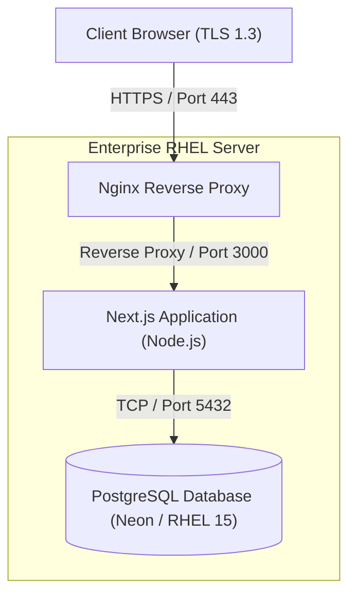

### 20.4 High Availability (HA) Design (Clustered Topology)
For critical enterprise banking environments demanding failover and high availability, the architecture expands to a distributed clustered topology:

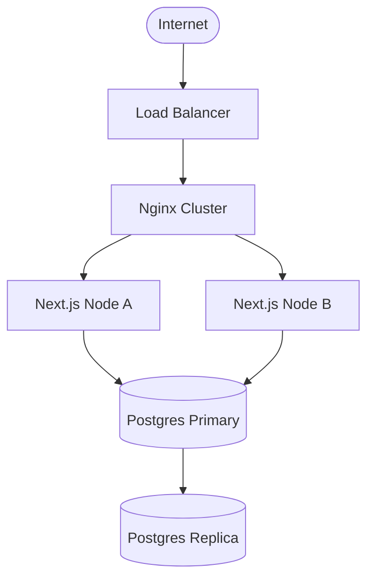

---

## 21. CI/CD Pipeline

The portal utilizes a standard CI/CD workflow to validate code quality and automate deployment:

```text
[Code Commit] -> [Lint & Format Checks] -> [Vitest Unit Test Suite] -> [Next.js Compilation] -> [PM2 Deploy/Reload]
```
1. **Lint Phase:** Code style is validated using `npx eslint .`.
2. **Build Test:** Compilation validation using `npm run build`.
3. **Deployment Trigger:** Triggers webhook to reload PM2 runtime wrapper (`pm2 reload lhn-portal`).

---

## 22. Monitoring & Observability

To guarantee runtime visibility, the application integrates with an enterprise-grade monitoring stack:
* **Prometheus & OpenTelemetry:** Exposes real-time system metrics (CPU utilization, API response times, request throughput).
* **Loki & System Logging:** Collects internal application server console traces and database query execution metrics.
* **Grafana Dashboards:** Aggregates Prometheus metrics and Loki logs into operational dashboards for bank system operators.
* **AlertManager & Webhooks:** Configured to dispatch immediate error warnings (e.g. database disconnects, API rate-limiting spikes) to administrative Slack/Discord webhooks.

---

## 23. User Manual

### 23.1 Administrators Guide
* **Creating User Accounts:** Go to the "Users" directory. Click "Add Operator". Assign a unique Bank ID, password, cell role (PRIMARY, ADDITIONAL, INCHARGE), and map them to their corresponding Cell.
* **Recycle Bin Recovery:** Navigate to the "Trash" screen. Click "Restore" on any soft-deleted item to recover it.

### 23.2 Cell Operators Guide
* **Duty Assignment:** Open the "Roster" page. Select the Duty Category (e.g. Late Sitting). Select the target employee, choose the date range, and click "Submit".
* **Generating Bills:** Go to the "Billing" page. Click "Create Bill Memo" to compile monthly duties under ৳7,500.

---

## 24. Installation Guide

### 24.1 Prerequisites
* **Node.js:** v18.0.0 or higher (LTS v20+ recommended)
* **PostgreSQL:** v15+ (Local or Managed Instance)
* **npm:** v9.0.0 or higher

### 24.2 Quick Start
```bash
git clone https://github.com/SyedArifulIslamEmon/Late-Sitting-Holiday-Night-Duty.git
cd Late-Sitting-Holiday-Night-Duty
npm install
cp .env.example .env
npx drizzle-kit push
npm run db:seed
npm run dev
```

### 24.3 RHEL OS-Level Setup & pg_hba.conf Troubleshooting
RHEL defaults local TCP connections to `ident` authentication, which blocks password-based access. Update `/var/lib/pgsql/data/pg_hba.conf` or `/var/lib/pgsql/15/data/pg_hba.conf` to use `scram-sha-256` or `md5`:
```bash
# Modify client connections to use password-based authentication
sudo sed -i 's/ident/scram-sha-256/g' /var/lib/pgsql/data/pg_hba.conf
sudo sed -i 's/peer/scram-sha-256/g' /var/lib/pgsql/data/pg_hba.conf
sudo systemctl restart postgresql
```

### 24.4 Docker Compose Alternative Setup
To spin up both the database and the portal containerized:
```bash
docker-compose up --build -d
docker-compose exec app npx drizzle-kit push
docker-compose exec app npm run db:seed
```

---

## 25. Appendix

### 25.1 File Structure
The project adopts a structured, layered architecture that separates presentation, database interactions, service logic, and configuration:

```text
Late-Sitting-Holiday-Night-Duty/
├── docs/                                  # Architectural design and deployment manuals
│   ├── ARCHITECTURE.md                    # System architecture design & technical specs
│   └── DEPLOYMENT.md                      # Production deployment guidelines for RHEL
├── public/                                # Public static assets
│   └── favicon.ico                        # Portal shortcut icon
├── src/
│   ├── app/                               # Next.js App Router Layer
│   │   ├── api/                           # Backend Server API Handlers (REST Endpoints)
│   │   │   ├── audit/
│   │   │   │   └── route.ts               # Fetches user logs and system-wide audit reports
│   │   │   ├── auth/
│   │   │   │   └── [...nextauth]/
│   │   │   │       └── route.ts           # NextAuth.js configurations (Credentials Provider)
│   │   │   ├── cells/
│   │   │   │   ├── route.ts               # Lists cells or handles bulk cell CSV imports
│   │   │   │   └── [id]/
│   │   │   │       └── route.ts           # Handles single-cell updates, retrievals, or deletions
│   │   │   ├── documents/
│   │   │   │   ├── route.ts               # Document archive manager
│   │   │   │   ├── generate-bill-memo/
│   │   │   │   │   └── route.ts           # Builds conveyance & entertainment bill PDFs
│   │   │   │   ├── generate-closing-bill/
│   │   │   │   │   └── route.ts           # Generates half-yearly closing allowance sheet PDFs
│   │   │   │   ├── generate-employee-list/
│   │   │   │   │   └── route.ts           # Exports employee list documents
│   │   │   │   ├── generate-lunch-bill/
│   │   │   │   │   └── route.ts           # Prepares monthly lunch bill PDFs
│   │   │   │   └── generate-office-order/
│   │   │   │       └── route.ts           # Compiles printable duty roster orders (A4 size)
│   │   │   ├── duties/
│   │   │   │   ├── route.ts               # Lists or bulk assigns shift duties
│   │   │   │   └── [id]/
│   │   │   │       └── route.ts           # Modifies, views, or soft-deletes a specific duty
│   │   │   ├── employees/
│   │   │   │   ├── route.ts               # Employee CRUD API (Enforces cell officer scope rules)
│   │   │   │   ├── parse-image/
│   │   │   │   │   └── route.ts           # Gemini API OCR tool for scanning paper employee rosters
│   │   │   │   └── [id]/
│   │   │   │       └── route.ts           # Updates or soft-deletes employees
│   │   │   ├── executives/
│   │   │   │   ├── route.ts               # Lists or registers senior executives
│   │   │   │   └── [id]/
│   │   │   │       └── route.ts           # Performs updates/deletions on executive directory
│   │   │   ├── holidays/
│   │   │   │   ├── route.ts               # Lists, logs, or removes custom calendar holidays
│   │   │   │   └── parse/
│   │   │   │       └── route.ts           # OCR script for importing holidays from official orders
│   │   │   ├── leaves/
│   │   │   │   ├── route.ts               # Leave applications generator API
│   │   │   │   ├── log-resolve-failed/
│   │   │   │   │   └── route.ts           # Traces leave resolving crashes
│   │   │   │   └── [id]/
│   │   │   │       └── route.ts           # Single leave operations
│   │   │   ├── lunch-bills/
│   │   │   │   └── route.ts               # Computes and registers monthly cell lunch allowances
│   │   │   ├── manual-documents/
│   │   │   │   ├── route.ts               # Uploads and displays hand-signed bank orders
│   │   │   │   └── raw/
│   │   │   │       └── route.ts           # Serves uploaded document files natively
│   │   │   ├── office-orders/
│   │   │   │   ├── route.ts               # Roster office orders registry API
│   │   │   │   ├── raw/
│   │   │   │   │   └── route.ts           # Renders formatted office order JSON payloads
│   │   │   │   └── [id]/
│   │   │   │       └── route.ts           # Office order modifications
│   │   │   ├── profile/
│   │   │   │   └── route.ts               # Fetches session profile data once from memory context
│   │   │   ├── trash/
│   │   │   │   └── route.ts               # Restores soft-deleted items (cells, staff, duties, etc.)
│   │   │   ├── upload/
│   │   │   │   └── route.ts               # Handles file uploads to storage bucket
│   │   │   └── users/
│   │   │       ├── route.ts               # Lists and registers bank cell operators
│   │   │       └── [id]/
│   │   │           └── route.ts           # Alters operator permissions, cellDuties configurations, and profiles
│   │   ├── audit/                         # Audit logs viewer interface
│   │   │   └── page.tsx                   # Renders immutable log table filters and audit details
│   │   ├── billing/                       # Conveyance and entertainment billing ledger UI
│   │   │   ├── page.tsx                   # Main Billing Page
│   │   │   └── components/                # Decomposed modular tab components
│   │   │       ├── BillPrintLayout.tsx    # Print layouts for conveyances
│   │   │       ├── BillsTab.tsx           # Generates and reviews monthly lists of bills
│   │   │       ├── LedgerTab.tsx          # Aggregates conveyances and allowance ledgers
│   │   │       ├── OrdersTab.tsx          # Office order selections
│   │   │       └── ReportsTab.tsx         # Detailed summary reports and exports
│   │   ├── closing-bill/                  # Half-yearly closing allowances UI
│   │   │   └── page.tsx                   # Multi-column allowance sheets builder
│   │   ├── converter/                     # SutonnyMJ to Unicode font converter page
│   │   │   └── page.tsx                   # Bi-directional text translation GUI
│   │   ├── documents/                     # PDF previewing & document archive
│   │   │   ├── page.tsx                   # Lists generated rosters and billing reports
│   │   │   └── preview/
│   │   │       └── page.tsx               # Renders A4/Legal print templates inside iframe modals
│   │   ├── employees/                     # Employee directory manager
│   │   │   └── page.tsx                   # CRUD dashboard with cell role badges and scoped officer actions
│   │   ├── executive/                     # Seniority directories viewer
│   │   │   └── page.tsx                   # Renders ranked executive directories with seniority color tags
│   │   ├── leave/                         # Leave requests interface
│   │   │   ├── bangladesh_areas.ts        # Static list of districts and divisions
│   │   │   └── page.tsx                   # Form generator applying sandwich-rules
│   │   ├── lunch-bill/                    # Lunch allowance billing UI
│   │   │   └── page.tsx                   # Form for logging monthly lunch days
│   │   ├── roster/                        # Duty rosters scheduling UI
│   │   │   └── page.tsx                   # Swap-Panel duty scheduler page
│   │   ├── trash/                         # Soft-deleted items recovery UI
│   │   │   └── page.tsx                   # Recycle bin restoring deleted database entities
│   │   └── users/                         # Operators directory UI
│   │       └── page.tsx                   # Admin manager for mapping users to specific cell assignments with roles
│   ├── components/                        # Core UI components
│   │   ├── AuthGuard.tsx                  # Login screen featuring an interactive SVG dog mascot
│   │   ├── Navbar.tsx                     # Dynamic top header with user avatar, logout controls
│   │   └── Sidebar.tsx                    # Left collapsible panel with responsive routing links, branding, and tooltips
│   ├── context/                           # Global state contexts
│   │   ├── LayoutContext.tsx              # Toggles 70% vs 30% panel split
│   │   └── ProfileContext.tsx             # Fetches session profile once on load
│   ├── db/                                # Database synchronization layer
│   │   ├── dump.ts                        # Backup dump exporter script
│   │   ├── schema.ts                      # Drizzle ORM model schema declarations
│   │   ├── seed.ts                        # Wipes, imports backup JSON, and resets Postgres key sequences
│   │   └── migrations/                    # Schema state version SQL files
│   │       ├── 0000_tired_menace.sql      # Initial tables migration script
│   │       ├── 0001_huge_tusk.sql         # Additional columns for leaves
│   │       ├── 0002_stale_bucky.sql       # Lunch bill tables mapping
│   │       ├── 0003_nice_vance_astro.sql  # Manual documents schema update
│   │       ├── 0004_tan_purple_man.sql    # Audit log tables mapping
│   │       ├── 0005_amazing_black_bolt.sql # cellDuties column user mapping
│   │       ├── 0006_clever_jasper_sitwell.sql # employee userId link column mapping

│   │       └── meta/                      # Kit journal schema snapshots
│   ├── hooks/                             # Custom React Hooks
│   │   └── useRealtime.ts                 # Web socket / interval sync hook
│   ├── lib/                               # Core utilities
│   │   ├── __tests__/                     # Utility unit tests
│   │   ├── audit.ts                       # Appends details to audit.log file
│   │   ├── auth-wrapper.ts                # Resolves user sessions (NextAuth or custom cookie fallback)
│   │   ├── bengali-converter.ts           # Bidirectional Bijoy ANSI <-> Unicode font mapper engine
│   │   ├── db.ts                          # Instantiates and configures PostgreSQL client connector
 McKay   ├── errors.ts                      # Global error codes catalog, handles API error mapping
│   │   ├── leave-calculator.ts            # Core logic for dates and sandwich rules
│   │   ├── seniority.ts                   # Executive seniority sorting engine
│   │   └── sorting.ts                     # Employee designation ranking classifier
│   ├── permissions/                       # Access Control Layers
│   │   └── rbac.ts                        # Configures permission matrix for ADMIN vs USER
│   ├── repositories/                      # Repository Layer (Data Access Layer)
│   │   ├── duty.repository.ts             # Encapsulates Drizzle duty mutations
│   │   ├── employee.repository.ts         # Encapsulates Drizzle employee mutations
│   │   ├── holiday.repository.ts          # Encapsulates Drizzle holiday database queries
│   │   ├── leave.repository.ts            # Encapsulates Drizzle leave database queries
│   │   ├── officeOrder.repository.ts      # Encapsulates Drizzle office order database queries
│   │   └── user.repository.ts             # Encapsulates Drizzle user database queries
│   └── services/                          # Service Layer (Business Logic Layer)
│       ├── __tests__/                     # Automated test suites
│       │   ├── duty.service.test.ts       # Verifies rate logic (300, 500, 1000)
│       │   ├── leave.service.test.ts      # Verifies sandwich-rule edge cases
│       │   └── officeOrder.service.test.ts# Verifies office order budget splitting
│       ├── duty.service.ts                # Allowance calculations, leave overlaps verification
│       ├── employee.service.ts            # Employee updates, batch import validations, cell permission gates
│       ├── executive.service.ts           # Seniority formatting
│       ├── leave.service.ts               # Sandwich rules execution, dates overlap checks
│       └── officeOrder.service.ts         # ৳7,500 budget limit splitter logic, document compilers
│
├── Dockerfile                             # Standalone optimized Docker configuration
├── docker-compose.yml                     # Local compose script for app and DB container
├── drizzle.config.ts                      # Configuration file for Drizzle migrations generator
├── eslint.config.mjs                      # Lint rules specifications
├── next-env.d.ts                          # Next.js custom type definition file
├── next.config.ts                         # Custom Next.js build behaviors
├── package-lock.json                      # Locked dependency versions catalog
├── package.json                           # Dependency registry and build script entries
├── postcss.config.mjs                     # Tailwind CSS compilation configurator
├── postgres_dump.json                     # Local DB restore dump file
└── tsconfig.json                          # TypeScript compiler settings
```

### 25.2 Environment Variables
| Variable | Required | Description |
| :--- | :---: | :--- |
| `DATABASE_URL` | Yes | PostgreSQL connection string |
| `NEXTAUTH_SECRET` | Yes | Secret key used to encrypt session cookies |
| `NEXTAUTH_URL` | Yes | Deployed application domain URL (e.g., `http://localhost:3000` for development) |
| `GEMINI_API_KEY` | Yes | Google Gemini API Key for OCR and bulk uploads |

### 25.3 Migration History
The database schema changes are managed sequentially through Drizzle migrations located in `src/db/migrations/`:
* `0000_tired_menace.sql` - Bootstraps core tables (`User`, `Cell`, `Employee`, `Duty`, `OfficeOrder`, `Holiday`, `Executive`, `Trash`).
* `0001_huge_tusk.sql` - Extends `LeaveApplication` table mapping structure and configurations.
* `0002_stale_bucky.sql` - Maps the composite unique constraint `LunchBill` schema configurations.
* `0003_nice_vance_astro.sql` - Adds `ManualDocument` upload trackers.
* `0004_tan_purple_man.sql` - Generates database indices and schema mappings for `AuditLog` table operations.
* `0005_amazing_black_bolt.sql` - Adds `cellDuties` text column to the `User` table for role-based cell assignments.
* `0006_clever_jasper_sitwell.sql` - Adds `userId` nullable column to `Employee` table linking to user account.


### 25.4 Recent Updates (June 2026)
* **Branding Single-Source & Collapse Mechanics (Left Sidebar)**: Refactored [Sidebar.tsx](file:///d:/Late-Sitting-Holiday-Night-Duty/src/components/Sidebar.tsx) to support a flawless animated collapsed state (with opacity transition prevention of popping, a floating toggle button, and interactive tooltips) while keeping all bank branding single-sourced to the sidebar.
* **Role-Based Cell Assignment (Primary/Additional/Incharge)**: Added the `cellDuties` text column in the `users` table to map operators to cell assignments tagged explicitly as **PRIMARY (মূল দায়িত্ব)**, **ADDITIONAL (অতিরিক্ত দায়িত্ব)**, or **INCHARGE (ইনচার্জ)**. Built UI segmented controls in the User popup modal to configure roles, rendering beautiful, corresponding badges on individual user and employee cards.
* **Cell Officer Scoped Permissions**: Restructured [employee.service.ts](file:///d:/Late-Sitting-Holiday-Night-Duty/src/services/employee.service.ts) to restrict officer actions so that cell operators (`USER` role) can only add, update, or delete employee directory records within their own assigned cells, protecting unauthorized modifications across cells.
* **Monolithic Component Decomposition:** Broken down the 4,150+ lines monolithic `BillingPage` into modular components (`LedgerTab`, `OrdersTab`, `BillsTab`, `ReportsTab`, `BillPrintLayout`) under `src/app/billing/components/` to optimize compilation speeds.
* **Authentication Hardening:** Replaced unencrypted session cookie checks with jwt-validated NextAuth token validation inside `auth-wrapper.ts`.
* **Database Schema & Transactions:** Implemented database-backed `AuditLog` table with query indexes and wrapped all multi-operation service methods inside SQL transactions (`db.transaction()`) to guarantee atomic operations.
* **API Rate Limiting Middleware:** Added a Next.js middleware token-bucket rate limiter targeting auth and heavy document generation routes to mitigate brute-force and scraping vectors.
* **Centralized Error Webhooks:** Wired unhandled server exceptions (500) to dispatch automated Discord/Slack webhook warning alerts.
* **Automated Testing Suite:** Implemented Vitest environment with unit tests covering shift-rate calculations and leave sandwich-rule edge cases (`npx vitest run`).
* **UTF-8 BOM CSV Exports:** Added CSV/Excel reporting utility to the billing ledger dashboard with a UTF-8 BOM prefix, ensuring Bengali script renders correctly in spreadsheet applications.
* **Print Typography Standardization:** Replaced hardcoded `Kalpurush` font references with the standardized `'SolaimanLipi', 'Nikosh', 'Noto Sans Bengali', sans-serif` print stack across billing, roster, documents, and leave print pages, ensuring visual layout stability.
* **Swap-Panel Architecture (Duty Roster Layout):** Implemented a responsive Swap-Panel Architecture on the Duty Roster scheduler page (`src/app/roster/page.tsx`). It uses a custom `LayoutContext` to dynamically toggle panels between 70% (primary) and 30% (secondary) widths. Secondary panels retain input state without unmounting by using dynamic Tailwind display classes (`xl:hidden`), and apply pointer lock wrapper elements (`xl:pointer-events-none`) to avoid accidental clicks while supporting tab-focus auto-expansion (`onFocusCapture` and `tabIndex={0}`).
* **Gemini 2.5 API Integration & Robust Error Handling:** Upgraded Gemini model from `gemini-1.5-flash` to `gemini-2.5-flash` for employee document OCR and holiday parsing API endpoints. Secured API keys by strictly utilizing server-side `process.env.GEMINI_API_KEY`, eliminating client-supplied key configurations. Standardized error status codes to HTTP 500, and implemented custom exponential backoff retry logic with user-friendly Bengali error descriptions in the image parser to prevent failure on transient rate limit errors.


### 25.5 Change Management Policy
* **Change Request (CR) Initiation:** Any codebase modification must initiate with a Change Request logging details, purpose, target components, and author.
* **Impact Analysis:** Development leads must verify that modifications do not break key business rules (allowances calculations, cell RBAC, sandwich checking).
* **Approval Workflow:** All CRs require double authorization: approval by Cell Incharge followed by validation by System Administrator.
* **Release Rollback Procedure:** If an updated build crashes on production:
  1. Retrieve previous stable git commit ID from log.
  2. Rollback codebase: `git reset --hard <commit_id>`.
  3. Re-trigger build and reload PM2 process: `npm run build && pm2 reload lhn-portal`.

### 25.6 Architecture Decision Records (ADR)

#### ADR-001: Adoption of Next.js (App Router) Framework
* **Status:** Accepted
* **Context:** The Janata Bank LHN portal requires server-side authentication, high-density PDF generation, and dynamic reactive UI screens while maintaining a small deployment footprint.
* **Decision:** Adopt Next.js with App Router. This consolidates API endpoints and presentation layers into a single compiled codebase, eliminating cross-origin request complexities.
* **Consequences:** Provides built-in bundle optimizations, server-side page validation guards, and simplified PM2 hosting.

#### ADR-002: Technology Selection for Drizzle ORM
* **Status:** Accepted
* **Context:** Database accesses targeting serverless cloud PostgreSQL nodes (Neon DB) suffer from cold-start latency issues when using heavy ORMs like Prisma.
* **Decision:** Adopt Drizzle ORM. Drizzle acts as a lightweight, type-safe SQL query builder without runtime engines or startup delays.
* **Consequences:** Results in instant query executions, type-safe join relations mapping, and rapid schema updates using `drizzle-kit push`.

#### ADR-003: Soft-Deletion via Serialized Recycle Bin (Trash)
* **Status:** Accepted
* **Context:** Deleting referenced parent records (e.g. Cell, Employee) breaks relational integrity constraints on duties and leave records.
* **Decision:** Implement soft deletion by writing the full JSON-serialized payload of deleted rows into a central `Trash` table rather than using standard `isDeleted` Boolean flags.
* **Consequences:** Keeps active tables clean and query performance high, prevents orphaned records, and allows administrators to restore any record with a single click.

---

## 26. Contributors

* **Syed Ariful Islam Emon**
