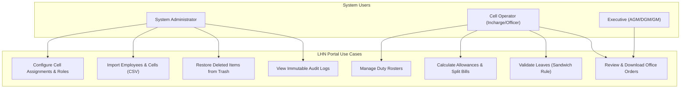
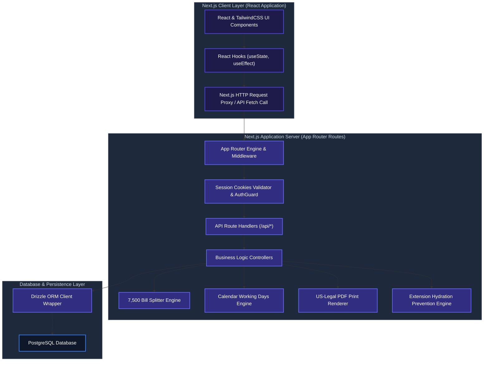
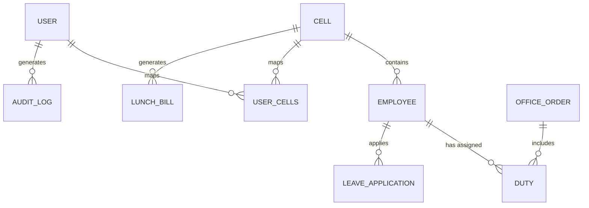

# Janata Bank Late-Sitting, Holiday, and Night Duty Portal (LHN Portal)

[](https://github.com/SyedArifulIslamEmon/Late-Sitting-Holiday-Night-Duty/actions)
[](https://nodejs.org/)
[](LICENSE)

An enterprise-grade administrative and financial utility management portal built to automate late-sitting, holiday, and night duty assignments, calculate conveyance and entertainment allowance bill reports, manage executive seniority directories, handle official leave requests, and configure fine-grained role-based cell assignments for Janata Bank PLC.

---

## 📋 Table of Contents

1. [Executive Summary](#1-executive-summary)
2. [Problem Statement](#2-problem-statement)
3. [Objectives](#3-objectives)
4. [Stakeholders & Roles](#4-stakeholders--roles)
5. [Functional Requirements & User Stories](#5-functional-requirements--user-stories)
6. [Non-Functional Requirements & SLA/SLO](#6-non-functional-requirements--slaslo)
7. [Business Rules](#7-business-rules)
8. [System Diagrams](#8-system-diagrams)
9. [Database Design & ERD](#9-database-design--erd)
10. [Reference Documentation](#10-reference-documentation)
11. [Planned Roadmap](#11-planned-roadmap)
12. [Installation & Quick Start](#12-installation--quick-start)
13. [Appendix](#13-appendix)
14. [Contributors](#14-contributors)

---

## 1. Executive Summary

The **Janata Bank LHN Portal** is a production-ready, security-hardened administrative system designed to automate shift-roster scheduling, leave verification, and allowance computation workflows for bank employees working non-standard operational shifts. Built specifically for the **Online Banking Department (CBS Integrated Development Cell)** of Janata Bank PLC, the portal digitizes the legacy manual roster preparation, allowance verification, and print-layout generation into an immutable, audit-compliant digital system. By integrating automated validations, collision checks, and bank-compliant document rendering, the system prevents billing leakage, eliminates human errors, and enforces strict compliance with internal banking audit policies.

---

## 2. Problem Statement

Prior to the deployment of the LHN Portal, the Online Banking Department at Janata Bank PLC relied on manual spreadsheet-based entry systems to track late-sitting, weekend holiday duties, and night shift assignments. This manual workflow suffered from several major operational and security deficiencies:
* **Duplicate Billing and Overlaps:** No real-time verification existed to prevent assigning an employee to multiple duties on the same date, or logging duties during their active approved leave periods.
* **Audit Violations:** Banking regulations limit single office order budgets to a threshold of ৳7,500. Exceeding this required manual partitioning, which was prone to errors, delays, and auditor queries.
* **Lack of Data Integrity and Accountability:** Data modifications lacked tracking, meaning changes to employee rosters, salary rates, or cell scopes had no immutable audit logs.
* **Cell Boundary Breaches:** Operators of one cell could view or modify employee rosters of different cells, leading to cross-department database pollution and unauthorized edits.

---

## 3. Objectives

The LHN Portal was built to achieve the following operational targets:
1. **Zero Duplicate Duty Assignments:** Automate database-level validation to block conflicting entries.
2. **Automated Budget Compliance:** Enforce the ৳7,500 split threshold dynamically via a programmatic split-billing engine.
3. **100% Audit Compliance:** Implement an immutable audit log tracking all CRUD operations for 5 financial years in compliance with Bangladesh Bank IT Audit guidelines.
4. **Fine-grained Access Controls:** Apply cell-based permission boundaries (RBAC) restricting operators to their mapped cells.
5. **Standardized High-Density Printouts:** Generate pixel-perfect A4 office orders and Legal-size billing memos containing zero English numerals or incorrect Bengali typography.

---

## 4. Stakeholders & Roles

The system manages four primary classes of actors with isolated permission scopes:
* **System Administrators (`ADMIN`):** Responsible for managing user directories, configuring global cell scopes, editing system parameters, reviewing immutable audit logs, and restoring soft-deleted records.
* **Operators (`USER` - Cell In-Charges & Cell Officers):** Assigned to specific cells (e.g., CBS Development Cell) to schedule rosters, input leave requests, compute conveyance/entertainment bills, and manage employee directories within their authorized cell boundaries.
* **Executives:** Review, authorize, and sign off on printed office orders, consolidated reports, and billing memos.
* **Employees (`EMPLOYEE` - General Staff):** Individual bank officers who log in to access their personalized self-service dashboard (`/my-portal`) and analytics view (`/analytics`), tracking personal monthly allowance trends ("আমার প্রাপ্ত ভাতার ধারা") and personal leaves in a read-only secure layout.

---

## 5. Functional Requirements & User Stories

### 5.1 System Functional Requirements (FR)
* **FR-001 (Duty Assignment):** System must block duplicate duty logging for the same employee on the same date.
* **FR-002 (Leave Validation):** System must prevent scheduling a duty for an employee on dates overlapping with their approved leaves.
* **FR-003 (Budget Split):** Automatically partition any billing ledger exceeding ৳7,500 into multiple compliant office orders sorted chronologically, assigning staggered unique reference dates.
* **FR-004 (Category Lock):** The user must select the duty category (Late Sitting, Holiday Duty, Night Shift) before selecting employees or dates.
* **FR-005 (BOM CSV Exports):** Export report datasets to CSV/Excel format with UTF-8 BOM headers to display Bengali characters properly.
* **FR-006 (Sandwich Rule):** Calculate leave balances applying the "Sandwich Rule" (sandwiched weekends are deducted from casual leave balances).
* **FR-007 (Recycle Bin):** Retain soft-deleted records (Employees, Duties, Cells, Users) in an audit-compliant bin, allowing administrators to restore them.

### 5.2 User Acceptance Test (UAT) Scenarios
| Case ID | Scenario | Preconditions | Input / Action | Expected Outcome |
| :--- | :--- | :--- | :--- | :--- |
| **UAT-SEC-01** | Row Scope Boundary check | User is Cell Officer scoped only to Cell 7 | Attempt to edit or delete an employee record in Cell 9 | Request blocked; API returns `HTTP 403 Forbidden` error. |
| **UAT-DUTY-01** | Date collision on active leave | Employee has approved leave from June 10 to June 15 | Create Late Sitting duty for employee on June 12 | System returns `HTTP 409 Conflict` and blocks insertion. |
| **UAT-LEAVE-01** | Sandwich Rule leave deduction | Employee applies for leave from Thursday to Sunday | Submit Casual Leave request | Sandwiched Friday and Saturday are programmatically deducted from balance. |
| **UAT-BILL-01** | ৳7,500 Splitter compliance | Cell has unbilled duties totaling ৳9,000 | Generate Billing Memo for month | Duties split chronologically into two memos of ৳4,500 with unique refs. |

---

## 6. Non-Functional Requirements & SLA/SLO

* **Performance & Scalability:** Server response times for API requests must be under 200ms under standard loads. Next.js build compilation must be optimized using modular sub-components to limit bundle sizes.
* **Security & Regulatory Compliance:** Session tokens must be cryptographically signed using JWT. Data in transit must use TLS 1.3.
* **Availability & Reliability:** Target 99.9% uptime. System failures must dispatch webhook warning alerts to administrative Slack/Discord channels immediately.
* **Recovery Targets:** Recovery Time Objective (RTO) must be less than 2 hours. Recovery Point Objective (RPO) must be less than 24 hours.
* **API Success Rate:** 99.95%
* **Document Generation:** < 5 sec

---

## 7. Business Rules

| Rule Identifier | Module | Description / Logic |
| :--- | :--- | :--- |
| **BR-ALLOW-RATE** | Billing | **Late Sitting:** Conveyance = ৳200, Apyaon/Entertainment = ৳100 (Total = ৳300/day).<br>**Holiday Duty:** Conveyance = ৳250, Apyaon/Entertainment = ৳250 (Total = ৳500/day).<br>**Night Shift:** Conveyance = ৳400, Apyaon/Entertainment = ৳600 (Total = ৳1000/day). |
| **BR-BUDGET-LIMIT** | Billing | Any single office order or bill memo must not exceed ৳7,500. Splitting must occur chronologically. |
| **BR-SANDWICH-RULE** | Leaves | Weekends (Friday/Saturday) sandwiched between consecutive casual leaves must be deducted from the leave balance. |
| **BR-LEAVE-LOCK** | Duties | Duties cannot be logged on dates where the employee has an active, approved leave application. |
| **BR-WEEKEND-DUTY** | Duties | Late Sitting duties cannot be assigned on weekends (Friday/Saturday) unless weekend is overridden as a working day. |
| **BR-CELL-GATE** | Security | Operators with `USER` role can only CRUD employees and process duties belonging to their assigned cells. |

---

## 8. System Diagrams

### 8.1 Use Case Diagram


### 8.2 System Architecture Diagram


---

## 9. Database Design & ERD

### 9.1 ER Diagram


### 9.2 Data Dictionary

#### 9.2.1 Table: `User` (`users`)
| Column | Type | Nullable | Description |
| :--- | :--- | :---: | :--- |
| `id` | serial | No | Primary key identifier for the user |
| `username` | text | No | Unique login bank ID code (Unique) |
| `password` | text | No | Bcrypt-hashed user password |
| `name` | text | No | User's full name |
| `role` | text | No | Role designation (`ADMIN`, `USER`, or `EMPLOYEE`) |
| `mobile` | text | Yes | Contact number |
| `cellDuties` | text | Yes | Context role (`PRIMARY`, `ADDITIONAL`, `INCHARGE`) |
| `createdAt` | timestamp | No | Creation timestamp (default now) |

#### 9.2.2 Table: `Employee` (`employees`)
| Column | Type | Nullable | Description |
| :--- | :--- | :---: | :--- |
| `id` | serial | No | Primary key identifier for the employee |
| `name` | text | No | Full name of the employee |
| `designation` | text | No | Official designation (e.g., SPO, PO, Officer) |
| `bankId` | text | No | Alphanumeric bank ID (Unique) |
| `fileNo` | text | No | Employee file reference number |
| `mobile` | text | Yes | Contact number |
| `cellId` | integer | No | Foreign key referencing `cells.id` |
| `userId` | integer | Yes | Optional foreign key referencing `users.id` linking to user profile |
| `createdAt` | timestamp | No | Creation timestamp (default now) |

#### 9.2.3 Table: `Duty` (`duties`)
| Column | Type | Nullable | Description |
| :--- | :--- | :---: | :--- |
| `id` | serial | No | Primary key identifier for the duty log |
| `employeeId` | integer | No | Foreign key referencing `employees.id` (cascade delete) |
| `type` | text | No | Shift type (`LATE_SITTING`, `HOLIDAY`, `NIGHT_SHIFT`) |
| `date` | text | No | Date of duty (format: `YYYY-MM-DD`) |
| `allowance1` | doublePrecision | No | Entertainment/Apyaon allowance in BDT (100, 250, 600) |
| `allowance2` | doublePrecision | No | Conveyance/Transport allowance in BDT (200, 250, 400) |
| `totalBill` | doublePrecision | No | Calculated sum of allowance1 and allowance2 (300, 500, 1000) |
| `orderRef` | text | Yes | Foreign key referencing `officeOrders.orderRef` |
| `createdAt` | timestamp | No | Creation timestamp (default now) |

---

## 10. Reference Documentation

To keep this `README.md` fast and legible, detailed system design specifications, testing details, deployment procedures, user instructions, and API contracts have been split into standalone documents inside the `docs/` folder:

* **[Security Design & Risk Assessment (docs/SECURITY.md)](file:///d:/Late-Sitting-Holiday-Night-Duty/docs/SECURITY.md):** Detailed overview of RBAC controls, data classifications, STRIDE threat models, and centralized error catalog.
* **[API Contract Specifications (docs/API_CONTRACT.md)](file:///d:/Late-Sitting-Holiday-Night-Duty/docs/API_CONTRACT.md):** Complete specifications of REST API endpoints, request/response payloads, and OpenAPI 3.0 YAML declarations.
* **[Testing Strategy & Execution (docs/TESTING.md)](file:///d:/Late-Sitting-Holiday-Night-Duty/docs/TESTING.md):** Detailed guide to Vitest unit/integration testing suites, coverage expectations, and check commands.
* **[Disaster Recovery & Backups (docs/DISASTER_RECOVERY.md)](file:///d:/Late-Sitting-Holiday-Night-Duty/docs/DISASTER_RECOVERY.md):** Procedures for automated backups, cron jobs, RTO/RPO objectives, and test recovery drill reports.
* **[Production Deployment Manual (docs/DEPLOYMENT.md)](file:///d:/Late-Sitting-Holiday-Night-Duty/docs/DEPLOYMENT.md):** High-availability clustering structures, PM2 process management, Nginx configurations, SELinux, and RHEL environment setups.
* **[User Manual & Operator Guide (docs/USER_MANUAL.md)](file:///d:/Late-Sitting-Holiday-Night-Duty/docs/USER_MANUAL.md):** Comprehensive instructions for admins creating accounts, and operators scheduling rosters or processing billing ledgers.

---

## 11. Planned Roadmap

The following security, performance, and monitoring features are planned and scheduled for future releases:

1. **Multi-Factor Authentication (MFA / TOTP):** RFC 6238-compliant TOTP codes, Google Authenticator sync, device trust periods, and hashed recovery codes.
2. **Account Lockout:** Block user logins for 30 minutes after 5 consecutive failed authentication attempts.
3. **Session Expiry Controls:** 15-minute idle session timeout and 8-hour absolute session duration token validation.
4. **At-Rest AES-256 Encryption:** Automatic encryption of PostgreSQL database storage blocks and backup file dumps.
5. **Prometheus & OpenTelemetry Integration:** Real-time system performance monitoring and Grafana metrics dashboard compilation.
6. **Playwright E2E testing integration:** End-to-end user path automated tests configuration.

---

## 12. Installation & Quick Start

### 12.1 Prerequisites
* **Node.js:** v24.0.0 or higher (Strictly required, verify with `node -v`)
* **PostgreSQL:** v15+ (Local instance, Docker container, or neon.tech cloud)
* **npm:** v9.0.0 or higher

### 12.2 Quick Start Commands
```bash
# Clone the repository
git clone https://github.com/SyedArifulIslamEmon/Late-Sitting-Holiday-Night-Duty.git
cd Late-Sitting-Holiday-Night-Duty

# Install dependencies
npm install

# Setup environment variables
cp .env.example .env
# Edit .env with your local credentials and API keys

# Push database schema definitions
npx drizzle-kit push

# Seed initial database data and restore original tables
npm run db:seed

# Run developer environment server
npm run dev
```

---

## 13. Appendix

### 13.1 File Structure
The project adopts a structured, layered architecture that separates presentation, database interactions, service logic, and configuration:

```text
Late-Sitting-Holiday-Night-Duty/
├── docs/                                  # Architectural design and deployment manuals
│   ├── ARCHITECTURE.md                    # System architecture design & technical specs
│   ├── API_CONTRACT.md                    # REST API Spec and OpenAPI 3.0 Contract
│   ├── SECURITY.md                        # Security specs, RBAC, classifications & STRIDE
│   ├── TESTING.md                         # Unit, integration and contract testing procedures
│   ├── DISASTER_RECOVERY.md               # Automated cron backups and restoration drills
│   ├── USER_MANUAL.md                     # Operator and Admin guide
│   └── DEPLOYMENT.md                      # Production deployment guidelines for RHEL
├── public/                                # Public static assets
├── src/
│   ├── app/                               # Next.js App Router Layer
│   │   ├── api/                           # Backend Server API Handlers (REST Endpoints)
│   │   ├── analytics/                     # Analytics Dashboard UI
│   │   ├── audit/                         # Audit logs viewer interface
│   │   ├── billing/                       # Conveyance and entertainment billing ledger UI
│   │   │   ├── page.tsx                   # Main Billing Page
│   │   │   └── components/                # Decomposed modular tab components
│   │   │       ├── BillPrintLayout.tsx    # Print layouts for conveyances
│   │   │       ├── BulkBillPrintLayout.tsx # Bulk print layout
│   │   │       ├── BillsTab.tsx           # Generates and reviews monthly lists of bills
│   │   │       ├── LedgerTab.tsx          # Aggregates conveyances and allowance ledgers
│   │   │       ├── OrdersTab.tsx          # Office order selections
│   │   │       └── ReportsTab.tsx         # Detailed summary reports and exports
│   │   ├── closing-bill/                  # Half-yearly closing allowances UI
│   │   ├── documents/                     # PDF previewing & document archive
│   │   │   ├── page.tsx                   # Lists generated rosters and billing reports
│   │   │   └── preview/
│   │   │       └── page.tsx               # Renders A4/Legal print templates inside iframe modals
│   │   ├── employees/                     # Employee directory manager
│   │   ├── executive/                     # Seniority directories viewer
│   │   ├── leave/                         # Leave requests interface
│   │   ├── login/                         # Login page
│   │   ├── lunch-bill/                    # Lunch allowance billing UI
│   │   ├── my-portal/                     # Employee self-service portal
│   │   ├── roster/                        # Duty rosters scheduling UI
│   │   │   ├── page.tsx                   # Swap-Panel duty scheduler page
│   │   │   └── components/
│   │   │       └── RosterOCRImport.tsx    # OCR scanner component
│   │   ├── trash/                         # Soft-deleted items recovery UI
│   │   └── users/                         # Operators directory UI
│   ├── components/                        # Core UI components
│   │   ├── AuthGuard.tsx                  # Login screen and role gates
│   │   ├── CommandCenter.tsx              # Global search (Ctrl + K) component
│   │   ├── InlineEdit.tsx                 # Inline edit field component
│   │   ├── SkeletonLoader.tsx             # Page skeleton loader UI
│   │   ├── TopProgressBar.tsx             # Page routing loader indicator
│   │   ├── Navbar.tsx                     # Top header with theme toggle, search, profile dropdown
│   │   └── Sidebar.tsx                    # Left collapsible panel with responsive routing links
│   ├── context/                           # Global state contexts
│   ├── db/                                # Database schemas, seeds and migration synchronization layer
│   ├── hooks/                             # Custom React Hooks
│   │   └── usePageData.ts                 # Page loading utility hook
│   ├── lib/                               # Core utility libraries
│   │   ├── bengali-converter.ts           # Bijoy ANSI <-> Unicode font mapper engine
│   │   ├── print-helpers.ts               # Printing layout scripts
│   │   ├── sorting.ts                     # Rank ordering utility
│   │   └── errors.ts                      # Centralized error handler and alert webhook notifier
│   ├── permissions/                       # Access Control Layers
│   │   └── rbac.ts                        # Configures permission matrix for ADMIN, USER, EMPLOYEE
│   ├── repositories/                      # Repository Layer (Data Access Layer)
│   └── services/                          # Service Layer (Business Logic Layer)
├── Dockerfile                             # Standalone optimized Docker configuration
├── docker-compose.yml                     # Local compose script for app and DB container
├── drizzle.config.ts                      # Configuration file for Drizzle migrations generator
├── eslint.config.mjs                      # Lint rules specifications
├── package.json                           # Dependency registry and build script entries
├── postcss.config.mjs                     # Tailwind CSS compilation configurator
├── postgres_dump.json                     # Local DB restore dump file
└── tsconfig.json                          # TypeScript compiler settings
```

### 13.2 Environment Variables
| Variable | Required | Description |
| :--- | :---: | :--- |
| `DATABASE_URL` | Yes | PostgreSQL connection string |
| `NEXTAUTH_SECRET` | Yes | Secret key used to encrypt session cookies |
| `NEXTAUTH_URL` | Yes | Deployed application domain URL (e.g., `http://localhost:3000` for development) |
| `GEMINI_API_KEY` | Yes | Google Gemini API Key for OCR and bulk uploads |
| `NEXT_PUBLIC_SUPABASE_URL` | Yes | Supabase public API endpoint for Realtime updates |
| `NEXT_PUBLIC_SUPABASE_ANON_KEY` | Yes | Supabase public anon key |
| `ERROR_WEBHOOK_URL` | Yes | Discord/Slack Webhook URL for server exception reporting |

---

## 14. Contributors

* **Syed Ariful Islam Emon**
