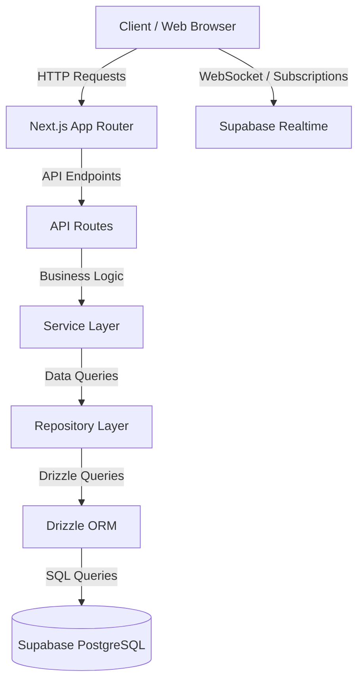
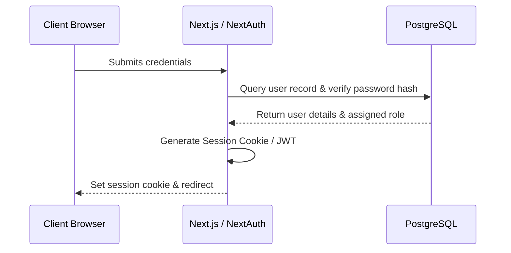

# Janata Bank Late-Sitting, Holiday, and Night Duty Portal (LHN Portal)

An enterprise-grade utility management portal built to automate late-sitting, holiday, and night duty assignments, generate conveyance and entertainment bill reports, manage executive seniority directories, and handle official leave requests.

---

## 2. Executive Summary

The **Janata Bank LHN Portal** is a production-ready administrative utility designed to automate the scheduling, verification, and allowance computation processes for bank employees working non-standard operational shifts. Built primarily for the **Online Banking Department (CBS Integrated Development Cell)** of Janata Bank PLC, the portal's core business objective is to transition manual shift-roster compilation, allowance calculations, and office order generation into a transparent, secure, and audit-compliant digital workflow.

The primary users of this application are:
* **System Administrators:** Who configure security, manage system access, and oversee audit trails.
* **Cell In-Charges / Operators:** Who coordinate team rosters, log shift logs, and initiate allowance billing.
* **Executives (AGM, DGM):** Who review, authorize, and sign off on duty rosters and bills.

---

## 3. Key Features

* **Duty Roster Management:** Dynamic assignment of late-sitting, holiday, and night shift duties using a responsive calendar scheduler.
* **Bill Memo Generator:** Automated compilation of conveyance and entertainment allowance bills based on validated duty hours, preventing double-billing or calculation errors.
* **Leave Processing Engine:** Automatic Casual, Station, and Special Leave management with sandwich-rule calendar offsets.
* **Executive Directory:** Seniority-ranked directory of executive members (AGM, DGM) with real-time status visibility.
* **Secure Chat System:** Dedicated real-time communication channel with server-side message encryption.
* **Trash & Recovery:** Audit-compliant soft-deletion bin that enables administrators to review and recover deleted records without database pollution.

---

## 4. Feature Matrix

| Module | Primary Capabilities | Target User Roles | Audit Focus |
| :--- | :--- | :--- | :--- |
| **Duty Roster** | Calendar scheduling, duplicate check, holiday detection | Operator, Cell In-Charge | Double shift prevention |
| **Billing** | Entertainment & conveyance calculations, PDF generator | Operator, Executive | Billing caps & limits |
| **Leave Management** | Sandwich rule calculator, dates validation | All Employees | Overlapping leave check |
| **Executive Directory** | Seniority indexing, in-charge assignments | Admin, Operator | Signatory authorization |
| **User Directory** | Operator access control, role assignments | Admin | Access control (RBAC) |
| **Secure Chat** | Real-time messages, cell channels | All Employees | Channel authorization |
| **Audit Log** | DB change tracking, logging mutations | Admin | Immutable action logs |
| **Recycle Bin** | Soft-deletes, restore points | Admin | Deletion accountability |

---

## 5. Screenshots

The following design mocks represent the refined production UI layout:
* **Dashboard Overview:** `docs/images/dashboard.png` (High-contrast billing indicators and calendar view)
* **Employee Directory:** `docs/images/employees.png` (Seniority-ordered grid with active statuses)
* **Billing Memo Generator:** `docs/images/billing.png` (Form inputs linked to print-ready PDF previews)

---

## 6. Technology Stack

* **Core Framework:** Next.js (App Router, Server Components)
* **Language:** TypeScript
* **Authentication:** Auth.js (NextAuth.js)
* **ORM:** Drizzle ORM
* **Database:** Supabase PostgreSQL
* **Realtime Synchronization:** Supabase Realtime
* **Styling & Layout:** Tailwind CSS v4, Vanilla CSS
* **Caching & Session Storage:** Dragonfly / Redis
* **Icons:** Lucide React

---

## 7. System Architecture

### 7.1 Tier Architecture Flow


### 7.2 Authentication Flow


---

## 8. Directory Structure

```text
Late-Sitting-Holiday-Night-Duty/
├── docs/                       # Comprehensive Architecture & Deployment Documentation
│   ├── ARCHITECTURE.md
│   └── DEPLOYMENT.md
├── public/                     # Static assets (Logos, Vector Icons, PDF Layout Fonts)
├── src/
│   ├── app/                    # Next.js App Router (Pages, Layouts, API Routes)
│   │   ├── api/                # Thin API Controllers
│   │   ├── billing/            # Conveyance & entertainment allowance billing UI
│   │   ├── closing-bill/       # Half-yearly closing allowances UI
│   │   ├── documents/          # Memo and roster generation templates UI
│   │   ├── employees/          # Employee directory UI
│   │   ├── executive/          # Executive directory UI
│   │   ├── leave/              # Leave creation wizard UI
│   │   ├── roster/             # Duty rosters scheduling UI
│   │   ├── trash/              # Soft-deleted items recovery UI
│   │   └── users/              # Operator user directories UI
│   ├── components/             # Reusable UI Controls (shadcn primitives)
│   ├── db/                     # Drizzle config and schema declarations
│   ├── hooks/                  # Custom React hooks (realtime state, window sizing)
│   ├── lib/                    # Shared helper engines (audit logging, errors, AES encryption)
│   ├── permissions/            # RBAC role mapper (ADMIN, USER)
│   ├── repositories/           # Repository data access layers (Drizzle wrappers)
│   ├── services/               # Service layers (Business logic & calculations)
│   └── validations/            # Zod validation schemas
├── .env.example                # Template configuration file for development setups
├── drizzle.config.ts           # Drizzle compiler settings
├── next.config.ts              # Next.js build parameters
├── package.json                # Project dependencies
├── postgres_dump.json          # DB restore backup file (Git ignored)
└── tsconfig.json               # TypeScript compiler config
```

---

## 9. Prerequisites

Before installing the project, verify that your environment contains the following tools:
* **Node.js:** v18.0.0 or higher (LTS v20+ recommended)
* **npm:** v9.0.0 or higher
* **PostgreSQL:** v15+ (Local or Managed Instance)

---

## 10. Quick Start

Initialize your local environment using the following steps:

### Step 1: Clone the Repository
```bash
git clone https://github.com/SyedArifulIslamEmon/Late-Sitting-Holiday-Night-Duty.git
cd Late-Sitting-Holiday-Night-Duty
```

### Step 2: Install NPM Dependencies
```bash
npm install
```

### Step 3: Configure Environment
Copy `.env.example` to `.env` and fill in your connection variables:
```bash
cp .env.example .env
```

### Step 4: Synchronize Database
Push the local schema structure to your database instance:
```bash
npx drizzle-kit push
```

### Step 5: Seed Local Data
Seed initial configurations, standard cells, and default login credentials:
```bash
npm run db:seed
```

### Step 6: Start Server
```bash
npm run dev
```
Open [http://localhost:3000](http://localhost:3000) to view the portal. 

*Note: Local seed development credentials are generated during the seed step and should be verified in the terminal console. Default development access is configured only for local debugging.*

---

## 11. Environment Variables

| Variable | Required | Default | Description |
| :--- | :---: | :---: | :--- |
| `DATABASE_URL` | Yes | - | PostgreSQL connection string with SSL configurations |
| `NEXTAUTH_SECRET` | Yes | - | Secret key used to encrypt Session cookies |
| `NEXTAUTH_URL` | Yes | `http://localhost:3000` | Fully qualified domain URL of the deployed application |
| `GEMINI_API_KEY` | Yes | - | Google Gemini AI key used to run image-based bulk imports |
| `NEXT_PUBLIC_SUPABASE_URL` | Yes | - | Supabase project API URL |
| `NEXT_PUBLIC_SUPABASE_ANON_KEY`| Yes | - | Supabase anonymous API key for websocket events |

---

## 12. Database Setup

Database modifications are managed using Drizzle ORM:
* **Schema Synchronization:** Push current TypeScript schema structures directly to the database:
  ```bash
  npx drizzle-kit push
  ```
* **Generate Migrations:** Compare local schemas with previous migrations and generate new SQL files:
  ```bash
  npx drizzle-kit generate
  ```
* **Execute Migrations:** Run all unapplied SQL migration files against the target database:
  ```bash
  npx drizzle-kit migrate
  ```

---

## 13. Database Backup & Restore

The application includes automated backup scripts to preserve and restore data states:

### 13.1 Export Database (Dump)
Export all records to `postgres_dump.json` (saved locally in the root folder):
```bash
npm run db:dump
```

### 13.2 Import Database (Restore)
Wipe the target database clean and seed records from `postgres_dump.json` while matching primary key constraints:
```bash
npm run db:seed
```

---

## 14. Development Workflow

1. **Feature Branching:** Always create a new feature branch from `main` before writing code.
2. **Schema updates:** Update files under `src/db/schema/` and run `npx drizzle-kit push` to synchronize schemas.
3. **Typechecking:** Always run type checks locally using `npx tsc --noEmit` before proposing merges.
4. **Linting:** Ensure code cleanups are run using `npm run lint`.

---

## 15. Build & Production Deployment

To prepare the portal for deployment in a production environment:

### Step 1: Package Code
Compile the static build package:
```bash
npm run build
```

### Step 2: Start Service
Start the optimized Node.js server:
```bash
npm run start
```

---

## 16. Linux Deployment Guide

Follow these steps to deploy and run the LHN Portal on **RHEL 8/9**, **Rocky Linux**, or **AlmaLinux**:

### Step 1: Install Node.js & Git
```bash
# Enable Node.js repository (v20 LTS)
curl -fsSL https://rpm.nodesource.com/setup_20.x | sudo bash -
sudo dnf install -y nodejs git
```

### Step 2: Configure Application Directory
```bash
cd /var/www
sudo git clone https://github.com/SyedArifulIslamEmon/Late-Sitting-Holiday-Night-Duty.git lhn-portal
cd lhn-portal
sudo npm install --omit=dev
```

### Step 3: Setup Environment & Process Manager
Install PM2 globally to run the node service in the background:
```bash
sudo npm install -y pm2 -g
```
Create a production `.env` file and configure server settings.

### Step 4: Build & Launch with PM2
```bash
# Compile code
npm run build

# Start PM2 process
pm2 start npm --name "lhn-portal" -- start

# Save PM2 state & enable launch on system reboot
pm2 save
pm2 startup
```

### Step 5: Nginx Reverse Proxy Setup
Install and configure Nginx to proxy requests from Port 80/443 to the local Port 3000:
```bash
sudo dnf install -y nginx
```
Create `/etc/nginx/conf.d/lhn-portal.conf`:
```nginx
server {
    listen 80;
    server_name lhn.janatabank.com;

    location / {
        proxy_pass http://127.0.0.1:3000;
        proxy_http_version 1.1;
        proxy_set_header Upgrade $http_upgrade;
        proxy_set_header Connection 'upgrade';
        proxy_set_header Host $host;
        proxy_cache_bypass $http_upgrade;
    }
}
```
Enable and start Nginx:
```bash
sudo systemctl enable --now nginx
```

### Step 6: Configure Firewall
Open HTTP and HTTPS ports in the system firewall:
```bash
sudo firewall-cmd --permanent --add-service=http
sudo firewall-cmd --permanent --add-service=https
sudo firewall-cmd --reload
```

---

## 17. Security Architecture

* **Authentication (Auth.js):** Custom credentials provider mapping login credentials against cryptographically-hashed database records.
* **Role-Based Access Control (RBAC):** Strict view and mutation barriers checking user sessions against roles (`ADMIN`, `USER`).
* **Audit Logging:** System-wide logging tracking data modifications (adds, edits, deletes).
* **Encryption:** Cryptographic parameters secure sensitive system fields.
* **Secrets management:** Production secrets are isolated using secure system variables.
* **Database Backups:** Daily backup exports scheduled to prevent data loss.

---

## 18. Realtime Architecture

Real-time notification feeds, online operator statuses, and updates are synchronized using **Supabase Realtime WebSockets**.
* Roster modifications published on client actions instantly trigger interface updates for other users without page reloads.
* System events are secured and scoped within client-side listener subscriptions.

---

## 19. Audit Logging

Every data mutation (Insertion, Update, and Soft-Deletion) is logged in an immutable system table.
* **Traceability:** Logs capture operator usernames, target identifiers, action types (`CREATE`, `UPDATE`, `DELETE`), and timestamps.
* **Recovery:** Enables audit compliance and direct traceability to recover system operations or investigate changes.

---

## 20. Troubleshooting

* **Database Connection Failures:** Ensure `sslmode=require` is present in the connection string and check if the database host is accessible.
* **Missing Environment Variables:** Verify that all variables outlined in `.env.example` are populated in the system `.env` file.
* **Realtime Synchronization Failures:** Verify that `NEXT_PUBLIC_SUPABASE_URL` and `NEXT_PUBLIC_SUPABASE_ANON_KEY` are correct and check your browser's console for WebSocket connection failures.
* **Build Failures:** Run `npx tsc --noEmit` and check for code type mismatch issues prior to building.

---

## 21. Maintenance Procedures

* **System Updates:** Pull updates from the main git branch, run `npm install`, compile the build via `npm run build`, and restart the service using `pm2 restart lhn-portal`.
* **Database Backups:** Schedule a nightly cron job to execute `npm run db:dump` and archive the generated `postgres_dump.json` to secure secondary storage.

---

## 22. Version History

* **v1.0.0 (Current Release):** Core Portal deployment, featuring automated duty rosters, entertainment conveyance calculators, leaf engine, and audit logs.

---

## 23. Production Readiness Checklist

- [ ] Environment variables configured securely
- [ ] Database backed up and schema initialized
- [ ] SSL certificates configured in Nginx configuration
- [ ] PM2 process manager configured for autostart
- [ ] Real-time websocket endpoints validated
- [ ] Audit logs write paths verified

---

## 24. Contributors

* **Syed Ariful Islam Emon** (Lead Developer)
* **Online Banking Department, Janata Bank PLC.**

---

## 25. License

Proprietary Software | Online Banking Department, Janata Bank PLC. All rights reserved.
