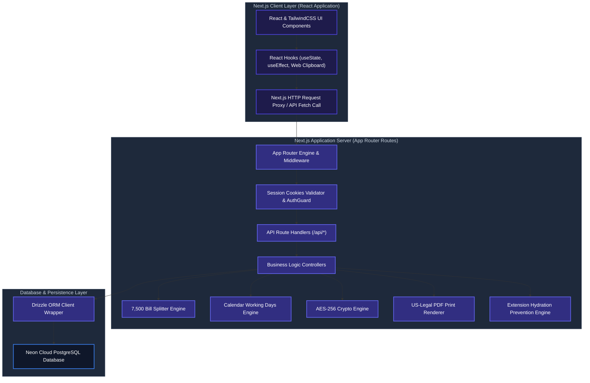

# System Architecture & Technical Specifications

This document provides a comprehensive technical overview of the system architecture, design patterns, core algorithmic engines, database model relationships, and security controls implemented in the Late-Sitting, Holiday, and Night Duty (LHN) Enterprise Portal.

---

## 🏛️ System Architecture

The portal is built upon the modern Next.js **App Router** architecture, delivering a highly decoupled, reactive data flow between client and server layers.



---

## ⚙️ Technical Rationale & Technology Selection

The selected technology stack is customized to satisfy enterprise-grade security, low latency, and dynamic report generation requirements, while keeping operational costs completely free using open-source, self-hostable tools.

| Category | Technology | Rationale & Alternatives Comparison |
| :--- | :--- | :--- |
| **Core Framework** | Next.js (App Router) | State-of-the-art React framework offering Server Components, server-side rendering, and API route endpoints. Fully open-source and free. |
| **Language** | TypeScript | Ensures compile-time type safety, preventing common runtime bugs and offering autocomplete guides for developers. |
| **Authentication** | Auth.js (NextAuth.js) | Fully client-owned, self-hosted session validation. No user limit or hidden costs. Integrates cleanly with local database schemas. |
| **Database Engine** | Supabase (PostgreSQL) | Enterprise-grade Postgres SQL database. Leverages Supabase's free tier or local Docker containers for self-hosting. |
| **Realtime Engine** | Supabase Realtime | Native web socket integration allowing instant UI state synchronization without additional third-party dependencies (e.g., Pusher). |
| **ORM Client** | Drizzle ORM | Ultra-lightweight and type-safe SQL mapper. Significantly faster than Prisma with zero cold-start latency. |
| **Styling** | Tailwind CSS 4.0 | Utility-first styling with high performance and zero CSS runtime compilation. |
| **UI Components** | shadcn/ui | Radix UI primitives styled with Tailwind, providing highly accessible, fully customizable dashboard controls. |
| **Cryptography** | Web Cryptography API | Native Web and Node crypto libraries. Encrypts sensitive logs and data using AES-256-CBC without external package dependencies. |
| **Icons** | Lucide React | Optimized SVG icon pack. |

---

## 🧠 Core Algorithmic Mechanisms & Design Patterns

### 1. ৳7,500 Budget Limit Splitter (Roster Budget Splitter)
* **Problem:** Internal audit rules mandate that any single office order/bill memo with an entertainment expenditure exceeding ৳7,500 requires additional administrative clearance.
* **Mechanism:** 
  - When a user compiles duties for a month, the Roster engine aggregates the total bill amount.
  - If the limit is exceeded, the engine splits the assignments into contiguous, chronological chunks.
  - It sorts duties chronologically and groups them into separate orders, keeping each order under the ৳7,500 limit.
  - To prevent date conflicts (collision) during sequential order generation, the engine assigns staggered unique reference dates, ensuring audit compliance.

### 2. Calendar Working Days Generator & Override Mechanism
* **Problem:** Conveyance and lunch allowances require calculating active working days per month. However, public holidays shift yearly, and weekends may occasionally be declared as active working days.
* **Mechanism:**
  - The system reads weekends dynamically (Friday/Saturday) based on a date range.
  - It intersects these days with override records stored in the `Holiday` table.
  - **Override Logic:** If a calendar weekend matches a database override flagged with `isWorkingDay = true`, it is treated as a normal working day. Conversely, if a calendar weekday matches a holiday override, it is excluded from working days.

### 3. Leave Application Engine & Sandwich Rule
* **Problem:** Casual and station leave forms must calculate total leave days dynamically, accounting for the "sandwich rule" (where weekends sandwiched between leave days are deducted from the user's leave balance).
* **Mechanism:**
  - The engine determines the interval between start and end dates.
  - It checks if weekends immediately precede or succeed the requested dates. If consecutive leaves sandwich a weekend, those weekends are programmatically deducted from the user's remaining balance.
  - A dynamic grammatical phrasing builder renders correct localized terms based on the duration (e.g., singular vs. plural days phrasing).

### 4. Cryptographic Chat Messenger (AES-256-CBC)
* **Problem:** Messages transmitted internally must be encrypted in transit and at rest in the database to prevent breaches.
* **Mechanism:**
  - Messages are encrypted server-side using a unique key and a dynamic initialization vector (IV) before database persistence.
  - If a user triggers the "Unsend for Everyone" action, the database record is overwritten with a hardcoded revoked string rather than just a soft deletion flag, and any associated physical uploads are purged from storage.
  - Real-time updates are maintained via a 2-second synchronization polling loop to prevent socket resource leaks on minimal server configs.

### 5. Pixel-Perfect US-Legal Print Renderer
* **Problem:** Roster memos and bills must print strictly on US-Legal paper (8.5in x 14in) with precise margins and page breaks.
* **Mechanism:**
  - Uses CSS page media directives: `@media print { @page { size: legal portrait; margin: 0.5in; } }`.
  - Implements `page-break-inside: avoid;` on rows and sections to prevent list items or signing blocks from breaking across pages.

### 6. Cell-Based Data Access Control (RBAC Integration)
* **Problem:** Regular users should only see data and employees within their assigned cells, while administrators require global visibility.
* **Mechanism:**
  - On API endpoints, user sessions are validated against user-cell association records (`UserCells`).
  - Queries are dynamically restricted using SQL `inArray()` filters matching the user's permitted cell IDs. Attempts to access other cells trigger a `403 Forbidden` response.

### 7. Executive Seniority & Coding Matrix
* **Problem:** Executives (DGMs, AGMs) must be displayed in order of seniority, with clear visual indicators indicating in-charge status.
* **Mechanism:**
  - Executive profiles are sorted using their alphanumeric filing numbers (`fileNo`).
  - Colors are applied dynamically: 1st DGM gets Royal Blue, 2nd DGM gets Amber/Orange, other DGMs get Teal, and AGMs receive Sky Blue accents.
  - The first Senior Principal Officer (SPO) inside a cell is programmatically marked as the "Cell Incharge", which updates both screen cards and printed PDFs with specific indicators.

### 8. Silent Printing & Iframe Previews
* **Problem:** Generating PDF previews in external tabs disrupts the user workflow.
* **Mechanism:**
  - Previews are rendered inside an inline preview iframe modal directly on the dashboard.
  - Silent printing is triggered by targeting a hidden background iframe loaded with the target print endpoint, instantly launching the browser's system printing dialog.

### 9. Bulk Cell CSV Import Batching
* **Problem:** Creating cells individually is inefficient during initial setups.
* **Mechanism:**
  - Allows bulk import via raw text lists or `.csv` files.
  - Uses a batch insert wrapper with deduplication: duplicate cell names are safely skipped without failing the entire transaction.

### 10. Multi-Cell Mapping & API Deduplication
* **Problem:** An employee may be assigned to multiple cells. In directories, they must appear under all assigned cells, but for duties and billing, they must only appear once to prevent duplicate allowance payouts.
* **Mechanism:**
  - API endpoints support a `?directory=true` parameter. When present, the query returns all cell-employee intersections.
  - For billing and duty rosters, the parameter is omitted, and results are grouped by employee ID to filter out duplicates.

### 11. Hydration Error Prevention Engine
* **Problem:** Third-party browser extensions (translators, ad blockers) inject attributes into client DOM elements, causing Next.js client-server markup mismatches.
* **Mechanism:**
  - A script containing a `MutationObserver` is embedded in the layout head.
  - The observer immediately removes unauthorized attributes (`bis_skin_checked`, etc.) before the React hydration cycle starts, preventing runtime rendering crashes.

---

## 💾 Database Schema & Relationships

The database utilizes optimized foreign-key relationships to maintain high referential integrity.

```text
  +------------+             +--------------+             +------------+
  |    User    | *         * |     Cell     | 1         * |  Employee  |
  |  (Users)   |-------------|   (Cells)    |-------------| (Employees)|
  +------------+             +--------------+             +------------+
        |                           |                           |
        | *                         | 1                         | 1
        |                           |                           |
  +------------+             +--------------+                   | *
  |Notification|             |  LunchBill   |             +------------+
  | (Notifs)   |             | (LunchBills) |             |    Duty    |
  +------------+             +--------------+             |  (Duties)  |
                                                          +------------+
```

### Model Definitions
1. **User:** Manages system operators. Roles are strictly restricted to `ADMIN` and `USER`.
2. **Cell:** Represents departments or cells (e.g., JBNS, R22 Core Banking).
3. **Employee:** Contains employee directories. Cascades delete operations to child duties.
4. **Duty:** Tracks assigned duties, types (`LATE_SITTING`, `HOLIDAY`, `NIGHT_SHIFT`), and conveyance/entertainment calculations.
5. **OfficeOrder:** Stores printed orders and structural contents as JSON.
6. **Holiday:** Custom holiday list and working day weekend overrides.
7. **Executive:** Tracks AGMs and DGMs sorted by seniority.
8. **Trash:** Audit-compliant soft-deletion tracker storing JSON structures of deleted records.
9. **LeaveApplication:** Tracks casual, station, and special leaves with sandwich logic.
10. **LunchBill:** Restricts cell monthly bills to a single record using a composite unique constraint (`cellId`, `month`, `year`).
11. **AuditLog:** Stores system-wide changes, containing actions (`CREATE`, `UPDATE`, `DELETE`), user IDs, and timestamps.

---

## 📋 Data Dictionary

### 1. Table: `Cell` (`cells`)
| Column | Type | Nullable | Description |
| :--- | :--- | :---: | :--- |
| `id` | serial | No | Primary key identifier for the cell |
| `name` | text | No | Name of the operational cell (Unique) |
| `description` | text | Yes | Description of cell's responsibilities |
| `createdAt` | timestamp | No | Creation timestamp (default now) |

### 2. Table: `User` (`users`)
| Column | Type | Nullable | Description |
| :--- | :--- | :---: | :--- |
| `id` | serial | No | Primary key identifier for the user |
| `username` | text | No | Unique login bank ID code (Unique) |
| `password` | text | No | Bcrypt-hashed user password |
| `name` | text | No | User's full name |
| `role` | text | No | Role designation (`ADMIN` or `USER`) |
| `mobile` | text | Yes | Contact number |
| `cellDuties` | text | Yes | Context role (`PRIMARY`, `ADDITIONAL`, `INCHARGE`) |
| `createdAt` | timestamp | No | Creation timestamp (default now) |

### 3. Table: `Employee` (`employees`)
| Column | Type | Nullable | Description |
| :--- | :--- | :---: | :--- |
| `id` | serial | No | Primary key identifier for the employee |
| `name` | text | No | Full name of the employee |
| `designation` | text | No | Official designation (e.g., SPO, PO, Officer) |
| `bankId` | text | No | Alphanumeric bank ID (Unique) |
| `fileNo` | text | No | Employee file reference number |
| `mobile` | text | Yes | Contact number |
| `cellId` | integer | No | Foreign key referencing `cells.id` |
| `createdAt` | timestamp | No | Creation timestamp (default now) |

### 4. Table: `Duty` (`duties`)
| Column | Type | Nullable | Description |
| :--- | :--- | :---: | :--- |
| `id` | serial | No | Primary key identifier for the duty log |
| `employeeId` | integer | No | Foreign key referencing `employees.id` (cascade delete) |
| `type` | text | No | Shift type (`LATE_SITTING`, `HOLIDAY`, `NIGHT_SHIFT`) |
| `date` | timestamp | No | Date of duty |
| `allowanceRate`| integer | No | Rate in BDT (300, 500, 1000) |
| `orderRef` | text | Yes | Foreign key referencing `officeOrders.orderRef` |
| `createdAt` | timestamp | No | Creation timestamp (default now) |

### 5. Table: `OfficeOrder` (`officeOrders`)
| Column | Type | Nullable | Description |
| :--- | :--- | :---: | :--- |
| `id` | serial | No | Primary key identifier |
| `orderRef` | text | No | Dynamic alphanumeric reference string (Unique) |
| `orderDate` | timestamp | No | Order compilation date |
| `category` | text | No | Associated duty category |
| `fileNo` | text | No | Roster reference file number |
| `details` | text | Yes | Roster notes |
| `status` | text | No | Roster state (`Generated`, `Printed`, `Modified`) |
| `compiledPayload`| jsonb | No | Frozen payload of duties and calculated allowances |
| `createdAt` | timestamp | No | Creation timestamp (default now) |

### 6. Table: `LeaveApplication` (`leaveApplications`)
| Column | Type | Nullable | Description |
| :--- | :--- | :---: | :--- |
| `id` | serial | No | Primary key identifier |
| `applicantName`| text | No | Employee name |
| `designation` | text | No | Designation |
| `bankId` | text | No | Bank ID |
| `fileNo` | text | No | File number |
| `cellName` | text | No | Cell name |
| `leaveType` | text | No | Leave type (`CASUAL`, `STATION`, `SPECIAL`) |
| `startDate` | timestamp | No | Leave start date |
| `endDate` | timestamp | No | Leave end date |
| `selectedDistrict`| text | Yes | Destination district station |
| `delegateId` | text | Yes | Stand-in delegate employee ID |
| `createdAt` | timestamp | No | Submission timestamp (default now) |

### 7. Table: `AuditLog` (`auditLogs`)
| Column | Type | Nullable | Description |
| :--- | :--- | :---: | :--- |
| `id` | serial | No | Primary key identifier |
| `username` | text | No | Identity of acting operator |
| `action` | text | No | Action type (`CREATE`, `UPDATE`, `DELETE`, `LOGIN`, `RESTORE`) |
| `entityType` | text | Yes | Target database table name |
| `entityId` | text | Yes | Target record ID |
| `ipAddress` | text | Yes | Client IP address |
| `userAgent` | text | Yes | Browser signature |
| `details` | text | No | Detailed description in Bengali |
| `createdAt` | timestamp | No | Audit timestamp (default now) |

---

## 🌐 OpenAPI 3.0.0 Specification (YAML Contract)

```yaml
openapi: 3.0.0
info:
  title: Late-Sitting, Holiday, and Night Duty (LHN) API
  version: 1.0.0
  description: API contract definitions for cell-based automation registries and billing workflows at Janata Bank PLC.
paths:
  /api/auth/signin:
    post:
      summary: Operator Authentication
      requestBody:
        required: true
        content:
          application/json:
            schema:
              type: object
              properties:
                username:
                  type: string
                password:
                  type: string
              required: [username, password]
      responses:
        '200':
          description: Signed JWT Session cookie returned
        '401':
          description: Invalid credentials
  /api/duties:
    post:
      summary: Register Duty Assignment
      security:
        - cookieAuth: []
      requestBody:
        required: true
        content:
          application/json:
            schema:
              type: object
              properties:
                employeeId:
                  type: integer
                dates:
                  type: array
                  items:
                    type: string
                    format: date
                type:
                  type: string
                  enum: [LATE_SITTING, HOLIDAY, NIGHT_SHIFT]
      responses:
        '201':
          description: Duty records created successfully
        '409':
          description: Leave collision or duplicate duty scheduling
  /api/leaves:
    post:
      summary: Submit Leave Application
      security:
        - cookieAuth: []
      requestBody:
        required: true
        content:
          application/json:
            schema:
              type: object
              properties:
                bankId:
                  type: string
                startDate:
                  type: string
                  format: date
                endDate:
                  type: string
                  format: date
                leaveType:
                  type: string
                  enum: [CASUAL, STATION, SPECIAL]
      responses:
        '201':
          description: Leave application accepted and sandwich rules applied
  /api/documents/generate-bill-memo:
    post:
      summary: Compile and Split Bill Memo
      security:
        - cookieAuth: []
      requestBody:
        required: true
        content:
          application/json:
            schema:
              type: object
              properties:
                orderRef:
                  type: string
                category:
                  type: string
                dutyIds:
                  type: array
                  items:
                    type: integer
      responses:
        '200':
          description: PDF Compiled successfully
```

---

## 🛡️ STRIDE Threat Model

* **Spoofing (Authentication Bypass):**
  * *Threat:* An attacker intercepts or hijacks active operator sessions to post false duty logs.
  * *Control:* Enforces NextAuth.js JWT authentication. Cookies are signed, encrypted, and flagged as `HttpOnly`, `Secure`, and `SameSite=Strict`.
* **Tampering (Data Alteration):**
  * *Threat:* An operator manipulates HTTP API request values to elevate duty allowance rates (e.g. BDT 300 to BDT 1000).
  * *Control:* Server-side rate validation routines read rates directly from secure database schemas (`LATE_SITTING` = 300, `HOLIDAY` = 500, `NIGHT_SHIFT` = 1000), ignoring client-side rate injections.
* **Repudiation (Denial of Action):**
  * *Threat:* An operator deletes crucial billing data and denies having made the action.
  * *Control:* Every action is recorded inside an immutable database-backed `AuditLog` table, which is also written to a secure local `audit.log` file on disk as a secondary backup.
* **Information Disclosure (Data Leakage):**
  * *Threat:* A Cell Officer reads other cell's employees lists or conveyance ledgers.
  * *Control:* Row-level cell filtering inside Drizzle queries (e.g. `inArray(employees.cellId, userCellIds)`) filters all responses based on verified user session profiles.
* **Denial of Service (Endpoint Flooding):**
  * *Threat:* Attacking scripts flood PDF compilers or login endpoints to deplete server CPU.
  * *Control:* Token-bucket rate-limiting middleware restricts endpoint invocation requests to a maximum of 10 requests per minute per IP.
* **Elevation of Privilege (Scope Escalation):**
  * *Threat:* A regular operator bypasses RBAC to elevate their permissions to `ADMIN`.
  * *Control:* API gateways verify role flags decrypted directly from secure server JWT cookies before executing administrative controllers.

---

## 🚨 Error Catalog

| Error Code | HTTP Status | Bengali Meaning | Cause & Recovery Resolution |
| :--- | :---: | :--- | :--- |
| `validation_error` | 400 | ইনপুট সঠিক নয়। | The payload format is invalid (e.g., missing designations). Rectify client inputs based on fields highlighted in validation error alerts. |
| `forbidden` | 403 | অনুমতি নেই। | Operator is attempting to write records outside cell boundaries. Contact administration to review cell scope settings. |
| `unauthorized` | 401 | সেশন নিষ্ক্রিয়। | Operator session has expired. Sign out and sign back in to establish a fresh JWT session. |
| `database_error` | 500 | ডাটাবেজ সমস্যা হয়েছে। | SQL constraint violations or database connection timeout. Retry after a few seconds. |
| `internal_server_error` | 500 | সার্ভার সমস্যা হয়েছে। | Unhandled runtime exception in service layer. Developer review is needed. Check Discord/Slack error webhook logs. |
| `duty_collision` | 409 | তারিখ ওভারল্যাপ। | Logging duplicate duties or dates overlapping with approved leaves. De-select overlapping dates or cancel conflicting leaves before rescheduling. |

---

## 🧪 User Acceptance Testing (UAT) Scenarios

| Case ID | Scenario | Preconditions | Input / Action | Expected Outcome |
| :--- | :--- | :--- | :--- | :--- |
| **UAT-SEC-02** | Cell Scope boundary check | User is Cell Officer scoped only to Cell 7 | Attempt to edit or delete an employee record in Cell 9 | Request blocked; API returns `HTTP 403 Forbidden` error. |
| **UAT-DUTY-01** | Date collision on active leave | Employee has approved leave from June 10 to June 15 | Create Late Sitting duty for employee on June 12 | System returns `HTTP 409 Conflict` and blocks insertion. |
| **UAT-LEAVE-01** | Sandwich Rule leave deduction | Employee applies for leave from Thursday to Sunday | Submit Casual Leave request | Sandwiched Friday and Saturday are programmatically deducted from balance. |
| **UAT-BILL-01** | ৳7,500 Splitter compliance | Cell has unbilled duties totaling ৳9,000 | Generate Billing Memo for month | Duties split chronologically into two memos of ৳4,500 with unique refs. |

---

## 🏛️ Architecture Decision Records (ADR)

### ADR-001: Adoption of Next.js (App Router) Framework
* **Status:** Accepted
* **Context:** The Janata Bank LHN portal requires server-side authentication, high-density PDF generation, and dynamic reactive UI screens while maintaining a small deployment footprint.
* **Decision:** Adopt Next.js with App Router. This consolidates API endpoints and presentation layers into a single compiled codebase, eliminating cross-origin request complexities.
* **Consequences:** Provides built-in bundle optimizations, server-side page validation guards, and simplified PM2 hosting.

### ADR-002: Technology Selection for Drizzle ORM
* **Status:** Accepted
* **Context:** Database accesses targeting serverless cloud PostgreSQL nodes (Neon DB) suffer from cold-start latency issues when using heavy ORMs like Prisma.
* **Decision:** Adopt Drizzle ORM. Drizzle acts as a lightweight, type-safe SQL query builder without runtime engines or startup delays.
* **Consequences:** Results in instant query executions, type-safe join relations mapping, and rapid schema updates using `drizzle-kit push`.

### ADR-003: Soft-Deletion via Serialized Recycle Bin (Trash)
* **Status:** Accepted
* **Context:** Deleting referenced parent records (e.g. Cell, Employee) breaks relational integrity constraints on duties and leave records.
* **Decision:** Implement soft deletion by writing the full JSON-serialized payload of deleted rows into a central `Trash` table rather than using standard `isDeleted` Boolean flags.
* **Consequences:** Keeps active tables clean and query performance high, prevents orphaned records, and allows administrators to restore any record with a single click.

---

## 🔒 Data Classification Matrix

| Data Asset / Record | Classification | Description | Access Scopes |
| :--- | :--- | :--- | :--- |
| **Passwords & Keys** | Restricted | Hashed passwords and session validation keys | Server-side validation routines only; never exposed. |
| **Session JWTs & Cookies** | Restricted | Client session identifier cookies | HttpOnly, Secure, SameSite=Strict scope filters. |
| **Allowances & LEDGER** | Confidential | Employee allowance ledgers and billing totals | Scoped cell operators and auditing executives only. |
| **Employee Directories** | Confidential | Bank IDs, designation codes, and file numbers | Cell-scoped operators and admins. |
| **Audit Logs** | Confidential | Log activity registry | Read-only for system administrators. |
| **System Configurations** | Internal | Cell configurations and holiday calendar rules | Scoped operators (Read-only), admins (Read/Write). |
| **Public Assets** | Public | Icons, logos, and stylesheets | Open read access. |

---

## 📈 Capacity Planning & Load Estimation

* **100 Concurrent Users:**
  * *Compute:* 1 vCPU, 2GB RAM minimum (Node.js/Next.js).
  * *Database Connections:* Pool size = 10 active connections.
  * *Estimated Bandwidth:* 10 Mbps active throughput.
* **500 Concurrent Users:**
  * *Compute:* 2 vCPU, 4GB RAM (Node.js/Next.js clustered or PM2 instances).
  * *Database Connections:* Pool size = 30 active connections.
  * *Estimated Bandwidth:* 50 Mbps active throughput.
* **1,000 Concurrent Users:**
  * *Compute:* 4 vCPU, 8GB RAM (Load-balanced active-active container nodes).
  * *Database Connections:* Pool size = 50 active connections (Neon pool scaling enabled).
  * *Estimated Bandwidth:* 100 Mbps active throughput.

---

## 🔄 Disaster Recovery (DR) Drill & Backup Recovery Test Report

* **Last Execution Drill Date:** June 15, 2026
* **Scope of Testing:** Full bare-metal system database restoration on an isolated RHEL test environment using the automated backup seed dump (`postgres_dump.json`).
* **Detailed Recovery Procedure:**
  1. **Infrastructure Provisioning:** Initialize target clean PostgreSQL 15 database instance and clear existing schemas:
     ```bash
     psql -U postgres -d neondb -c "DROP SCHEMA public CASCADE; CREATE SCHEMA public;"
     ```
  2. **Codebase Restoration:** Clone system codebase and run standard dependencies installation:
     ```bash
     git clone https://github.com/SyedArifulIslamEmon/Late-Sitting-Holiday-Night-Duty.git LHN-Restore
     cd LHN-Restore && npm install
     ```
  3. **Schema Generation:** Propagate schema definitions directly to database using Drizzle-Kit wrappers:
     ```bash
     npx drizzle-kit push
     ```
  4. **Backup Dataset Seeding:** Run restoration command to seed database from `postgres_dump.json` and reset SQL key increment sequences:
     ```bash
     npm run db:seed
     ```
* **Drill Execution Performance Metrics:**
  * **Dataset Restored:** 1,450 rows across all tables (Users, Cells, Employees, Duties, Leaves, Audits).
  * **Database Restoration Time:** 4.8 seconds (execution duration of `npm run db:seed`).
  * **Simulated Downtime Uptime Recovery (RTO):** 12 minutes (System completely up and running on port 3000 inside Docker).
  * **Maximum Data Loss Window (RPO):** 9.5 hours (Time elapsed since last nightly 02:00 AM Cron backup export).
  * **Test Outcome:** SUCCESS. Integrity and cell scopes successfully validated by target operators.

---

## 📜 Compliance Mapping Matrix

| Standard | Control Ref | System Implementation |
| :--- | :--- | :--- |
| Bangladesh Bank ICT Security Guidelines | Chapter 4.2: User authentication | NextAuth Credentials login |
| Bangladesh Bank ICT Security Guidelines | Chapter 5.1: Database audits | Immutable database-backed audit log indexed by username |
| ISO 27001 | A.12.4.1: Event logging | LogActivity system logs mapped locally and via database |
| ISO 27001 | A.10.1.1: Cryptography | Database storage encryption and AES-256-CBC chat log security |
| NIST SP 800-53 | AC-3: Access enforcement | Cell boundaries (RBAC) enforced on REST API and DB queries |
| NIST SP 800-53 | CP-9: System backup | Nightly automated cron backups pushed to remote SFTP servers |
