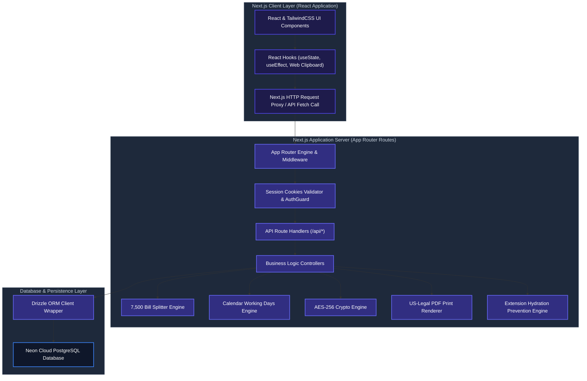

# System Architecture & Technical Specifications

This document provides a comprehensive technical overview of the system architecture, design patterns, core algorithmic engines, database model relationships, and security controls implemented in the Late-Sitting, Holiday, and Night Duty (LHN) Enterprise Portal.

---

## 🏛️ System Architecture

The portal is built upon the modern Next.js **App Router** architecture, delivering a highly decoupled, reactive data flow between client and server layers.



---

## ⚙️ Technical Rationale & Technology Selection

The selected technology stack is customized to satisfy enterprise-grade security, low latency, and dynamic report generation requirements, while keeping operational costs completely free using open-source, self-hostable tools.

| Category | Technology | Rationale & Alternatives Comparison |
| :--- | :--- | :--- |
| **Core Framework** | Next.js (App Router) | State-of-the-art React framework offering Server Components, server-side rendering, and API route endpoints. Fully open-source and free. |
| **Language** | TypeScript | Ensures compile-time type safety, preventing common runtime bugs and offering autocomplete guides for developers. |
| **Authentication** | Auth.js (NextAuth.js) | Fully client-owned, self-hosted session validation. No user limit or hidden costs. Integrates cleanly with local database schemas. |
| **Database Engine** | Supabase (PostgreSQL) | Enterprise-grade Postgres SQL database. Leverages Supabase's free tier or local Docker containers for self-hosting. |
| **Realtime Engine** | Supabase Realtime | Native web socket integration allowing instant UI state synchronization without additional third-party dependencies (e.g., Pusher). |
| **ORM Client** | Drizzle ORM | Ultra-lightweight and type-safe SQL mapper. Significantly faster than Prisma with zero cold-start latency. |
| **Styling** | Tailwind CSS 4.0 | Utility-first styling with high performance and zero CSS runtime compilation. |
| **UI Components** | shadcn/ui | Radix UI primitives styled with Tailwind, providing highly accessible, fully customizable dashboard controls. |
| **Cryptography** | Web Cryptography API | Native Web and Node crypto libraries. Encrypts sensitive logs and data using AES-256-CBC without external package dependencies. |
| **Icons** | Lucide React | Optimized SVG icon pack. |

---

## 🧠 Core Algorithmic Mechanisms & Design Patterns

### 1. ৳7,500 Budget Limit Splitter (Roster Budget Splitter)
* **Problem:** Internal audit rules mandate that any single office order/bill memo with an entertainment expenditure exceeding ৳7,500 requires additional administrative clearance.
* **Mechanism:** 
  - When a user compiles duties for a month, the Roster engine aggregates the total bill amount.
  - If the limit is exceeded, the engine splits the assignments into contiguous, chronological chunks.
  - It sorts duties chronologically and groups them into separate orders, keeping each order under the ৳7,500 limit.
  - To prevent date conflicts (collision) during sequential order generation, the engine assigns staggered unique reference dates, ensuring audit compliance.

### 2. Calendar Working Days Generator & Override Mechanism
* **Problem:** Conveyance and lunch allowances require calculating active working days per month. However, public holidays shift yearly, and weekends may occasionally be declared as active working days.
* **Mechanism:**
  - The system reads weekends dynamically (Friday/Saturday) based on a date range.
  - It intersects these days with override records stored in the `Holiday` table.
  - **Override Logic:** If a calendar weekend matches a database override flagged with `isWorkingDay = true`, it is treated as a normal working day. Conversely, if a calendar weekday matches a holiday override, it is excluded from working days.

### 3. Leave Application Engine & Sandwich Rule
* **Problem:** Casual and station leave forms must calculate total leave days dynamically, accounting for the "sandwich rule" (where weekends sandwiched between leave days are deducted from the user's leave balance).
* **Mechanism:**
  - The engine determines the interval between start and end dates.
  - It checks if weekends immediately precede or succeed the requested dates. If consecutive leaves sandwich a weekend, those weekends are programmatically deducted from the user's remaining balance.
  - A dynamic grammatical phrasing builder renders correct localized terms based on the duration (e.g., singular vs. plural days phrasing).

### 4. Cryptographic Chat Messenger (AES-256-CBC)
* **Problem:** Messages transmitted internally must be encrypted in transit and at rest in the database to prevent breaches.
* **Mechanism:**
  - Messages are encrypted server-side using a unique key and a dynamic initialization vector (IV) before database persistence.
  - If a user triggers the "Unsend for Everyone" action, the database record is overwritten with a hardcoded revoked string rather than just a soft deletion flag, and any associated physical uploads are purged from storage.
  - Real-time updates are maintained via a 2-second synchronization polling loop to prevent socket resource leaks on minimal server configs.

### 5. Pixel-Perfect US-Legal Print Renderer
* **Problem:** Roster memos and bills must print strictly on US-Legal paper (8.5in x 14in) with precise margins and page breaks.
* **Mechanism:**
  - Uses CSS page media directives: `@media print { @page { size: legal portrait; margin: 0.5in; } }`.
  - Implements `page-break-inside: avoid;` on rows and sections to prevent list items or signing blocks from breaking across pages.

### 6. Cell-Based Data Access Control (RBAC Integration)
* **Problem:** Regular users should only see data and employees within their assigned cells, while administrators require global visibility.
* **Mechanism:**
  - On API endpoints, user sessions are validated against user-cell association records (`UserCells`).
  - Queries are dynamically restricted using SQL `inArray()` filters matching the user's permitted cell IDs. Attempts to access other cells trigger a `403 Forbidden` response.

### 7. Executive Seniority & Coding Matrix
* **Problem:** Executives (DGMs, AGMs) must be displayed in order of seniority, with clear visual indicators indicating in-charge status.
* **Mechanism:**
  - Executive profiles are sorted using their alphanumeric filing numbers (`fileNo`).
  - Colors are applied dynamically: 1st DGM gets Royal Blue, 2nd DGM gets Amber/Orange, other DGMs get Teal, and AGMs receive Sky Blue accents.
  - The first Senior Principal Officer (SPO) inside a cell is programmatically marked as the "Cell Incharge", which updates both screen cards and printed PDFs with specific indicators.

### 8. Silent Printing & Iframe Previews
* **Problem:** Generating PDF previews in external tabs disrupts the user workflow.
* **Mechanism:**
  - Previews are rendered inside an inline preview iframe modal directly on the dashboard.
  - Silent printing is triggered by targeting a hidden background iframe loaded with the target print endpoint, instantly launching the browser's system printing dialog.

### 9. Bulk Cell CSV Import Batching
* **Problem:** Creating cells individually is inefficient during initial setups.
* **Mechanism:**
  - Allows bulk import via raw text lists or `.csv` files.
  - Uses a batch insert wrapper with deduplication: duplicate cell names are safely skipped without failing the entire transaction.

### 10. Multi-Cell Mapping & API Deduplication
* **Problem:** An employee may be assigned to multiple cells. In directories, they must appear under all assigned cells, but for duties and billing, they must only appear once to prevent duplicate allowance payouts.
* **Mechanism:**
  - API endpoints support a `?directory=true` parameter. When present, the query returns all cell-employee intersections.
  - For billing and duty rosters, the parameter is omitted, and results are grouped by employee ID to filter out duplicates.

### 11. Hydration Error Prevention Engine
* **Problem:** Third-party browser extensions (translators, ad blockers) inject attributes into client DOM elements, causing Next.js client-server markup mismatches.
* **Mechanism:**
  - A script containing a `MutationObserver` is embedded in the layout head.
  - The observer immediately removes unauthorized attributes (`bis_skin_checked`, etc.) before the React hydration cycle starts, preventing runtime rendering crashes.

---

## 💾 Database Schema & Relationships

The database utilizes optimized foreign-key relationships to maintain high referential integrity.

```text
  +------------+             +--------------+             +------------+
  |    User    | *         * |     Cell     | 1         * |  Employee  |
  |  (Users)   |-------------|   (Cells)    |-------------| (Employees)|
  +------------+             +--------------+             +------------+
        |                           |                           |
        | *                         | 1                         | 1
        |                           |                           |
  +------------+             +--------------+                   | *
  |Notification|             |  LunchBill   |             +------------+
  | (Notifs)   |             | (LunchBills) |             |    Duty    |
  +------------+             +--------------+             |  (Duties)  |
                                                          +------------+
```

### Model Definitions
1. **User:** Manages system operators. Roles are strictly restricted to `ADMIN` and `USER`.
2. **Cell:** Represents departments or cells (e.g., JBNS, R22 Core Banking).
3. **Employee:** Contains employee directories. Cascades delete operations to child duties.
4. **Duty:** Tracks assigned duties, types (`LATE_SITTING`, `HOLIDAY`, `NIGHT_SHIFT`), and conveyance/entertainment calculations.
5. **OfficeOrder:** Stores printed orders and structural contents as JSON.
6. **Holiday:** Custom holiday list and working day weekend overrides.
7. **Executive:** Tracks AGMs and DGMs sorted by seniority.
8. **Trash:** Audit-compliant soft-deletion tracker storing JSON structures of removed records for restoration.
9. **LeaveApplication:** Tracks casual, station, and special leaves with sandwich logic.
10. **LunchBill:** Restricts cell monthly bills to a single record using a composite unique constraint (`cellId`, `month`, `year`).
