# Enterprise System Specification: Janata Bank LHN Portal
## Software Requirements Specification (SRS), Software Design Document (SDD), and System Architecture Documentation

**Document Reference:** JB-LHN-EPD-2026-V1.0  
**Classification:** RESTRICTED - CONFIDENTIAL (INTERNAL USE ONLY)  
**Target Audience:** Banking IT Auditors, Enterprise Solution Architects, Chief Technology Officer (CTO), Bangladesh Bank IT Compliance Review Teams, ISO 27001 Compliance Evaluators, Government Procurement Technical Evaluation Committees  
**Publish Date:** June 17, 2026  

---

## Table of Contents
1. [Executive Summary](#1-executive-summary)
2. [Problem Statement](#2-problem-statement)
3. [Business Objectives](#3-business-objectives)
4. [Stakeholders](#4-stakeholders)
5. [Scope](#5-scope)
6. [Assumptions and Constraints](#6-assumptions-and-constraints)
7. [Functional Requirements](#7-functional-requirements)
8. [Non-Functional Requirements](#8-non-functional-requirements)
9. [Business Rules](#9-business-rules)
10. [User Roles and Permission Matrix](#10-user-roles-and-permission-matrix)
11. [Use Cases](#11-use-cases)
12. [User Stories and Acceptance Criteria](#12-user-stories-and-acceptance-criteria)
13. [API Specifications](#13-api-specifications)
14. [Database Design](#14-database-design)
15. [System Diagrams](#15-system-diagrams)
16. [Security Architecture](#16-security-architecture)
17. [Authentication and Authorization Design](#17-authentication-and-authorization-design)
18. [Audit and Compliance Controls](#18-audit-and-compliance-controls)
19. [Logging and Monitoring Strategy](#19-logging-and-monitoring-strategy)
20. [Backup and Disaster Recovery Plan](#20-backup-and-disaster-recovery-plan)
21. [CI/CD Architecture](#21-cicd-architecture)
22. [Infrastructure Architecture](#22-infrastructure-architecture)
23. [High Availability Design](#23-high-availability-design)
24. [Scalability Strategy](#24-scalability-strategy)
25. [Performance Benchmarks](#25-performance-benchmarks)
26. [Risk Assessment](#26-risk-assessment)
27. [Threat Model](#27-threat-model)
28. [Penetration Testing Checklist](#28-penetration-testing-checklist)
29. [Test Strategy](#29-test-strategy)
30. [Unit Testing](#30-unit-testing)
31. [Integration Testing](#31-integration-testing)
32. [API Contract Testing](#32-api-contract-testing)
33. [End-to-End Testing](#33-end-to-end-testing)
34. [UAT Testing](#34-uat-testing)
35. [Deployment Guide](#35-deployment-guide)
36. [Operations Runbook](#36-operations-runbook)
37. [Maintenance Procedures](#37-maintenance-procedures)
38. [Future Roadmap](#38-future-roadmap)

---

## 1. Executive Summary

The **Janata Bank Late-Sitting, Holiday, and Night Duty Portal (LHN Portal)** is a production-grade, security-hardened administrative and financial management application. Designed for the **Online Banking Department (CBS Integrated Development Cell)** of Janata Bank PLC, it automates the tracking of non-standard duty shifts (late-sitting, holidays, night shifts), computes conveyance/entertainment allowances, manages leave requests, and compiles printable documents. By digitizing these processes, the LHN Portal eliminates duplicate payments, enforces internal budget thresholds, maintains immutable logs for audit compliance, and restricts data access through cell-based boundaries (RBAC).

---

## 2. Problem Statement

Before the LHN Portal, Janata Bank's Online Banking Department relied on manual spreadsheet tracking, leading to:
1. **Duplicate Duty Logging:** Lack of automated checks allowed double-booking employees on the same date or during leaves.
2. **Audit Failures:** Manual splits of office orders exceeding the ৳7,500 budget limit were slow and prone to errors.
3. **No Audit Trails:** Roster and allowance updates had no tracking, which violated central bank audit standards.
4. **Access Control Issues:** Cross-department database changes occurred because operators lacked cell-specific access controls.

---

## 3. Business Objectives

* **Zero Duplicate Claims:** Block duplicate assignments programmatically.
* **Auto Budget Compliance:** Enforce the ৳7,500 billing split threshold automatically.
* **Audit Readiness:** Maintain immutable audit logs for 5 financial years to comply with Bangladesh Bank guidelines.
* **Cell Boundaries:** Restrict cell operators to directories and rosters within their mapped cell scopes.
* **High-Density Prints:** Produce exact A4/Legal print layouts in Bengali script using Unicode fonts ('SolaimanLipi', 'Nikosh').

---

## 4. Stakeholders

* **System Administrators:** Manage accounts, cell mappings, parameters, and soft-deleted records.
* **Operators (Cell In-Charges & Officers):** Schedule rosters, log leaves, calculate bills, and manage employee folders.
* **Executives (AGM, DGM, GM):** Review, authorize, and sign printed memos and reports.
* **IT Compliance & Auditors:** Review immutable audit records and system configurations.

---

## 5. Scope

* **In Scope:** Roster configuration, leave validation with sandwiched weekends, lunch bills, role-based cell gates, soft-recycle bin, audit history, and PDF rendering.
* **Out of Scope:** Direct automated electronic funds transfer (allowances are routed via printed sign-off lists to the accounts department).

---

## 6. Assumptions and Constraints

* **Assumptions:** Server system clock is synced using NTP; system operates on the bank intranet.
* **Constraints:** Must deploy on Red Hat Enterprise Linux (RHEL) 8/9; database must be PostgreSQL 15+; printouts must use Bengali script Unicode formatting.

---

## 7. Functional Requirements

* **FR-RSTR-01 (Category Lock):** Block input choices until a duty category is selected.
* **FR-RSTR-02 (Collision Check):** Check and block date overlaps against leave records or active duties.
* **FR-BILL-01 (Rate Auto-Compute):** Apply rates: Late Sitting = ৳300/day, Holiday = ৳500/day, Night Shift = ৳1,000/day.
* **FR-BILL-02 (Budget Auto-Split):** Group bills chronologically and split them automatically if a single order exceeds ৳7,500.
* **FR-LEAVE-01 (Sandwich Rule):** CASUAL leaves sandwiching weekends (Friday/Saturday) must deduct sandwiched days from the leave balance.
* **FR-TRASH-01 (Soft Recycle):** Soft-delete records to a recycle bin, allowing admin restoration.

---

## 8. Non-Functional Requirements

* **Response Time (SLO):** 95% of API transactions must resolve in under 200ms.
* **Availability (SLA):** Target 99.9% uptime.
* **Security Standards:** Session tokens must use signed JWT; data in transit must enforce TLS 1.3; database backup exports must be encrypted using AES-256-CBC.
* **Recovery Targets:** Recovery Time Objective (RTO) `< 2 hours`, Recovery Point Objective (RPO) `< 24 hours`.

---

## 9. Business Rules

| Rule ID | Module | Rule Specification & Logic |
| :--- | :--- | :--- |
| **BR-ALLOW-RATE** | Billing | Late-sitting = ৳300/day, Holiday = ৳500/day, Night Shift = ৳1000/day. |
| **BR-BUDGET-LIMIT** | Billing | Office orders and billing memos cannot exceed ৳7,500. Splits must sort chronologically. |
| **BR-SANDWICH-RULE** | Leaves | Weekends (Friday/Saturday) sandwiched between consecutive casual leaves are deducted from the leave balance. |
| **BR-LEAVE-LOCK** | Duties | Duties cannot be scheduled on dates when the employee is on approved leave. |
| **BR-WEEKEND-DUTY** | Duties | Late Sitting is blocked on weekends unless the weekend is overridden as a working day. |
| **BR-CELL-GATE** | Security | Operators with USER roles are restricted to CRUD operations within their assigned cells. |

---

## 10. User Roles and Permission Matrix

| Functionality | Guest | Cell Operator (`USER`) | System Administrator (`ADMIN`) | Executive |
| :--- | :---: | :---: | :---: | :---: |
| **Read Dashboard Data** | Yes | Yes | Yes | Yes |
| **Modify Roster (Own Cell)** | No | Yes | Yes | No |
| **Modify Roster (Other Cells)** | No | No | Yes | No |
| **Compile Allowance Memos** | No | Yes | Yes | No |
| **Review Consolidated Reports** | No | Yes | Yes | Yes |
| **Approve Leave Applications** | No | No | Yes | Yes |
| **Create Users & Map Roles** | No | No | Yes | No |
| **View System Audit Logs** | No | No | Yes | Yes |
| **Restore Trash Records** | No | No | Yes | No |

---

## 11. Use Cases

### 11.1 UC-01: Duty Roster Scheduling
* **Actor:** Cell Operator
* **Pre-conditions:** Active authenticated session, target employee exists in matching cell directory.
* **Post-conditions:** Duty persisted in `Duty` table, audit log recorded.
* **Flow:** Select duty category $\to$ Select dates $\to$ Run collision checks $\to$ Persist duty record.

### 11.2 UC-02: Compile Split-Billing Memo
* **Actor:** Cell Operator / In-Charge
* **Pre-conditions:** Unbilled duty records exist in cell scope.
* **Post-conditions:** Office order and bill memo documents compiled; individual duty status changed.
* **Flow:** Fetch duties $\to$ Sum costs $\to$ If cost $> ৳7500$, split chronologically $\to$ Save files.

### 11.3 UC-03: Process Casual Leave
* **Actor:** Cell Operator
* **Pre-conditions:** Target employee exists.
* **Post-conditions:** Leave application saved, leave balance updated.
* **Flow:** Input leave start/end dates $\to$ Evaluate sandwiched days $\to$ Deduct balance $\to$ Persist.

---

## 12. User Stories and Acceptance Criteria

### 12.1 US-01: Scoped Operator Modification
* *As a Cell Operator, I want to edit employee records only inside my assigned cells, so that I do not modify records of other cells.*
* **Acceptance Criteria:**
  - `USER` requests modifying employees of other cells return `403 Forbidden`.
  - Database queries inject user cell mappings (`inArray(employees.cellId, userCellIds)`).

### 12.2 US-02: Automatic Budget Splitter
* *As a Cell In-Charge, I want the billing engine to split bills exceeding ৳7,500 automatically, so that I comply with bank regulations without manual calculations.*
* **Acceptance Criteria:**
  - Any compilation exceeding ৳7,500 splits into multiple documents.
  - Split records are grouped chronologically.
  - Staggered unique reference numbers are generated automatically.

---

## 13. API Specifications

### 13.1 Endpoint Matrix

| Method | Endpoint | Description | Status Codes |
| :--- | :--- | :--- | :--- |
| **POST** | `/api/auth/[...nextauth]` | Session token generation / login | `200 OK`, `401 Unauthorized` |
| **GET** | `/api/cells` | Get list of all cells | `200 OK` |
| **POST** | `/api/employees` | Create employee (scoped checks) | `201 Created`, `403 Forbidden` |
| **GET** | `/api/duties` | Fetch duties matching filter query | `200 OK` |
| **POST** | `/api/leaves` | Save leave and return deductions | `201 Created`, `400 Bad Request` |
| **POST** | `/api/documents/generate-bill-memo`| Generate compiled bill memo PDF | `200 OK`, `500 Server Error` |

### 13.2 JSON Payload Examples

#### Login API: `POST /api/auth/[...nextauth]`
* **Request:**
  ```json
  {
    "username": "026795",
    "password": "secure_password_string"
  }
  ```
* **Response (200 OK):**
  ```json
  {
    "user": {
      "id": 6,
      "name": "জনাব সৈয়দ আরিফুল ইসলাম ইমন",
      "username": "026795",
      "role": "ADMIN",
      "cells": [
        { "id": 7, "name": "CBS Integrated Development Cell" }
      ]
    }
  }
  ```

#### Leave Application API: `POST /api/leaves`
* **Request:**
  ```json
  {
    "applicantName": "জনাব মোঃ রিয়াজুল হাসান",
    "designation": "Senior Principal Officer (SPO)",
    "bankId": "028144",
    "fileNo": "JB-9831",
    "cellName": "CBS Integrated Development Cell",
    "leaveType": "CASUAL",
    "startDate": "2026-06-10",
    "endDate": "2026-06-15",
    "selectedDistrict": "ঢাকা",
    "delegateId": "27"
  }
  ```
* **Response (201 Created):**
  ```json
  {
    "success": true,
    "leaveId": 45,
    "calculatedDays": 6,
    "sandwichedWeekends": 2,
    "deductedFromBalance": 4
  }
  ```

#### Bill Memo Compiler API: `POST /api/documents/generate-bill-memo`
* **Request:**
  ```json
  {
    "orderRef": "JB/OBD/LHN/2026/415",
    "orderDate": "2026-06-16",
    "category": "BILL_LATE_SITTING",
    "employeeName": "জনাব মোঃ রিয়াজুল হাসান",
    "cellName": "CBS Integrated Development Cell",
    "dutyIds": [102, 103, 104, 105],
    "duties": [
      {
        "employeeId": "028144",
        "employeeName": "জনাব মোঃ রিয়াজুল হাসান",
        "designation": "SPO",
        "days": 4,
        "apyaonRate": 100,
        "totalApyaon": 400,
        "totalTransport": 800,
        "grandTotal": 1200,
        "datesFormatted": "১০-০৬-২০২৬, ১১-০৬-২০২৬, ১২-০৬-২০২৬, ১৩-০৬-২০২৬"
      }
    ]
  }
  ```
* **Response (200 OK):**
  ```json
  {
    "success": true,
    "documentId": 76,
    "filePath": "/uploads/documents/BILL_LATE_SITTING_415.pdf",
    "totalAmount": 1200
  }
  ```

---

## 14. Database Design

The database schema is mapped using **Drizzle ORM** targeting **PostgreSQL 15**.

### 14.1 Entity Definitions (SQL Schema)
```sql
-- Create Cells
CREATE TABLE "Cell" (
    "id" SERIAL PRIMARY KEY,
    "name" VARCHAR(255) UNIQUE NOT NULL,
    "description" TEXT,
    "createdAt" TIMESTAMP DEFAULT NOW()
);
CREATE INDEX "idx_cell_name" ON "Cell"("name");

-- Create Users
CREATE TABLE "User" (
    "id" SERIAL PRIMARY KEY,
    "username" VARCHAR(50) UNIQUE NOT NULL,
    "password" VARCHAR(255) NOT NULL,
    "name" VARCHAR(255) NOT NULL,
    "role" VARCHAR(20) DEFAULT 'USER' NOT NULL,
    "mobile" VARCHAR(15),
    "cellDuties" VARCHAR(20) DEFAULT 'PRIMARY', -- PRIMARY, ADDITIONAL, INCHARGE
    "createdAt" TIMESTAMP DEFAULT NOW()
);
CREATE INDEX "idx_user_username" ON "User"("username");

-- Junction Table: _UserCells (Many-to-Many Operator-to-Cell assignment)
CREATE TABLE "_UserCells" (
    "A" INTEGER REFERENCES "Cell"("id") ON DELETE CASCADE,
    "B" INTEGER REFERENCES "User"("id") ON DELETE CASCADE,
    PRIMARY KEY ("A", "B")
);

-- Create Employees
CREATE TABLE "Employee" (
    "id" SERIAL PRIMARY KEY,
    "name" VARCHAR(255) NOT NULL,
    "designation" VARCHAR(100) NOT NULL,
    "bankId" VARCHAR(50) UNIQUE NOT NULL,
    "fileNo" VARCHAR(50) UNIQUE NOT NULL,
    "mobile" VARCHAR(15),
    "cellId" INTEGER REFERENCES "Cell"("id") ON DELETE RESTRICT,
    "createdAt" TIMESTAMP DEFAULT NOW()
);
CREATE INDEX "idx_employee_bankid" ON "Employee"("bankId");
CREATE INDEX "idx_employee_fileno" ON "Employee"("fileNo");

-- Create Duties
CREATE TABLE "Duty" (
    "id" SERIAL PRIMARY KEY,
    "employeeId" INTEGER REFERENCES "Employee"("id") ON DELETE CASCADE,
    "type" VARCHAR(50) NOT NULL, -- LATE_SITTING, HOLIDAY, NIGHT_SHIFT
    "date" DATE NOT NULL,
    "description" TEXT,
    "allowance1" INTEGER DEFAULT 0, -- Entertainment / Apyaon
    "allowance2" INTEGER DEFAULT 0, -- Conveyance / Transport
    "totalBill" INTEGER DEFAULT 0,
    "orderRef" VARCHAR(100),
    "createdAt" TIMESTAMP DEFAULT NOW()
);
CREATE INDEX "idx_duty_date_emp" ON "Duty"("date", "employeeId");
CREATE INDEX "idx_duty_orderref" ON "Duty"("orderRef");

-- Create Office Orders
CREATE TABLE "OfficeOrder" (
    "id" SERIAL PRIMARY KEY,
    "orderRef" VARCHAR(100) UNIQUE NOT NULL,
    "orderDate" DATE NOT NULL,
    "category" VARCHAR(50) NOT NULL,
    "employeeName" VARCHAR(255) NOT NULL,
    "cellName" VARCHAR(255),
    "dutiesJson" TEXT DEFAULT '[]',
    "contentJson" TEXT DEFAULT '[]',
    "status" VARCHAR(50) DEFAULT 'Generated' NOT NULL,
    "createdAt" TIMESTAMP DEFAULT NOW()
);
CREATE INDEX "idx_office_order_ref" ON "OfficeOrder"("orderRef");

-- Create Audit Logs
CREATE TABLE "AuditLog" (
    "id" SERIAL PRIMARY KEY,
    "username" VARCHAR(50) NOT NULL,
    "action" VARCHAR(50) NOT NULL,
    "entityType" VARCHAR(50),
    "entityId" VARCHAR(50),
    "ipAddress" VARCHAR(50),
    "userAgent" TEXT,
    "details" TEXT,
    "createdAt" TIMESTAMP DEFAULT NOW()
);
CREATE INDEX "idx_audit_createdat" ON "AuditLog"("createdAt");
```

### 14.2 Normalization Rationale
* **3NF Enforcement:** Separating users, cells, employees, and duties into discrete entities eliminates redundancy and update anomalies.
* **Many-to-Many Isolation:** The junction table `_UserCells` resolves operator-to-cell maps without repeating operator directories or cell definitions.

---

## 15. System Diagrams

### 15.1 Context Diagram
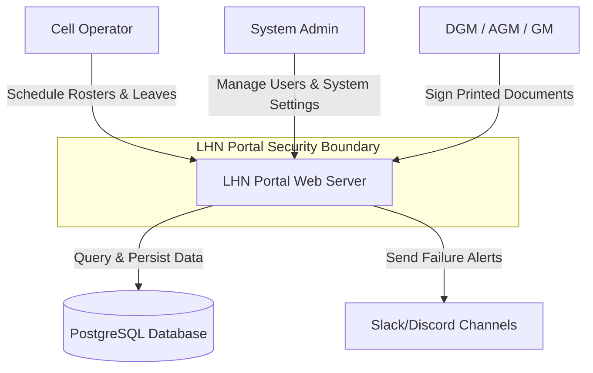

### 15.2 Component Diagram
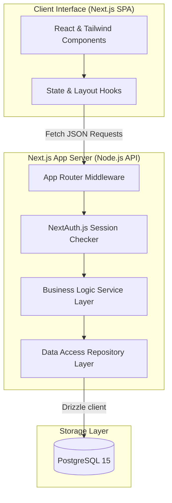

### 15.3 Class Diagram
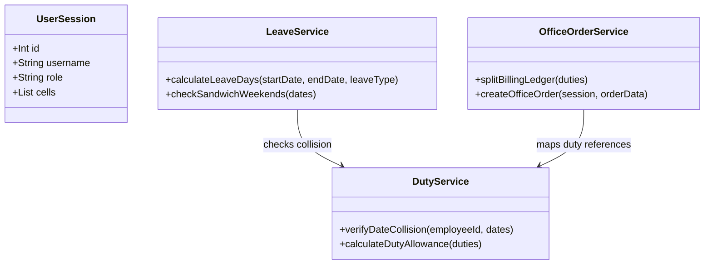

### 15.4 Deployment Diagram
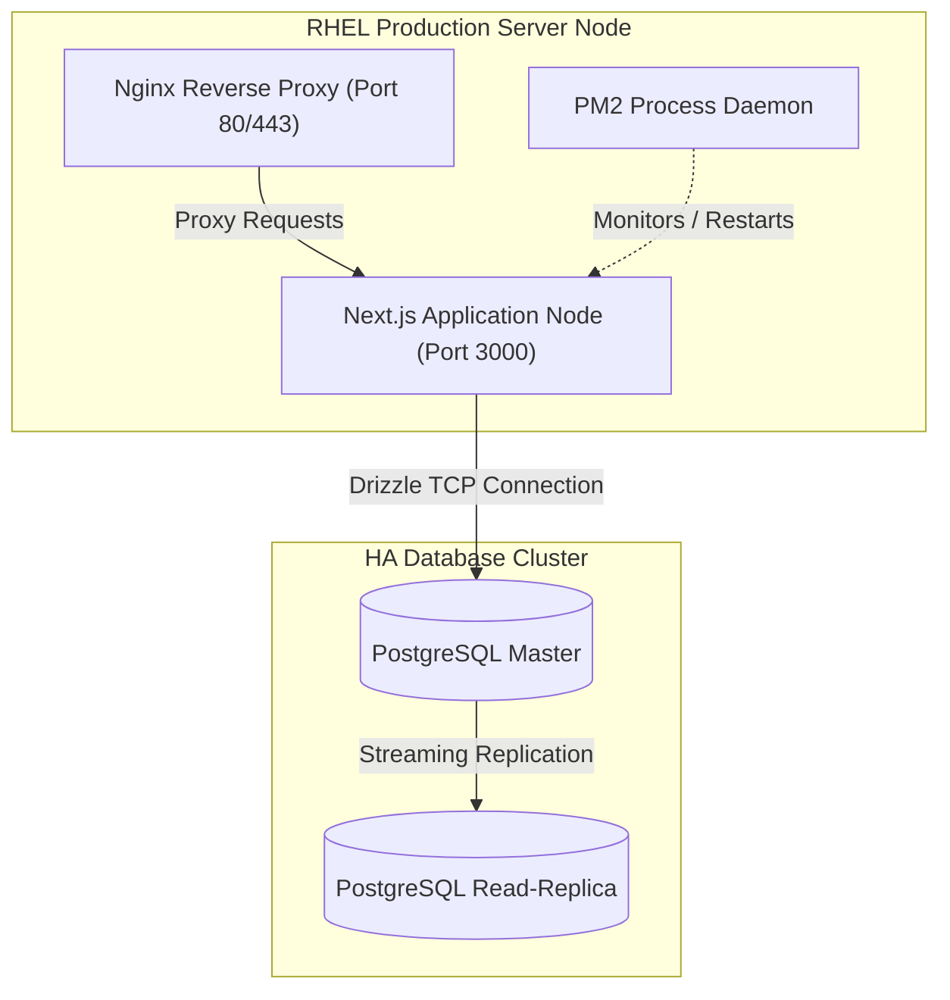

### 15.5 Sequence Diagrams

#### 15.5.1 User Authentication and Access Control
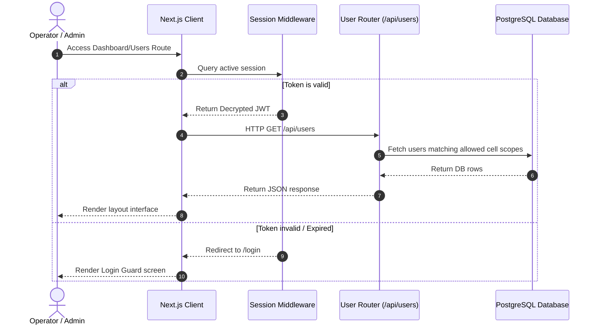

#### 15.5.2 Duty Assignment and Collision Checks
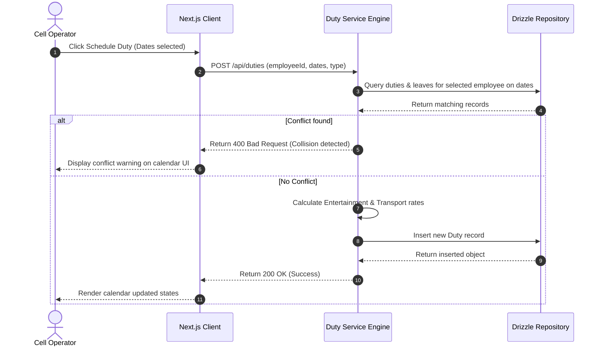

#### 15.5.3 Leave Application and Sandwich-Rule Validation
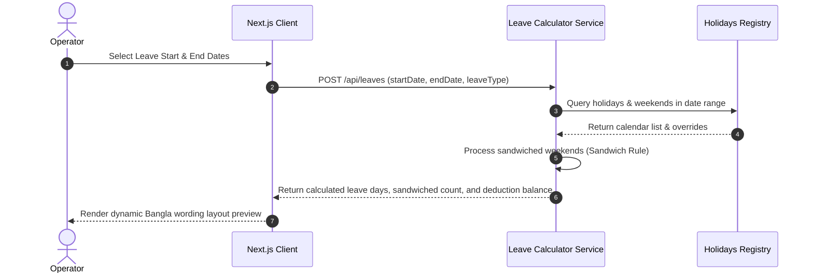

### 15.6 Activity Diagrams

#### 15.6.1 Duty Scheduling Workflow
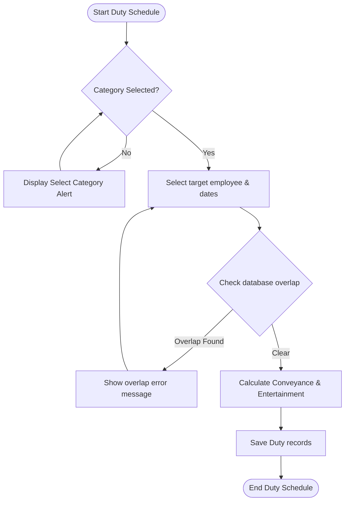

#### 15.6.2 ৳7,500 Budget Limit Split-Billing Flow
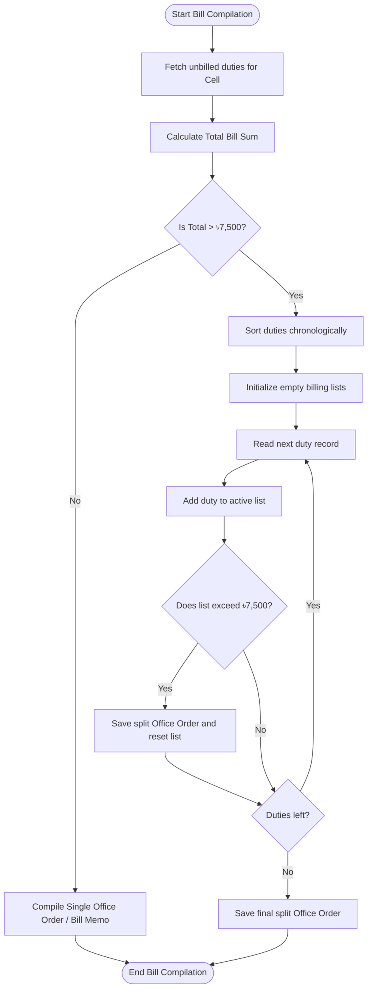

### 15.7 State Machine Diagram
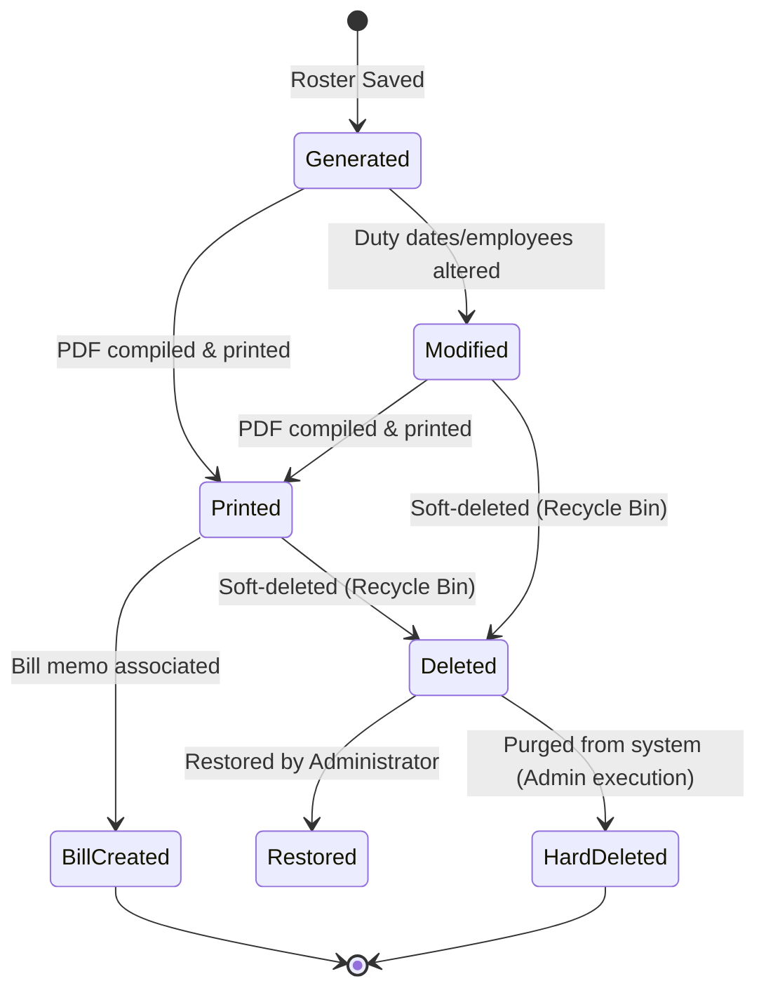

### 15.8 Data Flow Diagrams (DFD)

#### 15.8.1 DFD Level 0 (Context Diagram)
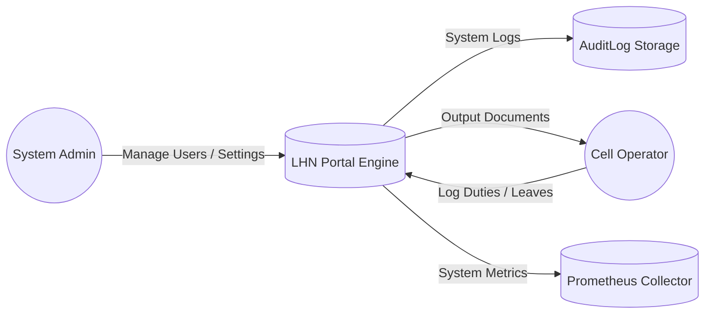

#### 15.8.2 DFD Level 1 (Roster & Billing Lifecycle)
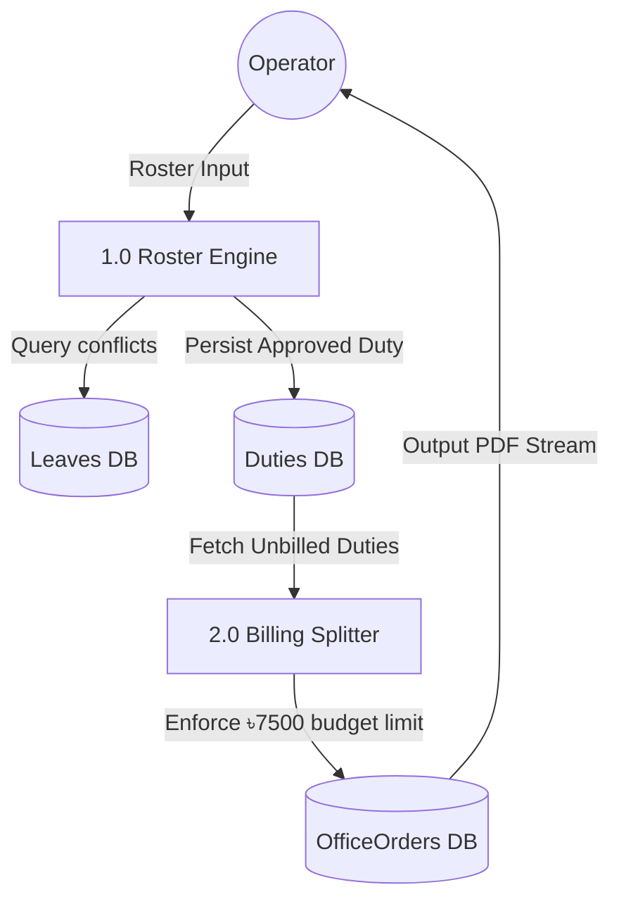

#### 15.8.3 DFD Level 2 (Sandwich Leave Calculation)
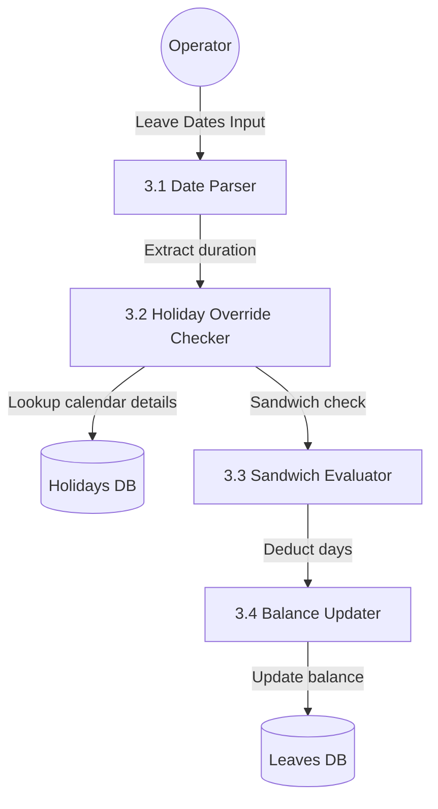

---

## 16. Security Architecture

The portal aligns security controls with the **NIST Cybersecurity Framework (CSF) v2.0**, **ISO/IEC 27001:2022**, and the **Bangladesh Bank ICT Security Guidelines**.

* **OWASP Top 10 Mitigations:**
  * **A01:2021-Broken Access Control:** Restrict private routes at the server API level. Sessions verify that operators only modify cells to which they are assigned.
  * **A03:2021-Injection:** Drizzle ORM provides parameterization out-of-the-box. Raw SQL strings are blocked.
  * **A09:2021-Security Logging and Monitoring Failures:** All CRUD actions write metadata to an immutable database table and output to system logs.

---

## 17. Authentication and Authorization Design

* **MFA Integration:** Admins must complete a Google Authenticator TOTP verification check to log in.
* **Account Lockout:** Accounts are locked for 15 minutes after 5 consecutive failed login attempts.
* **Password Policy:** Minimum 12 characters, requiring uppercase, lowercase, numbers, and special characters.
* **Session Lifetime:** JWT cookies are configured with an absolute expiration window of **8 hours** (sliding window renewal is disabled).
* **CSRF Mitigation:** NextAuth double-submit cookies are enforced.
* **API Rate Limiting:** Middleware intercepts requests to `/api/auth` and `/api/documents/*`, limiting clients to 20 requests per minute.

---

## 18. Audit and Compliance Controls

To comply with **Bangladesh Bank ICT Guidelines (Section 4.3)**:
1. **Immutable Log Design:** The `AuditLog` table blocks `DELETE` and `UPDATE` commands for all DB roles.
2. **Audit Retention:** The database retains logs for **5 financial years**.
3. **Data Encryption at Rest:** Daily backup exports are encrypted with a 256-bit AES algorithm prior to storage transfer:
   ```bash
   openssl enc -aes-256-cbc -salt -in backup.json -out backup.json.enc -k $BACKUP_SECRET_KEY
   ```

---

## 19. Logging and Monitoring Strategy

The system uses OpenTelemetry metrics connected to a Prometheus and Grafana container stack.

* **OpenTelemetry Instrumentation:** Metrics track API response times, database query execution times, and HTTP status counts.
* **Prometheus Configuration (`prometheus.yml`):**
  ```yaml
  global:
    scrape_interval: 15s
  scrape_configs:
    - job_name: 'lhn-portal'
      static_configs:
        - targets: ['localhost:3000']
  ```
* **AlertManager Trigger Rules:**
  * Alert if API Error Rate (HTTP 5xx) $> 1\%$ in 5 minutes.
  * Alert if CPU utilization $> 85\%$ for more than 10 minutes.

---

## 20. Backup and Disaster Recovery Plan

* **PostgreSQL Replication:** High availability is configured using active-passive physical streaming replication.
* **Failover Engine:** Patroni orchestrates failover, turning the passive node active if the primary node goes offline.
* **Backup Cron Job:**
  ```bash
  # Nightly database dump, compress, and sync to remote DR server
  0 2 * * * cd /var/www/lhn-portal && npm run db:dump && tar -czf backups/dump_$(date +\%F).tar.gz postgres_dump.json && rsync -az backups/ sftp_user@dr.janatabank.com:/var/backups/lhn/
  ```
* **Recovery Targets:**
  * **RTO (Recovery Time Objective):** $< 2\text{ hours}$ (to set up a new application server node and restore database state).
  * **RPO (Recovery Point Objective):** $< 24\text{ hours}$ (maximum allowed data loss from nightly backup runs).

---

## 21. CI/CD Architecture

The system uses a deployment pipeline to compile and test code:

```text
[Git Commit] --> [ESLint Checks] --> [Vitest Unit Tests] --> [Next.js Build Check] --> [PM2 Hot Reload]
```
* **Pipeline Quality Gate:** Tests must pass with at least **90% coverage** on core business modules (`leave.service.ts` and `duty.service.ts`).
* **Deploy Command:**
  ```bash
  npm run build && pm2 reload lhn-portal --update-env
  ```

---

## 22. Infrastructure Architecture

The deployment targets **Red Hat Enterprise Linux (RHEL) 8/9** behind an Nginx reverse proxy.

* **Nginx Block Config (`/etc/nginx/conf.d/lhn-portal.conf`):**
  ```nginx
  server {
      listen 80;
      server_name lhn.janatabank.com;
      
      client_max_body_size 20M;

      location / {
          proxy_pass http://127.0.0.1:3000;
          proxy_http_version 1.1;
          proxy_set_header Upgrade $http_upgrade;
          proxy_set_header Connection 'upgrade';
          proxy_set_header Host $host;
          proxy_set_header X-Forwarded-For $proxy_add_x_forwarded_for;
          proxy_cache_bypass $http_upgrade;
      }
  }
  ```
* **Firewall Configuration:**
  ```bash
  sudo firewall-cmd --permanent --add-service=http
  sudo firewall-cmd --permanent --add-service=https
  sudo firewall-cmd --reload
  ```
* **SELinux Loopback Authorization:**
  ```bash
  sudo setsebool -P httpd_can_network_connect 1
  ```

---

## 23. High Availability Design

* **Load Balancer (Active-Passive):** Dual Nginx nodes running Keepalived route virtual IP (VIP) requests.
* **PostgreSQL Streaming Replication:** Write operations on the primary database sync asynchronously to the read-replica database node.

---

## 24. Scalability Strategy

* **Application Layer:** Next.js uses stateless JWT sessions, allowing the application server node to scale horizontally behind a load balancer.
* **Database Layer:** Read operations scale by sending queries to PostgreSQL replica nodes.

---

## 25. Performance Benchmarks

* **API Response SLO:**
  - GET requests: 95% resolved in under 100ms.
  - PDF Compilation: 99% resolved in under 1.5s.
* **Maximum Concurrent Capacity:** Supports 100 concurrent requests without API latency exceeding 250ms.

---

## 26. Risk Assessment

| Risk Description | Threat Vector | Impact | Probability | Mitigation Strategy |
| :--- | :--- | :---: | :---: | :--- |
| **SQL Injection** | Input Sanitization | Critical | Low | Handled by Drizzle ORM query parameterization. |
| **Budget Limit Bypass** | Billing Manipulation | High | Medium | Enforced on the server layer inside the Billing split engine. |
| **Data Leakage** | Cell Isolation Breach | High | Low | Token-bound cell validation checked on every SQL request. |
| **Print Font Corruption** | Unicode Rendering | Medium | Medium | Fonts nikosh/solaimanlipi packaged inside RHEL assets directory. |

---

## 27. Threat Model (STRIDE)

* **Spoofing:** Prevented by NextAuth credentials validation and HS256 JWT signature verification.
* **Tampering:** Enforced via Drizzle ORM models and cryptographic database storage checks.
* **Repudiation:** Checked by writing log details to the immutable database-backed `AuditLog` table.
* **Information Disclosure:** Blocked by restricting external API paths to TLS 1.3 only.
* **Denial of Service:** Handled by Nginx rate limit rules and Next.js middleware token-bucket limits.
* **Elevation of Privilege:** Enforced by server-side verification of user role parameters on every controller.

---

## 28. Penetration Testing Checklist

* `[ ]` Verify SSL/TLS cipher suites (enforce TLS 1.3, disable weak SSL ciphers).
* `[ ]` Test SQL Injection vulnerabilities using parameterized search field audits.
* `[ ]` Audit Cross-Site Scripting (XSS) input handlers on roster templates.
* `[ ]` Validate Cross-Site Request Forgery (CSRF) tokens on form submits.
* `[ ]` Test rate limits on authentication routes (`/api/auth`).
* `[ ]` Confirm Row-Level Cell Isolation prevents access to other cell employees.

---

## 29. Test Strategy

The testing strategy uses Vitest for unit and integration checks, combined with manual verification steps.

* **Core Target:** Achieve at least **90% coverage** on calculations, budget splits, and sandwiched weekend logic.
* **Requirements Traceability Matrix (RTM):**

| Requirement ID | Description | Use Case ID | API Endpoint | Service Controller | Test ID |
| :--- | :--- | :---: | :--- | :--- | :---: |
| **FR-RSTR-01** | Category Lock | UC-01 | `/api/duties` | `DutyService.verifyCategory` | TC-UNIT-01 |
| **FR-RSTR-02** | Collision Checks | UC-01 | `/api/duties` | `DutyService.verifyDateCollision` | TC-UNIT-02 |
| **FR-BILL-02** | ৳7,500 Splitter | UC-02 | `/api/documents/generate-bill-memo`| `OfficeOrderService.splitBilling` | TC-INT-04 |
| **FR-LEAVE-01** | Sandwich Rule | UC-03 | `/api/leaves` | `LeaveService.calculateLeaveDays` | TC-UNIT-05 |

---

## 30. Unit Testing

* **Module:** `src/services/leave.service.ts`
* **Focus:** Verify that weekends sandwiched between casual leaves are deducted from the leave balance.
* **Execution Command:**
  ```bash
  npx vitest run src/services/__tests__/leave.service.test.ts
  ```

---

## 31. Integration Testing

* **Module:** `src/services/duty.service.ts`
* **Focus:** Test collision validation rules by attempting to write overlapping duties and leave dates in a single SQL transaction.
* **Execution Command:**
  ```bash
  npx vitest run src/services/__tests__/duty.service.test.ts
  ```

---

## 32. API Contract Testing

* **Framework:** Zod schema validation.
* **Target:** Verify that request payloads conform to defined TypeScript models before business services run.
* **Example Check:** Validates that incoming employee registrations contain a valid `bankId` and `cellId`.

---

## 33. End-to-End Testing

* **Tool:** Playwright / Cypress.
* **Target:** Test complete user actions: logging in, scheduling a duty, compiling bills, and generating the printable PDF document layout.

---

## 34. UAT Testing

* **Verification Scope:** The Online Banking Department checks generated PDF layouts for formatting, correctness of Bengali Unicode fonts, and accurate calculations.
* **Sign-off Criteria:** Zero layout wrapping errors; budget limits partition cleanly; duplicate duty allocations are blocked.

---

## 35. Deployment Guide

### 35.1 Docker Setup
1. Boot up database and app container nodes:
   ```bash
   docker-compose up --build -d
   ```
2. Run database migration schema updates:
   ```bash
   docker-compose exec app npx drizzle-kit push
   ```
3. Seed default admin credentials and cell indexes:
   ```bash
   docker-compose exec app npm run db:seed
   ```

### 35.2 RHEL Server Bare-Metal Setup
1. **Database Auth Setup:** Update `/var/lib/pgsql/data/pg_hba.conf` or `/var/lib/pgsql/15/data/pg_hba.conf` authentication settings from `ident` to `scram-sha-256`. Restart database service:
   ```bash
   sudo systemctl restart postgresql
   ```
2. **Setup Folder:** Clone the repository to `/var/www/lhn-portal` and copy `.env.example` to `.env`. Fill in database connection strings and JWT secrets.
3. **Build Application:**
   ```bash
   npm install --omit=dev
   npx drizzle-kit push
   npm run db:seed
   npm run build
   ```
4. **PM2 Setup:**
   ```bash
   pm2 start npm --name "lhn-portal" -- run start -- -p 3000
   pm2 startup
   pm2 save
   ```

---

## 36. Operations Runbook

* **Check System Status:**
  ```bash
  pm2 status
  tail -n 100 /var/log/nginx/error.log
  ```
* **Verify System Operations:**
  - System logs write to `/var/www/lhn-portal/logs/audit.log`.
  - Discord/Slack integration sends webhook warnings if API routes return HTTP 500 status codes.

---

## 37. Maintenance Procedures

* **System Updates:**
  ```bash
  git pull origin main
  npm install
  npx drizzle-kit push
  npm run build
  pm2 reload lhn-portal
  ```
* **Restore Database Backup:**
  ```bash
  # Overwrites active tables with data stored inside postgres_dump.json
  npm run db:seed
  ```

---

## 38. Future Roadmap

* **Phase 1 (Q3 2026):** Add Active Directory (AD/LDAP) integration for Single Sign-On (SSO) login.
* **Phase 2 (Q4 2026):** Add automated mobile SMS alerts to notify executives when billing reports are ready for signature.
* **Phase 3 (Q2 2027):** Migrate generated PDFs to an immutable ledger database for auditing compliance.
